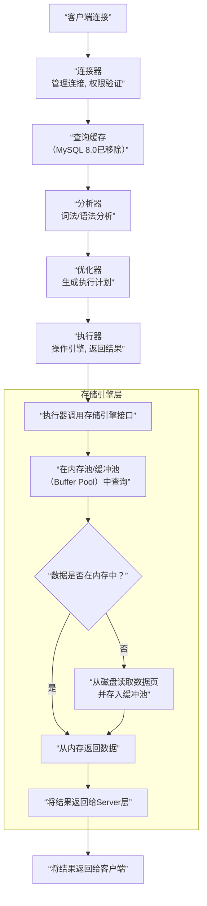

## 数据库

> 参考资料：小林coding——图解MySQL、图解Redis

### 1 一条SQL查询语句是如何执行的？

以MySQL的InnoDB引擎为例，一条SQL查询语句的执行过程可以看作一个贯穿数据库核心组件的流水线。总的来说，可以分为两大块：**Server层** 和 **存储引擎层**。

**Server层** 负责连接管理、SQL解析、优化等核心功能；**存储引擎层** （如InnoDB）负责数据的存储和提取。

其完整的执行流程，可以用下面这张图来概括，接下来我会详细讲解每个步骤：

具体来说，它需要经历以下核心阶段：

**第一阶段：建立连接与权限验证 (对应图中的“连接器”)**

- 首先，客户端通过连接器连接到数据库。连接器负责身份认证和权限校验。
- 如果用户名或密码错误，会收到`"Access denied"`错误，连接终止。
- 认证通过后，连接器会查出该用户拥有的权限。这个连接内的所有权限判断逻辑，都将依赖于此时读到的权限。这意味着，即使管理员中途修改了用户权限，也不会影响已经存在的连接。
- 连接完成后，如果没有后续动作，这个连接就处于空闲状态。如果太长时间空闲，连接器会自动将其断开，由参数`wait_timeout`控制，默认是8小时。

**第二阶段：查询缓存 (对应图中的“查询缓存”，但请注意MySQL 8.0已移除此功能)**

- 在早期版本中，连接建立后，MySQL会先到查询缓存看看是否之前执行过这条完全相同的语句。
- 如果找到缓存，结果会直接返回给客户端，效率非常高。
- **但是，查询缓存往往弊大于利**。因为任何表的更新（INSERT、UPDATE、DELETE）操作都会导致该表所有的查询缓存失效。对于更新频繁的数据库，缓存命中率会非常低。
- 因此，**在MySQL 8.0中，查询缓存整块功能被删除了**。所以现在这个步骤可以忽略。

**第三阶段：SQL解析与处理 (对应图中的“分析器”)**

- 如果没有命中缓存，就进入分析器。分析器主要做两件事：
    1.  **词法分析**：将整个SQL语句字符串拆分成一个个的“词”（token）。例如，识别出`SELECT`是关键字，`T1`是表名，`ID`是列名。
    2.  **语法分析**：根据词法分析的结果，判断这条SQL语句是否满足MySQL的语法。如果语法不对，就会收到`"You have an error in your SQL syntax"`的错误提示。

**第四阶段：查询优化 (对应图中的“优化器”)**

- 经过分析器，MySQL知道你要做什么了。但在执行之前，需要由优化器决定**怎么做最快**。
- 优化器是一个非常重要的组件，它会在多种执行方案中选择一个它认为最优秀的。
- **例如**：
    - **选择使用哪个索引**：表里有多个索引时，优化器会权衡每个索引的查询成本和数据分布，选择一个它认为最优的索引。
    - **多表关联（JOIN）的顺序**：当多表关联时，决定先读哪张表，后读哪张表，不同的顺序对性能影响很大。

**第五阶段：执行查询 (对应图中的“执行器”与“存储引擎层”)**

- 到了这一步，MySQL才真正开始执行语句。
    1.  **执行器**：首先，执行器会判断你对要操作的表`T`有没有执行查询的权限。如果没有，返回权限错误。
    2.  **调用引擎接口**：如果有权限，执行器就会根据表的引擎定义，去**调用存储引擎提供的接口**。
    3.  **引擎读取数据**：存储引擎（如InnoDB）的接口收到请求后：
        - 首先在**缓冲池（Buffer Pool）** 中查找所需的数据页。Buffer Pool是内存中的一个区域，缓存了经常访问的数据，可以极大减少磁盘I/O。
        - 如果数据不在内存中，存储引擎会去磁盘读取相应的数据页，并加载到Buffer Pool中。
        - 然后，在存储引擎内部执行索引扫描或全表扫描等具体的数据获取操作。
    4.  **返回结果**：存储引擎将满足条件的行数据一行一行地返回给执行器。执行器收到后，可能会做进一步的计算（如聚合函数），然后组成结果集，最终返回给客户端。

**总结**

所以，一条简单的`SELECT * FROM T WHERE ID=10;`语句，背后经历了：**连接 -> 解析 -> 优化 -> 执行（调用存储引擎） -> 返回结果** 这样一个复杂的过程。其中，**优化器**和**存储引擎**是性能的关键所在。

**面试官可能的追问与延伸：**

1.  **你说到了优化器，能详细说一下它基于什么做选择吗？**
    - 回答：基于“成本（Cost）”。MySQL内部有一个成本模型，会估算不同执行计划的I/O成本（读取数据页）和CPU成本（数据比较、排序等），然后选择总成本最小的那个计划。

2.  **Buffer Pool具体是做什么的？**
    - 回答：Buffer Pool是InnoDB引擎中一块非常重要的内存区域，它起到了一个缓存的作用。它用“页”为单位来缓存数据，当需要读取数据时，先看页是否在Buffer Pool中（命中），如果命中就直接返回，避免了昂贵的磁盘I/O。写操作也是先修改Buffer Pool中的页（称为“脏页”），然后由后台线程在适当时机刷回磁盘。

3.  **如果执行的是UPDATE语句，过程有什么不同？**
    - 回答：UPDATE语句的前半部分（连接、分析、优化）和SELECT类似。但在执行器阶段，它调用引擎接口是“读-改-写”的过程。此外，它还涉及两个重要的日志模块：
        - **redo log（重做日志）**：属于InnoDB引擎。在修改数据时，会先写redo log，然后再在Buffer Pool中修改数据页。这是一种“预写式日志（WAL）”技术，用于保证事务的持久性（Crash-Safe）。
        - **binlog（归档日志）**：属于Server层。记录的是逻辑操作，用于数据备份、恢复和主从复制。

### 2 事务的四大特性有哪些？