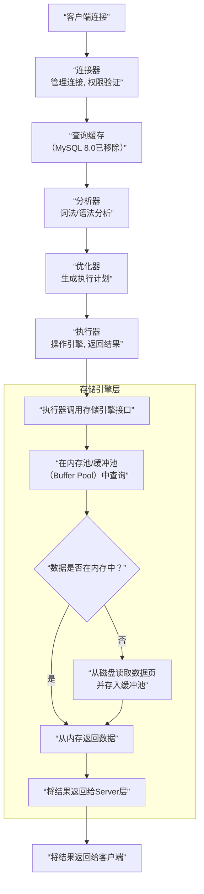

## 数据库

> 参考资料：小林coding——图解MySQL、图解Redis

### 1 一条SQL查询语句是如何执行的？

以MySQL的InnoDB引擎为例，一条SQL查询语句的执行过程可以看作一个贯穿数据库核心组件的流水线。总的来说，可以分为两大块：**Server层** 和 **存储引擎层**。

**Server层** 负责连接管理、SQL解析、优化等核心功能；**存储引擎层** （如InnoDB）负责数据的存储和提取。

其完整的执行流程，可以用下面这张图来概括，接下来我会详细讲解每个步骤：

具体来说，它需要经历以下核心阶段：

**第一阶段：建立连接与权限验证 (对应图中的“连接器”)**

- 首先，客户端通过连接器连接到数据库。连接器负责身份认证和权限校验。
- 如果用户名或密码错误，会收到`"Access denied"`错误，连接终止。
- 认证通过后，连接器会查出该用户拥有的权限。这个连接内的所有权限判断逻辑，都将依赖于此时读到的权限。这意味着，即使管理员中途修改了用户权限，也不会影响已经存在的连接。
- 连接完成后，如果没有后续动作，这个连接就处于空闲状态。如果太长时间空闲，连接器会自动将其断开，由参数`wait_timeout`控制，默认是8小时。

**第二阶段：查询缓存 (对应图中的“查询缓存”，但请注意MySQL 8.0已移除此功能)**

- 在早期版本中，连接建立后，MySQL会先到查询缓存看看是否之前执行过这条完全相同的语句。
- 如果找到缓存，结果会直接返回给客户端，效率非常高。
- **但是，查询缓存往往弊大于利**。因为任何表的更新（INSERT、UPDATE、DELETE）操作都会导致该表所有的查询缓存失效。对于更新频繁的数据库，缓存命中率会非常低。
- 因此，**在MySQL 8.0中，查询缓存整块功能被删除了**。所以现在这个步骤可以忽略。

**第三阶段：SQL解析与处理 (对应图中的“分析器”)**

- 如果没有命中缓存，就进入分析器。分析器主要做两件事：
    1.  **词法分析**：将整个SQL语句字符串拆分成一个个的“词”（token）。例如，识别出`SELECT`是关键字，`T1`是表名，`ID`是列名。
    2.  **语法分析**：根据词法分析的结果，判断这条SQL语句是否满足MySQL的语法。如果语法不对，就会收到`"You have an error in your SQL syntax"`的错误提示。

**第四阶段：查询优化 (对应图中的“优化器”)**

- 经过分析器，MySQL知道你要做什么了。但在执行之前，需要由优化器决定**怎么做最快**。
- 优化器是一个非常重要的组件，它会在多种执行方案中选择一个它认为最优秀的。
- **例如**：
    - **选择使用哪个索引**：表里有多个索引时，优化器会权衡每个索引的查询成本和数据分布，选择一个它认为最优的索引。
    - **多表关联（JOIN）的顺序**：当多表关联时，决定先读哪张表，后读哪张表，不同的顺序对性能影响很大。

**第五阶段：执行查询 (对应图中的“执行器”与“存储引擎层”)**

- 到了这一步，MySQL才真正开始执行语句。
    1.  **执行器**：首先，执行器会判断你对要操作的表`T`有没有执行查询的权限。如果没有，返回权限错误。
    2.  **调用引擎接口**：如果有权限，执行器就会根据表的引擎定义，去**调用存储引擎提供的接口**。
    3.  **引擎读取数据**：存储引擎（如InnoDB）的接口收到请求后：
        - 首先在**缓冲池（Buffer Pool）** 中查找所需的数据页。Buffer Pool是内存中的一个区域，缓存了经常访问的数据，可以极大减少磁盘I/O。
        - 如果数据不在内存中，存储引擎会去磁盘读取相应的数据页，并加载到Buffer Pool中。
        - 然后，在存储引擎内部执行索引扫描或全表扫描等具体的数据获取操作。
    4.  **返回结果**：存储引擎将满足条件的行数据一行一行地返回给执行器。执行器收到后，可能会做进一步的计算（如聚合函数），然后组成结果集，最终返回给客户端。

**总结**

所以，一条简单的`SELECT * FROM T WHERE ID=10;`语句，背后经历了：**连接 -> 解析 -> 优化 -> 执行（调用存储引擎） -> 返回结果** 这样一个复杂的过程。其中，**优化器**和**存储引擎**是性能的关键所在。

**面试官可能的追问与延伸：**

1.  **你说到了优化器，能详细说一下它基于什么做选择吗？**
    - 回答：基于“成本（Cost）”。MySQL内部有一个成本模型，会估算不同执行计划的I/O成本（读取数据页）和CPU成本（数据比较、排序等），然后选择总成本最小的那个计划。

2.  **Buffer Pool具体是做什么的？**
    - 回答：Buffer Pool是InnoDB引擎中一块非常重要的内存区域，它起到了一个缓存的作用。它用“页”为单位来缓存数据，当需要读取数据时，先看页是否在Buffer Pool中（命中），如果命中就直接返回，避免了昂贵的磁盘I/O。写操作也是先修改Buffer Pool中的页（称为“脏页”），然后由后台线程在适当时机刷回磁盘。

3.  **如果执行的是UPDATE语句，过程有什么不同？**
    - 回答：UPDATE语句的前半部分（连接、分析、优化）和SELECT类似。但在执行器阶段，它调用引擎接口是“读-改-写”的过程。此外，它还涉及两个重要的日志模块：
        - **redo log（重做日志）**：属于InnoDB引擎。在修改数据时，会先写redo log，然后再在Buffer Pool中修改数据页。这是一种“预写式日志（WAL）”技术，用于保证事务的持久性（Crash-Safe）。
        - **binlog（归档日志）**：属于Server层。记录的是逻辑操作，用于数据备份、恢复和主从复制。

### 2 事务的四大特性有哪些？

事务的四大特性是数据库事务可靠性的基石，通常简称为 **ACID**，它们分别是：

1.  **原子性（Atomicity）**
2.  **一致性（Consistency）**
3.  **隔离性（Isolation）**
4.  **持久性（Durability）**

1. **原子性 (Atomicity)**

- **核心思想**：事务是一个不可分割的工作单位，事务中的所有操作要么**全部发生**，要么**全部不发生**。
- **比喻**：它就像化学中的原子，是物质的基本单位，不可再分。例如，银行转账操作包含了从A账户扣款和向B账户加款两个步骤。原子性确保这两个步骤要么一起成功，要么一起失败，绝不会出现A账户的钱扣了，但B账户没收到的情况。
- **实现机制**：在MySQL的InnoDB引擎中，**Undo Log（回滚日志）** 是实现原子性的关键。如果事务执行过程中发生错误或用户执行了ROLLBACK，系统可以利用Undo Log将已经执行的操作全部撤销，回滚到事务开始前的状态。

2. **一致性 (Consistency)**

- **核心思想**：事务的执行必须使数据库从一个**一致性状态**转变到另一个**一致性状态**。
- **解释**：这里的一致性有多层含义：
    - **数据库完整性约束**：事务执行前后，数据库必须满足所有预定义的规则，如主键唯一、外键约束、字段类型、触发器等。事务不能破坏这些规则。
    - **业务逻辑一致性**：这是应用层面的一致性。比如转账前后，A和B两个账户的总额应该保持不变。一致性需要**应用层和数据库层共同维护**——应用层保证业务的逻辑正确，数据库层通过A、I、D三个特性来保证这种逻辑正确的操作能被可靠地执行。
- **与其它特性的关系**：**一致性是事务的最终目的**，而原子性、隔离性、持久性则是实现一致性的手段和保障。

3. **隔离性 (Isolation)**

- **核心思想**：一个事务的执行**不被其他事务干扰**。在并发环境下，各个事务之间是隔离的。
- **问题与解决**：如果没有隔离性，会引发一系列并发问题：
    - **脏读（Dirty Read）**：读到了另一个未提交事务修改的数据。
    - **不可重复读（Non-repeatable Read）**：同一事务内，两次读取同一数据，结果不一致（因为被其他已提交事务**修改**了）。
    - **幻读（Phantom Read）**：同一事务内，两次按相同条件查询，记录数不一致（因为被其他已提交事务**新增或删除**了）。
- **实现机制**：数据库通过**锁机制**和**多版本并发控制（MVCC）** 来实现隔离性。MySQL InnoDB默认的隔离级别是 **可重复读（REPEATABLE READ）**，在这个级别下可以避免脏读和不可重复读，并通过Next-Key Locks等机制很大程度上避免幻读。

4. **持久性 (Durability)**

- **核心思想**：一旦事务**提交（COMMIT）**，它对数据库的修改就是**永久性**的，即使后续系统发生故障（如断电、崩溃），数据也不会丢失。
- **比喻**：就像你用钢笔在纸上写字，字迹会永久保留下来。
- **实现机制**：在MySQL的InnoDB引擎中，**Redo Log（重做日志）** 是实现持久性的关键。事务提交时，会先将所有修改信息写入Redo Log，然后再去修改内存中的数据页（Buffer Pool）。即使数据库突然崩溃，重启后也能根据Redo Log将未来得及写入磁盘的数据重新“重做”一遍，从而保证已提交事务的持久性。这是一种 **Write-Ahead Logging (WAL)** 技术。

**总结**

所以，ACID四大特性共同构成了一个可靠的事务处理模型：
- **原子性** 关注事务的“执行单元”，确保全做或全不做。
- **一致性** 关注事务的“最终目标”，确保数据状态正确。
- **隔离性** 关注事务的“并发执行”，确保事务间互不干扰。
- **持久性** 关注事务的“执行结果”，确保修改永久有效。

面试官可能的追问与延伸：

1.  **你能详细说一下MySQL的各个隔离级别吗？**
    - 回答：可以。从低到高分别是：
        - **读未提交（READ UNCOMMITTED）**：可能发生脏读、不可重复读、幻读。
        - **读已提交（READ COMMITTED）**：避免脏读，但可能发生不可重复读和幻读。（Oracle、SQL Server默认级别）
        - **可重复读（REPEATABLE READ）**：避免脏读和不可重复读，可能发生幻读。（MySQL InnoDB默认级别，并通过Next-Key Locks很大程度上解决了幻读）
        - **串行化（SERIALIZABLE）**：最高隔离级别，强制事务串行执行，避免所有并发问题，但性能开销最大。

2.  **Redo Log和Undo Log的区别是什么？**
    - 回答：它们的作用截然不同：
        - **Redo Log**：记录的是事务**提交后**数据页的物理日志，用于**崩溃恢复**，保证**持久性**。它是“重放”操作。
        - **Undo Log**：记录的是事务**发生前**数据的一个版本逻辑日志，用于**事务回滚**和**MVCC**，保证**原子性**和**隔离性**。它是“撤销”操作。

3.  **一致性是应用层保证的，为什么还说是数据库的特性？**
    - 回答：这是一个非常好的问题。一致性确实是应用的职责（比如转账逻辑要正确）。但数据库通过提供A、I、D这三个特性，为应用实现一致性提供了**强有力的工具和保障**。如果没有数据库的原子性，应用很难自己保证转账操作的“全有或全无”；如果没有隔离性，并发转账会导致数据错乱。所以，我们说一致性是目标，而A、I、D是数据库为实现这个目标所提供的机制。
