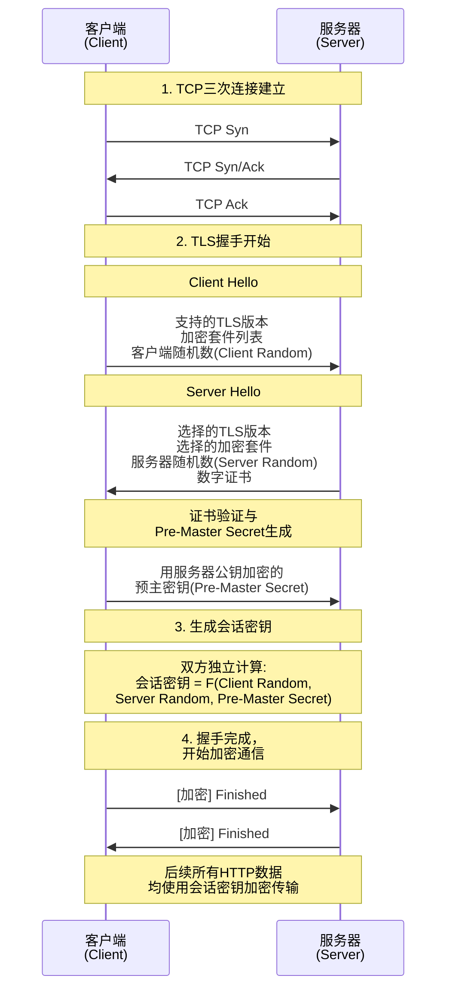
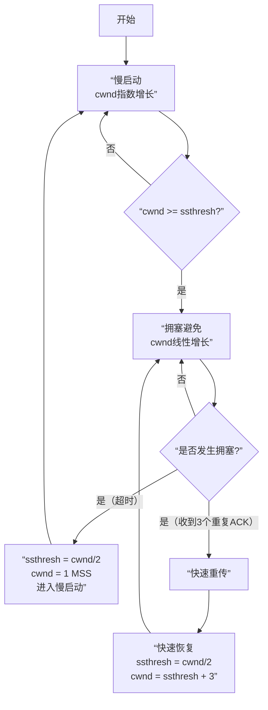
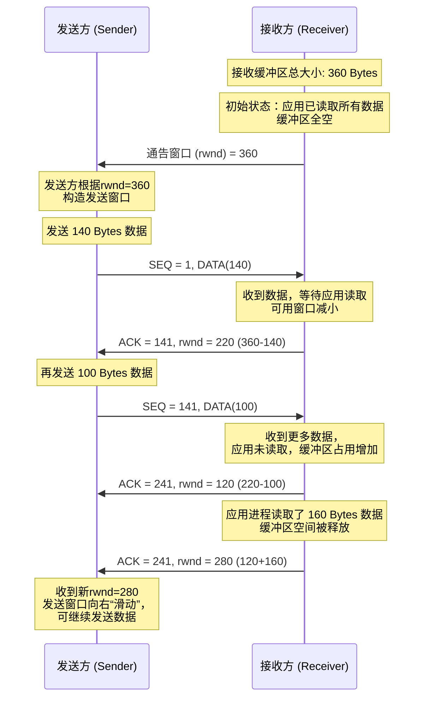
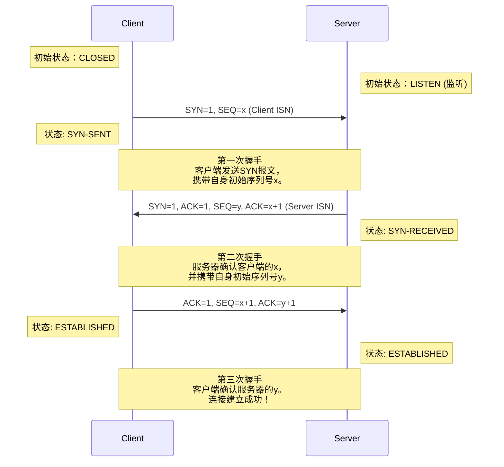
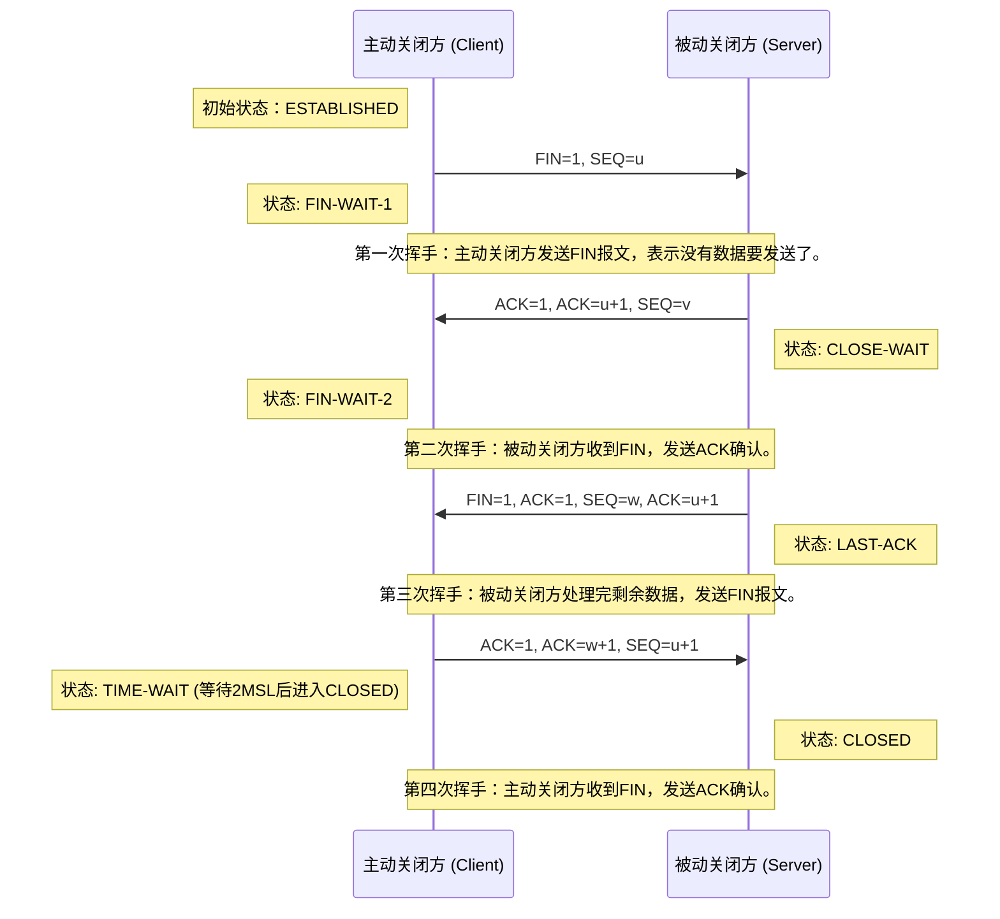
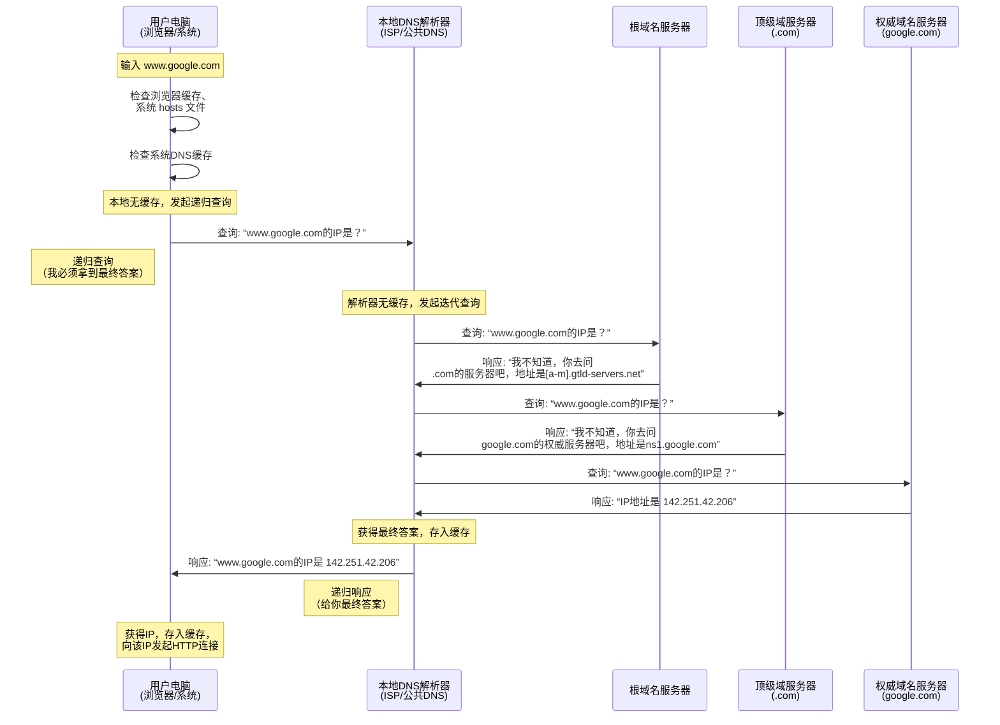
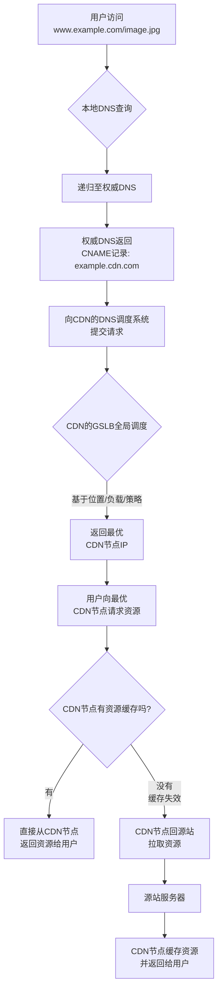
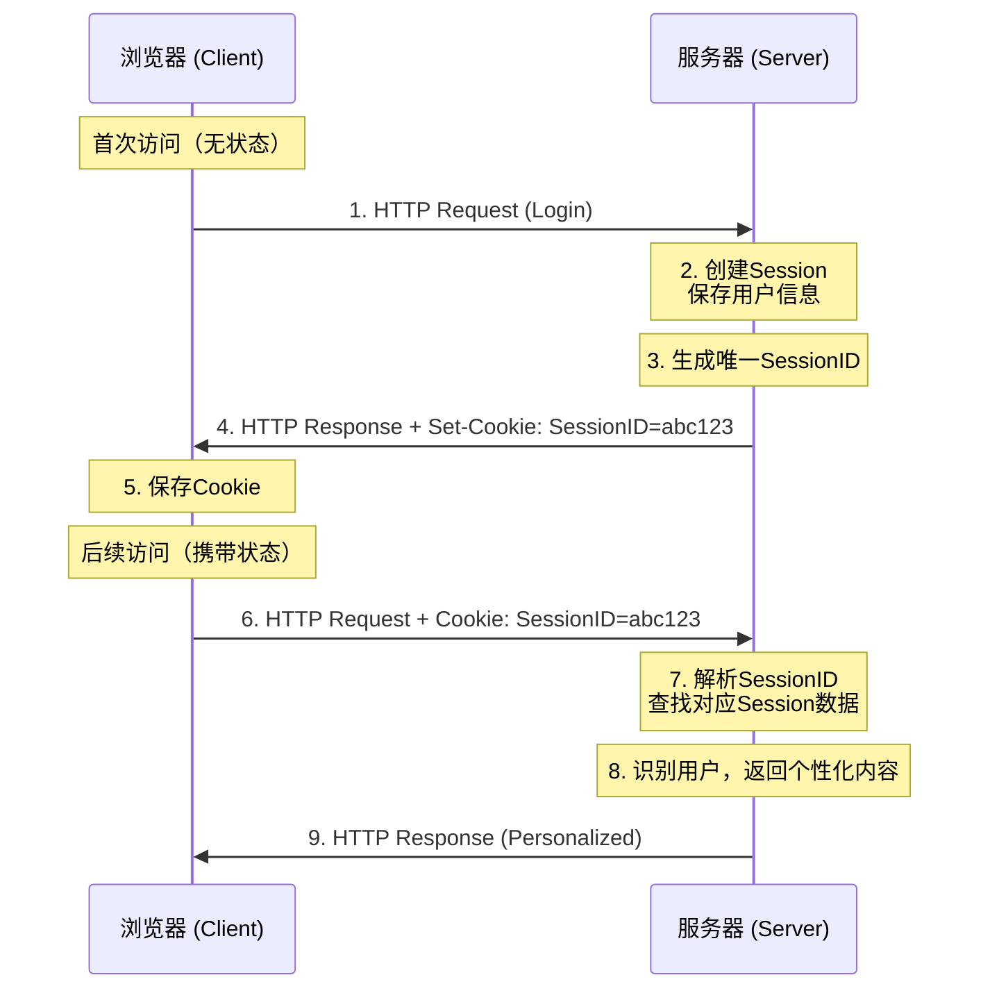
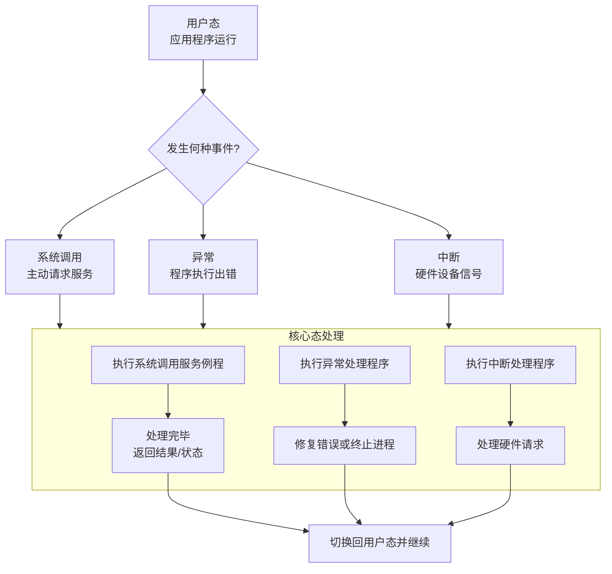

## 计算机网络

> 参考资料：小林coding——图解网络

### 1 介绍下OSI模型和TCP/IP模型的区别

关于OSI模型和TCP/IP模型，首先最核心的区别是：OSI是一个理论上的**参考模型**而TCP/IP是一个实践中运行的**协议模型**。

具体来讲他们的区别主要有以下几点：

首先是出生和目的不同，OSI模型由ISO提出的，是**“模型先行”**。它先设计一个分层框架来让大家遵守，是一个**理想化标准**。而TCP/IP模型源于美国国防部的APARNET项目，是**“协议先行”**。它是从实际应用中先有了TCP/IP这些协议再被总结为模型，是**互联网的事实标准**。

其次是结构层次不同，OSI有**7层**，从下至上分别为**物理层、数据链路层、网络层、传输层、会话层、表示层和应用层**。

- 物理层是最底层，它负责**在物理媒介上传输原始的比特流**，网线、光纤、集线器工作在这一层。
- 数据链路层负责**在同一个局域网内节点到节点的可靠传输**，它将比特流组装成“帧”，帧头包含MAC地址来寻址，帧尾包含校验码进行差错检测，交换机、网卡驱动工作在这一层。
- 网络层负责**在不同网络之间进行数据路由**，即选择最佳路径将数据包从源主机送到目标主机，IP协议、路由器是这一层的核心，其中**IP协议使用IP地址来标识主机和网络，并进行逻辑地址寻址**。
- 传输层负责**端到端的数据传输**，借助不同协议提供差异化服务，主要的传输层协议有TCP和UDP，**TCP是面向连接的、可靠的传输协议**，确保数据的正确性和完整性，**TCP的三次握手和四次挥手就是在这层实现的，**而**UDP则是无连接的、高效的传输协议**，适用于不要求可靠性的传输，如实时音频和视频流。
- 会话层负责**建立、管理和终止两个应用程序之间的会话**。
- 表示层充当翻译官的角色，负责数**据的格式转换、加密解密、压缩解压缩**。
- 应用层最靠近用户的一层，**为应用程序提供网络访问的接口，实现具体的网络服务**，如电子邮件（SMTP）、网页浏览（HTTP）、文件传输（FTP）等。

TCP/IP有4层，从下至上分别为网络接口层（**对应OSI的物理层和数据链路层**）、网络层、传输层和应用层（**整合了OSI模型中会话、表示、应用三层的功能**）。


### 2 从输入URL到页面展示发生了什么？

从输入URL到页面展示这个过程可以概括为：**URL解析 -> DNS域名解析 -> TCP握手 -> HTTP请求 -> 服务器处理响应 -> 浏览器解析渲染 -> TCP挥手**。

1. **URL解析：** 浏览器首先会解析输入的URL，比如 `https://www.example.com/index.html`。它会分析出协议（`https`）、主机名（`www.example.com`）、端口（`https`默认443）、路径（`/index.html`）等信息。

2. **DNS域名解析：** 浏览器需要知道目标服务器的IP地址才能通信。这个过程就是域名解析。
   - 浏览器会先检查**本地缓存**（浏览器缓存、操作系统缓存）。
   - 如果缓存没有，会向**本地配置的DNS服务器**（通常是路由器或运营商提供的）发起查询。
   - 查询是一个**递归过程**，可能经过根域名服务器、顶级域名（.com）服务器、权威域名服务器，最终获得IP地址。

3. **TCP握手：**拿到IP地址后，浏览器要通过**传输层的TCP协议**与服务器建立一个可靠的连接。**核心过程就是三次握手：**
   - 浏览器向服务器发送一个`SYN`（同步）包，表示请求建立连接。
   - 服务器收到后，回复一个`SYN-ACK`（同步确认）包，表示同意。
   - 浏览器再回复一个`ACK`包，握手完成。此时，TCP连接就建立好了。

​	**如果是HTTPS协议，还需要额外的TLS握手**，用于协商加密密钥、验证服务器证书等，确保通信安全。

4. **HTTP请求：**连接建立后，浏览器会构造一个**HTTP请求报文**，并通过这个TCP连接发送给服务器。请求报文主要包括：
   - **请求行：** 包含方法（GET/POST）、路径、HTTP版本。
   - **请求头：** 包含浏览器信息（User-Agent）、接受的数据类型（Accept）、Cookie等重要信息。
   - **请求体：** 如果是POST请求，会包含提交的表单数据等。

5. **服务器处理响应：**服务器接收到请求后，会根据路径和参数进行处理（比如调用后端应用、查询数据库）。处理完成后，服务器会返回一个**HTTP响应报文**。响应报文主要包括：
   - **状态行：** 包含状态码（如200成功、404未找到）。
   - **响应头：** 包含内容类型（Content-Type）、内容长度、设置Cookie等信息。
   - **响应体：** 即我们真正请求的数据，通常是HTML文档。

**浏览器解析渲染和TCP挥手是异步进行的，但核心在于页面的主要解析和渲染过程发生在TCP连接关闭之前。**

6. **浏览器解析渲染：**

   - **解析HTML，构建DOM树：** 浏览器从上到下解析HTML代码，将标签转换为树状结构的**DOM（文档对象模型）**。
   - **解析CSS，构建CSSOM树：** 同时，浏览器会解析CSS（包括外部样式表、内联样式），生成**CSSOM（CSS对象模型）**，它决定了每个DOM节点的样式。
   - **合并成渲染树：** 将DOM树和CSSOM树合并，生成一棵**渲染树**，它只包含需要显示在页面上的元素。
   - **布局：** 根据渲染树，计算每个节点在屏幕上的确切位置和大小。
   - **绘制：** 遍历渲染树，调用操作系统API，将每个节点绘制到屏幕上（像素化）。
   - **合成：** 现代浏览器有合成层机制，会将页面分成多个图层，分别绘制，最后再合成一个完整的页面，这样效率更高。

   **注：**HTML解析过程一旦遇到 `<script>` 标签，会**暂停DOM的构建**，先去下载（如果是外部脚本）和执行JavaScript。因为JS可能会修改DOM或CSSOM。所以通常建议将`<script>`标签放在body底部，或者使用`async`/`defer`属性来避免阻塞解析。

7. **TCP挥手：**当页面数据传输完成后，TCP连接会通过**四次挥手**的过程被安全地关闭。

   - 客户端发送一个 `FIN` 报文，并进入 `FIN_WAIT_1` 状态。
   - 服务器收到 `FIN` 后，立即回复一个 `ACK` 确认报文。此时，服务器可能还有数据要发送，进入 `CLOSE_WAIT` 状态。客户端收到 `ACK` 后进入 `FIN_WAIT_2` 状态。
   -  当服务器处理完所有剩余数据后，也发送一个 `FIN` 报文给客户端，然后进入 `LAST_ACK` 状态。
   -  客户端收到 `FIN` 后，发送最后一个 `ACK` 确认报文，并进入 `TIME_WAIT` 状态，等待一段时间（2MSL）后最终关闭。服务器收到这个 `ACK` 后便立即关闭连接。


### 3 HTTP请求报文和响应报文是怎样的，有哪些常见的字段？

HTTP报文是HTTP协议中用于在客户端和服务器之间传输数据的基本单位，它分为请求报文和响应报文两种。它们的结构类似，都包含三个部分：**起始行、头部字段和消息体**。

首先，是客户端发送给服务器的**请求报文**

1. **请求行**
   - 这是报文的第一行，包含了三个核心信息：
     - **方法：** 表示请求的目的，如 `GET`（获取资源）、`POST`（提交数据）、`PUT`（更新资源）、`DELETE`（删除资源）。
     - **请求目标：** 通常是URL的路径和查询参数，例如 `/index.html?name=value`。
     - **HTTP版本：** 如 `HTTP/1.1` 或 `HTTP/2`。
2. **请求头**
   - 紧接着请求行之后，每一行都是一个 `键: 值` 对，用于向服务器传递附加信息。
   - **常见重要字段包括：**
     - `Host`：**（必需）** 指定请求的服务器的域名和端口号。
     - `User-Agent`：告知服务器客户端的类型（如浏览器型号、操作系统）。
     - `Accept`：声明客户端可以处理的内容类型，如 `text/html, application/json`。
     - `Content-Type`：**（在POST/PUT等有体的请求中非常重要）** 声明请求体的数据类型，如 `application/json`、`application/x-www-form-urlencoded`。
     - `Cookie`：将本地存储的Cookie信息发送给服务器，用于身份验证等。
     - `Authorization`：用于携带身份验证凭证，如Bearer Token。
3. **请求体**
   - 在头部之后，用一个空行隔开，后面就是可选的请求体。
   - **GET请求通常没有请求体**，而 **POST、PUT等方法** 会使用请求体来发送数据，比如表单数据或JSON数据。

**举例：**

```json
GET /api/users/123 HTTP/1.1
Host: api.example.com
User-Agent: Mozilla/5.0...
Accept: application/json
Cookie: sessionId=abc123
```

*(这是一个GET请求，所以没有请求体)*

服务器收到请求后，会返回一个**响应报文**。

1. **状态行**
   - 响应的第一行，也包含三个部分：
     - **HTTP版本：** 如 `HTTP/1.1 200 OK`。
     - **状态码：** 一个三位数字，清晰表示请求的结果。这是最关键的信息。
     - **原因短语：** 对状态码的简短文字描述，如 `OK`。
2. **响应头**
   - 同样由 `键: 值` 对组成，描述了服务器的信息和返回的资源信息。
   - **常见重要字段包括：**
     - `Status Code`：状态码本身，如 `200`（成功）、`404`（未找到）、`500`（服务器内部错误）、`301`（永久重定向）。
     - `Content-Type`：**（非常重要）** 声明响应体的数据类型，如 `text/html; charset=UTF-8`、`application/json`。浏览器据此决定如何解析内容。
     - `Content-Length`：响应体的长度（字节）。
     - `Set-Cookie`：服务器要求客户端设置Cookie。
     - `Cache-Control`：指示客户端如何缓存响应资源，对性能优化至关重要，如 `max-age=3600`。
     - `Location`：在重定向（状态码3xx）时，指定新的URL地址。
3. **响应体**
   - 空行之后，就是服务器返回的实际数据，比如HTML文档、JSON数据或图片文件等。

**举例：**

```json
HTTP/1.1 200 OK
Content-Type: application/json; charset=utf-8
Content-Length: 56
Cache-Control: max-age=3600

{"id": 123, "name": "张三", "email": "zhangsan@example.com"}
```


### 4 HTTP有哪些请求方式？

HTTP协议定义了一组请求方法，也称为HTTP动词，用来表明要对目标资源执行的操作。**最核心和常见的是GET和POST**，但还有其他一些重要的方法。

1. **GET**
   - **语义：** **获取**资源。它应该是幂等的、安全的，意味着多次执行相同的GET请求，效果是一样的，且不会修改服务器数据。
   - **特点：** 请求参数直接附加在URL后面（查询字符串），有长度限制（因浏览器和服务器而异），可以被缓存、收藏为书签。
   - **场景：** 请求页面、搜索查询、获取数据等。
2. **POST**
   - **语义：** **提交**数据，用于创建新资源或触发一个处理数据的操作。它既不是安全的也不是幂等的。
   - **特点：** 数据放在请求体中，更适合传输敏感或大量数据（如图片、表单提交）。
   - **场景：** 用户登录、提交表单、上传文件。
3. **PUT**
   - **语义：** **更新**整个资源。客户端提供更新后的完整资源信息。它是幂等的。
   - **场景：** 更新用户的所有个人信息。
4. **DELETE**
   - **语义：** **删除**指定的资源。它也是幂等的。
   - **场景：** 删除一篇文章。
5. **PATCH**
   - **语义：** **部分更新**资源。客户端只提供需要修改的字段，而不是整个资源。它通常不是幂等的。
   - **场景：** 只更新用户的手机号码。
6. **HEAD**
   - **语义：** 与GET类似，但服务器**只返回响应头，不返回响应体**。用于获取资源的元信息（如大小、类型），检查资源是否存在或是否被修改。
   - **场景：** 在下载大文件前检查其大小或最后修改时间。


### 5 GET请求和POST请求的区别

GET和POST是HTTP协议中最基础的两种请求方法，它们的区别可以从**语义、用法、安全性、技术实现**等多个维度来理解。最核心的区别在于它们的**设计语义**不同。

- **GET** 的语义是 **“获取”** 数据。它用于从服务器检索资源，不应该对服务器状态产生任何副作用。它是 **“安全”** 且 **“幂等”** 的。
  - **安全**：意味着操作只是读取，不会修改数据。
  - **幂等**：意味着多次执行相同的GET请求，得到的结果都是一样的。
- **POST** 的语义是 **“提交/创建”** 数据。它用于向服务器提交数据，通常会改变服务器上的状态（如新建一个订单、更新数据库）。它既 **不是安全** 的，也 **不是幂等** 的。

**“幂等性”举例：** 比如我用GET请求查询用户信息，无论执行多少次，结果都一样。但如果我用POST请求创建一个新用户，执行两次就会创建两个用户，所以它不是幂等的。

基于上述语义，它们在具体实现上产生了差异。

| 特性          | GET                                                  | POST                                                         |
| :------------ | :--------------------------------------------------- | :----------------------------------------------------------- |
| **参数位置**  | 附在**URL**之后，作为**查询字符串**                  | 放在**请求体**中                                             |
| **数据大小**  | 受**URL长度限制**（浏览器和服务器不同，通常2KB-8KB） | **理论上无限制**，实际受服务器配置约束                       |
| **数据类型**  | 只允许ASCII字符                                      | 支持二进制数据（如文件上传）                                 |
| **安全性**    | **差**。参数直接暴露在URL、浏览器历史、服务器日志中  | **相对较好**。参数在请求体内，不直接可见（但仍是明文，HTTPS才是关键） |
| **缓存**      | **可被缓存**，可被收藏为书签                         | **默认不可缓存**，不可被收藏为书签                           |
| **后退/刷新** | 无害（因为是幂等的）                                 | 浏览器会提示“是否重新提交表单”（因为不是幂等的）             |


### 6 HTTP中常见的状态码有哪些？

HTTP状态码是服务器返回的3位数字代码，用来表示一个HTTP请求的处理结果。它分为五个大类，分别以不同的首位数字开头，这本身就便于我们快速定位问题。

1. **1xx (信息性状态码)：** 表示请求已被接收，需要继续处理。**在实际开发中较少直接接触**。
   - **例如：** `100 Continue`（客户端应继续发送请求体）。
2. **2xx (成功状态码)：** 表示请求已成功被服务器接收、理解并处理。这是我们最希望看到的。
   - **常见码：** 
     - `200 OK`：**最最常见的成功状态。** 请求成功，响应体中包含了请求的资源（如HTML页面、JSON数据）。
     - `201 Created`：**创建成功。** 通常在 `POST` 或 `PUT` 请求后返回，表示一个新资源已在服务器端被成功创建。**响应头 `Location` 字段通常会包含新资源的URL。**
     - `204 No Content`：**成功但无内容。** 服务器成功处理了请求，但不需要返回任何实体内容。例如，对于一些只需要成功信号而不需要返回数据的 `DELETE` 或 `UPDATE` 操作非常有用。
3. **3xx (重定向状态码)：** 表示需要客户端采取进一步的操作才能完成请求。通常与**缓存和URL重定向**相关。
   - **常见码：** 
     - `301 Moved Permanently`：**永久重定向。** 请求的资源已被**永久**移动到新的URL。搜索引擎会更新其链接到新的URL。**浏览器会缓存这个重定向。**
     -  `302 Found`：**临时重定向。** 请求的资源**临时**从不同的URL响应。搜索引擎不会更新链接。这是最常见的重定向类型。
     - `304 Not Modified`：**未修改。** 用于缓存控制。当客户端发起一个有条件的GET请求（例如请求头中带了 `If-Modified-Since`），如果资源自指定时间后未被修改，服务器会返回304，告诉客户端可以直接使用缓存的版本。**这可以极大地节省带宽。**
4. **4xx (客户端错误状态码)：** 表示请求含有错误（如语法错误）或无法完成。**责任通常在客户端**。
   - **常见码：** 
     - `400 Bad Request`：**错误请求。** 服务器无法理解请求的格式，通常是客户端发送的请求语法有误（例如，JSON格式错误）。
     - `401 Unauthorized`：**未认证。** 请求需要用户认证。客户端必须提供有效的身份验证凭证（如Bearer Token）。通俗讲，就是“你是谁？”的问题。
     - `403 Forbidden`：**禁止访问。** 服务器理解请求，但拒绝执行。与401不同，身份验证可能已经成功，但用户没有访问该资源的权限。通俗讲，就是“你无权做这个操作”。
     - `404 Not Found`：**未找到。** 服务器找不到请求的资源。可能是URL错误，或资源已被删除。
5. **5xx (服务器错误状态码)：** 表示服务器在处理请求的过程中发生了错误。**责任通常在服务器端**。
   - **常见码：**
     -  `500 Internal Server Error`：**通用服务器错误。** 服务器遇到了一个未曾预料的状况，导致了它无法完成对请求的处理。通常是后端代码出现了未捕获的异常。
     - `502 Bad Gateway`：**坏网关。** 当服务器作为网关或代理，从上游服务器收到无效响应。常见于Nginx等反向代理服务器后端的应用服务器（如Tomcat）挂掉或无法连接。
     - `503 Service Unavailable`：**服务不可用。** 服务器当前无法处理请求（由于超载或进行停机维护）。这通常是一个**临时状态**。

总结一下，理解状态码的关键在于抓住其首位数字的类别。在实际开发和调试中，状态码是我们定位问题的第一线索：

- **遇到4xx，我们应该优先检查前端发送的请求是否正确；**
- **遇到5xx，问题大概率出在后端服务上。**

这种分类能帮助我们快速协同排查问题。另外，像 `304` 对于性能优化，`201`、`204` 对于设计规范的RESTful API都至关重要。


### 7 什么是强缓存和协商缓存？

浏览器缓存是提升Web性能最关键的手段之一，它能显著减少重复请求、节省带宽、加快页面加载。浏览器缓存机制主要分为两大类：**强缓存**和**协商缓存**。它们的核心区别在于：**使用强缓存时，浏览器根本不会发送请求到服务器；而使用协商缓存时，浏览器会发送请求，但服务器会判断资源是否过期，从而决定是返回新资源还是告知浏览器使用本地缓存。**

**一、强缓存（Strong Cache）**

“首先，我们看强缓存。当浏览器第一次向服务器请求资源时，服务器可以在响应头中附带缓存规则，告诉浏览器这个资源可以缓存多久。”

**1. 核心概念：**

- **目标：** 在缓存有效期内，完全避免向服务器发送请求。
- **行为：** 浏览器直接读取本地磁盘或内存中的缓存副本，状态码为 `200 (from disk cache)` 或 `200 (from memory cache)`。**这个过程没有网络请求，因此速度极快。**

**2. 关键响应头字段（服务器返回的指令）：**

- **`Cache-Control`（HTTP/1.1 的规范，优先级更高）**
  - `max-age=31536000`： 资源的最大有效时间，单位是秒（例如一年）。
  - `no-cache`： **注意，这个名字有点误导性。它不代表不缓存，而是表示“可以使用缓存，但使用前必须经过服务器验证”**（即跳过强缓存，直接进入我们后面要讲的协商缓存）。
  - `no-store`： **真正的“不缓存”**。每次都要从服务器获取完整响应。
  - `public`： 响应可以被任何对象（浏览器、代理服务器）缓存。
  - `private`： 响应只能被单个用户的浏览器缓存，不能被代理服务器缓存。
- **`Expires`（HTTP/1.0 的遗留物）**
  - 它指定一个绝对的过期时间点，例如 `Expires: Wed, 21 Oct 2025 07:28:00 GMT`。
  - **缺点：** 依赖客户端和服务器的时间严格同步，如果用户修改了本地时间，会导致缓存失效判断不准。因此，在现代浏览器中，**`Cache-Control` 的 `max-age` 优先级更高。**

**强缓存流程：** 浏览器检查缓存，如果发现缓存未过期（根据 `Cache-Control` 或 `Expires`），则直接使用缓存，否则进入下一步——协商缓存。

**二、协商缓存（Negotiation Cache）**

“当强缓存失效（过期）后，浏览器就会携带缓存的‘标识’向服务器发起请求。这个阶段就是协商缓存。”

**1. 核心概念：**

- **目标：** 验证客户端缓存是否仍然有效，避免在资源未变化时重复下载整个资源。
- **行为：** 浏览器会发送请求到服务器。如果资源没变，服务器返回 `304 Not Modified`，响应体为空，浏览器则继续使用本地缓存。如果资源变了，服务器返回 `200 OK` 和新的资源。

**2. 关键字段对（一对请求头/响应头）：**

- **第一对：`Last-Modified` / `If-Modified-Since`**
  - **工作流程：**
    1. **第一次请求：** 服务器在响应头中返回 `Last-Modified: GMT`，表示资源最后的修改时间。
    2. **再次请求：** 浏览器将这个时间放在请求头 `If-Modified-Since: GMT` 中发给服务器。
    3. **服务器判断：** 服务器比较资源的当前修改时间和 `If-Modified-Since` 的时间。
       - 如果时间一致，返回 `304 Not Modified`。
       - 如果不一致，返回 `200 OK` 和新的资源，并更新 `Last-Modified`。
- **第二对：`ETag` / `If-None-Match`（更精确的方案）**
  - **为什么需要ETag？** `Last-Modified` 有一些缺陷：
    - 精度只到秒，如果文件在1秒内被多次修改，无法识别。
    - 文件内容可能没变，但修改时间变了（比如被touch了一下）。
  - **工作流程：**
    1. **第一次请求：** 服务器为资源生成一个唯一标识符（通常是哈希值），通过响应头 `ETag: "xyz123"` 返回。
    2. **再次请求：** 浏览器将这个标识符放在请求头 `If-None-Match: "xyz123"` 中发给服务器。
    3. **服务器判断：** 服务器计算当前资源的ETag，并与 `If-None-Match` 的值对比。
       - 如果一致，返回 `304 Not Modified`。
       - 如果不一致，返回 `200 OK` 和新的资源，并更新 `ETag`。
  - **`ETag` 的优先级通常比 `Last-Modified` 更高。**

我们可以把整个缓存决策过程想象成一个清晰的流程图：

1. 浏览器发起资源请求。
2. **检查强缓存：** 查看 `Cache-Control`/`Expires`。
   - 如果未过期，**直接使用本地缓存（200 from cache）**，流程结束。
   - 如果已过期，进入下一步。
3. **发起协商缓存请求：** 浏览器携带 `If-Modified-Since` 和 `If-None-Match` 向服务器发送请求。
4. **服务器验证：**
   - 如果资源未变，返回 `304 Not Modified`。浏览器使用本地缓存。
   - 如果资源已变，返回 `200 OK` 和新的资源及新的缓存标识。

**最佳实践：**

- 对于**不常变化的静态资源**（如JS、CSS库，图片字体），使用强缓存并设置很长的 `max-age`（例如一年）。同时，通过给文件名添加哈希指纹（如 `app.abc123.js`）来实现“覆盖式更新”：当文件内容变化时，文件名也变，就等于请求了一个全新的URL，从而绕过缓存。
- 对于**HTML文件**，通常使用 `Cache-Control: no-cache` 或较短的 `max-age`，使其走协商缓存，确保用户能及时获取到最新的页面。”


### 8 HTTP1.0和HTTP1.1的区别

HTTP/1.1 是 HTTP/1.0 的重大改进，它解决了许多 1.0 版本中影响性能和功能的关键问题。它们的区别主要体现在**连接方式、缓存机制、主机头支持、带宽优化**等多个方面。其中最核心的区别是**连接模型的改进**。

**一、核心区别：连接模型（Connection Model）**

这是最重要的区别，直接影响了网站性能。

- **HTTP/1.0：** 默认使用 **短连接**。
  - **行为：** 每次TCP连接只处理一个请求-响应周期。收到响应后，TCP连接立即关闭。
  - **缺点：** 加载一个包含多个资源（图片、CSS、JS）的网页时，需要频繁地建立和断开TCP连接。而TCP的三次握手和慢启动过程会带来巨大的性能开销和延迟。
- **HTTP/1.1：** 默认使用 **持久连接**。
  - **行为：** 在一个TCP连接上可以连续进行多个请求-响应，而不用每次都重新建立连接。连接会在空闲一段时间后或通过头字段显式关闭。
  - **优点：** 极大地减少了TCP握手和慢启动的次数，降低了延迟，提升了页面加载速度。这是HTTP/1.1最显著的性能优化。

**“管道化”是相关的进阶概念：**HTTP/1.1还尝试引入了**管道化**，允许客户端在同一个连接上连续发送多个请求，而不用等待上一个响应返回。但由于队头阻塞等问题，实践中很少被启用且现代浏览器默认禁用。

**二、其他关键区别**

1. 虚拟主机支持（Host Header）

- **HTTP/1.0：** 没有 `Host` 请求头。一个物理服务器（一个IP地址）只能托管一个网站。
- **HTTP/1.1：** **必须**包含 `Host` 请求头。这使得虚拟主机成为可能，即一个物理服务器可以通过不同的 `Host` 值来托管多个不同的网站（域名）。这是现代Web托管的基础。

2. 缓存控制机制

- **HTTP/1.0：** 缓存控制功能较弱，主要依赖 `Expires` 头（一个绝对过期时间）和 `If-Modified-Since`/`Last-Modified`。
- **HTTP/1.1：** 引入了功能强大的 `Cache-Control` 头，提供了更精细的缓存策略，如 `max-age`（相对过期时间）、`no-cache`、`no-store`、`public`、`private` 等。同时还引入了 `ETag`/`If-None-Match` 作为比 `Last-Modified` 更可靠的缓存验证器。

3. 带宽优化

- **HTTP/1.0：** 不支持断点续传。如果下载中断，必须重新开始。
- **HTTP/1.1：** 引入了 **范围请求**。
  - 通过 `Range` 和 `Content-Range` 头，客户端可以只请求资源的一部分。
  - **应用场景：**
    1. **断点续传：** 下载大文件时，可以从断开的地方继续下载。
    2. **视频/音频流：** 播放器可以跳转到指定时间点进行播放。

4. 状态码扩充

- **HTTP/1.0：** 定义了16个状态码。
- **HTTP/1.1：** 扩充到了24个，引入了更多描述性状态码，如：
  - `100 Continue`： 客户端在发送大请求体前，先询问服务器是否愿意接收。
  - `409 Conflict`： 请求与资源的当前状态发生冲突。
  - `410 Gone`： 资源已永久删除，比404更明确。

5. 错误处理

- **HTTP/1.0：** 连接出错时，只能简单地关闭连接。
- **HTTP/1.1：** 引入了 `Connection: close` 头，允许在传输完响应后优雅地关闭连接。还改进了错误消息的格式，使其更易于理解。

总而言之，HTTP/1.1 通过引入**持久连接**解决了HTTP/1.0最大的性能瓶颈，通过**Host头**奠定了现代互联网多站点共存的基础，并通过增强的缓存和带宽优化机制提供了更好的用户体验。这些改进使得HTTP/1.1成为统治了互联网近二十年的主流协议。

当然，HTTP/1.1本身也存在**队头阻塞**（Head-of-Line Blocking）等无法根治的问题，这最终催生了HTTP/2和HTTP/3的诞生。理解1.0到1.1的演进，有助于我们更好地把握后续协议的发展思路。


### 9 HTTP2.0与HTTP1.1的区别

HTTP/2 是 HTTP/1.1 的一次重大革新，它的目标不再是增加新的方法或状态码，而是**从根本上解决 HTTP/1.1 的性能瓶颈**。其核心区别在于，HTTP/2 从一种基于文本的、线性的协议，转变为了一种**二进制、多路复用**的协议。

**一、核心区别：二进制分帧层（The Binary Framing Layer）**

这是最根本的架构性改变，是其他所有优化的基础。

- **HTTP/1.1：** 是一个**文本协议**。请求和响应消息都是纯文本格式，用换行符分隔。虽然对人类可读，但对机器解析效率低，且容易出错（比如需要处理空白字符、大小写等）。
- **HTTP/2：** 是一个**二进制协议**。它在应用层（HTTP）和传输层（TCP）之间引入了一个**二进制分帧层**。

**这意味着什么？** HTTP/2 将请求和响应消息分解为更小的、独立的**帧**，例如 `HEADERS` 帧（存放头信息）和 `DATA` 帧（存放正文）。这些帧可以乱序发送，然后在另一端根据流标识符重新组装。

**这个改变带来了革命性的优势，最直接的就是解决了队头阻塞问题。**

**二、关键性能区别（由二进制分帧层衍生）**

1. 多路复用 vs. 队头阻塞

- **HTTP/1.1 的问题：** 存在**线头阻塞**。
  - 在同一个TCP连接上，虽然可以发送多个请求（持久连接），但**响应必须是按请求的顺序返回**。如果第一个请求的响应很慢（比如一个复杂的数据库查询），它会阻塞后面所有已经发送的请求的响应，即使后面的资源（如CSS、图片）已经准备好了。
- **HTTP/2 的解决方案：** **真正的多路复用**。
  - 基于二进制分帧，多个请求和响应可以**同时交错地进行**，而不会互相阻塞。
  - 浏览器只需要和服务器建立一个**TCP连接**，就可以并行地交互无数个请求和响应。这彻底解决了HTTP/1.1的队头阻塞问题，避免了为了并行而建立多个连接（HTTP/1.1的浏览器有6-8个域名连接数限制）所带来的巨大开销。

2. 头部压缩

- **HTTP/1.1：** 头部是纯文本的，且**大量重复**。每次请求都会携带 `Cookie`, `User-Agent`, `Accept` 等相同的头字段，造成巨大的带宽浪费（尤其是在移动网络上）。
- **HTTP/2：** 引入了 **HPACK** 压缩算法。
  - **静态表：** 预定义了61个常见头字段。
  - **动态表：** 在连接过程中，将首次出现的头字段存入动态表。
  - **Huffman编码：** 对值进行压缩。
  - **效果：** 头部大小通常能被压缩**85%-95%**，显著减少了开销。

3. 服务器推送

- **HTTP/1.1：** 完全是被动的“请求-响应”模式。浏览器必须解析HTML，发现需要哪些资源（如CSS、JS），然后再发起新的请求去获取。
- **HTTP/2：** 服务器可以**主动推送**资源给客户端。
  - **场景：** 当服务器收到对一个HTML页面的请求时，它知道客户端接下来一定会请求这个页面所依赖的CSS和JS文件。于是，它可以在返回HTML响应之前，主动将这些资源推送给浏览器。
  - **优势：** 减少了额外的请求往返延迟，让页面加载更快。

4. 流优先级

- **HTTP/1.1：** 虽然浏览器可以尝试优先下载重要的资源（如CSS），但受限于队头阻塞和有限的连接数，控制力很弱。
- **HTTP/2：** 客户端可以为每个“流”（即一个请求-响应交换）指定一个**依赖关系和权重**。
  - 例如，浏览器可以告诉服务器：“请优先处理HTML和CSS的流，然后再处理图片的流”。这使得浏览器能更智能地分配带宽，优化渲染速度。

总而言之，HTTP/2 并非通过增加新功能，而是通过**改变数据传输的基本方式**来提升性能。它用一个高效的二进制协议取代了低效的文本协议，并通过多路复用、头部压缩等机制，极大地降低了延迟和带宽消耗。

**需要注意的一点是：** HTTP/2 解决的是**应用层**的队头阻塞，但它的底层仍然基于TCP。如果单个TCP包在传输层丢失，会导致整个TCP连接等待重传，这被称为**TCP层的队头阻塞**。这也是为什么会有HTTP/3和QUIC协议的出现，它们旨在用UDP替代TCP，从根本上解决这个问题。

所以，理解HTTP/2的改进，能让我们看到网络协议优化从‘打补丁’（如HTTP/1.1的并发连接、域名分片）到‘重构架构’的演进思路。


### 10 HTTPS和HTTP有哪些区别

HTTP和HTTPS最核心的区别在于**安全性**。HTTP是超文本传输协议，而HTTPS可以理解为 **HTTP over SSL/TLS**，即在HTTP之下加入了一个安全层。这使得HTTPS能够解决HTTP三大安全问题：**窃听、篡改和冒充**。

**一、最核心的区别：安全性**

- **HTTP：** **明文传输**。数据在客户端和服务器之间以纯文本形式传送，就像寄送一张明信片。途中的任何中间人（网络运营商、公共Wi-Fi提供商、黑客）都可以轻松地看到所有内容，包括密码、信用卡号、聊天记录等。
- **HTTPS：** **加密传输**。通过SSL(Secure Sockets Layer)/TLS(Transport Layer Security)协议对传输的数据进行加密，就像把明信片装进一个只有收件人才能打开的保险箱。即使数据被截获，攻击者看到的也只是毫无意义的乱码。

**由此衍生出的三大安全能力：**

1. **加密：** 防止数据被窃听，保证**机密性**。
2. **完整性校验：** 防止数据在传输过程中被恶意篡改，保证**完整性**。
3. **身份认证：** 通过数字证书验证网站服务器的真实身份，防止你访问到假冒的钓鱼网站，保证**真实性**。

**二、具体技术区别**

| 特性         | HTTP                          | HTTPS                                                       | **区别解释**                                                 |
| :----------- | :---------------------------- | :---------------------------------------------------------- | :----------------------------------------------------------- |
| **协议**     | 应用层协议                    | **HTTP + SSL/TLS**                                          | HTTPS在HTTP和TCP之间增加了一个安全层（SSL/TLS）。            |
| **默认端口** | **80**                        | **443**                                                     | 这是服务器监听请求的默认端口号。                             |
| **URL开头**  | `http://`                     | `https://`                                                  | 浏览器地址栏会明确显示，现代浏览器对HTTP网站标记为“不安全”。 |
| **工作流程** | 直接建立TCP连接，发送HTTP报文 | 1. 建立TCP连接 2. **进行SSL/TLS握手** 3. 发送加密的HTTP报文 | HTTPS在传输数据前，需要先进行一个复杂的握手过程，以协商加密密钥、验证证书等。 |
| **数字证书** | 不需要                        | **必须由受信任的证书颁发机构（CA）签发**                    | 证书是验证服务器身份的关键，它包含了服务器的公钥和CA的签名。 |
| **性能开销** | 低                            | 相对较高                                                    | 由于加密、解密和握手过程，HTTPS会消耗更多的CPU和网络资源（但现代硬件优化已使差距微乎其微）。 |

**三、HTTPS的工作原理（SSL/TLS握手简析）**

HTTPS的安全核心是SSL/TLS握手，这个过程大致如下：

1. **ClientHello：** 客户端（浏览器）向服务器发送支持的加密套件列表和一个随机数。
2. **ServerHello：** 服务器选择加密套件，发送自己的**数字证书**和一个随机数。
3. **验证证书：** 客户端验证证书是否由可信CA签发、是否过期、域名是否匹配等。
4. **生成会话密钥：** 客户端用证书中的**公钥**加密一个预主密钥，发送给服务器。服务器用自己持有的**私钥**解密。双方利用三个随机数（两个Hello中的加上预主密钥）生成相同的**对称会话密钥**。
5. **加密通信：** 后续所有HTTP数据都使用这个高效的对称会话密钥进行加密传输。

**关键点：** 使用非对称加密（公钥/私钥）安全地交换对称密钥，再使用对称加密来高效地加密大量数据。

**四、为什么HTTPS在今天至关重要？**

除了显而易见的安全优势，HTTPS在现代Web中已经成为一项必备要求：

1. **浏览器标记：** Chrome、Firefox等主流浏览器会将所有HTTP网站明确标记为 **“不安全”** ，严重影响用户信任。
2. **SEO排名：** Google等搜索引擎明确将**HTTPS作为搜索排名的正面信号**，使用HTTPS的网站在排名上更有优势。
3. **现代Web API 的前提：** 很多强大的浏览器API（如**地理定位、Service Worker、支付请求API**等）都要求必须在HTTPS上下文环境中才能使用。
4. **性能和未来协议：** HTTP/2和HTTP/3协议在实践中几乎都要求基于HTTPS部署，它们能提供更好的性能。而且，HTTPS下的加密数据有助于避免某些网络运营商的消极流量干扰。

总而言之，HTTP和HTTPS的区别远不止于一个‘S’。这个‘S’代表的是**Security**，它通过加密、认证和完整性保护，将Web从开放的明文世界带入了安全的加密时代。在当今环境下，HTTPS不再是一个‘可选项’，而是构建可信、高性能、符合标准的网站的**基石**。

从HTTP切换到HTTPS的成本已经非常低（有Let‘s Encrypt这样的免费证书颁发机构），但收益是巨大的，它保护了用户，也保护了网站自身。


### 11 HTTPS的工作原理(HTTPS建立连接的过程）

HTTPS的工作原理核心是**SSL/TLS握手协议**。这个过程的主要目标有三个：**1）验证服务器身份；2）协商加密套件；3）安全地生成一个对称会话密钥**。整个过程可以概括为‘用非对称加密安全地交换对称密钥’。

**一、核心思想：为什么需要握手？**

HTTP是明文传输的，极不安全。直接使用对称加密（用同一把密钥加密和解密）虽然高效，但如何把密钥安全地告诉对方呢？在网上‘寄送钥匙’的过程中，钥匙本身就可能被窃听。

HTTPS的握手过程巧妙地解决了这个问题：它先使用**非对称加密**（公钥和私钥）来安全地传递‘对称加密的钥匙’，之后双方再使用这把‘钥匙’进行高效的**对称加密**通信。

**二、TLS握手过程详解（最关键的部分）**



**第一步：TCP连接建立（TLS握手的基础）**

- 客户端和服务器首先进行标准的**TCP三次握手**，建立一个可靠的TCP连接。这是所有后续TLS对话的基础。

**第二步：TLS握手开始 - `Client Hello`**

- 客户端向服务器发送一条消息，包含：
  1. **支持的TLS版本**：如TLS 1.2或TLS 1.3。
  2. **支持的加密套件列表**：一个密码学算法的组合，比如 `TLS_ECDHE_RSA_WITH_AES_128_GCM_SHA256`。
  3. **客户端随机数**：一个由客户端生成的随机字符串，后续用于生成会话密钥。

**第三步：服务器响应 - `Server Hello`**

- 服务器选择合适的参数，并返回给客户端：
  1. **确认的TLS版本**。
  2. **选择的加密套件**。
  3. **服务器随机数**：一个由服务器生成的随机字符串。
  4. **数字证书**：这是**最关键的一步**。证书中包含了服务器的公钥、域名、颁发机构（CA）等信息。

**第四步：客户端验证证书与生成预主密钥**

- **证书验证**：客户端（浏览器）会做以下几件事：
  - 检查证书是否由受信任的证书颁发机构（CA）签发。
  - 检查证书是否在有效期内。
  - 检查证书上的域名是否与正在访问的域名一致。
  - （可选）检查证书是否已被吊销。
  - **如果验证失败，浏览器会弹出严重警告。**
- **生成预主密钥**：验证通过后，客户端会再生成一个随机字符串，称为 **预主密钥**。
- **加密预主密钥**：客户端使用证书中提供的**服务器公钥**对这个预主密钥进行加密，然后发送给服务器。

**第五步：服务器解密预主密钥**

- 服务器用自己的**私钥**解密客户端发来的信息，得到预主密钥。
- **关键点到此为止**：至此，客户端和服务器都拥有了三个共同的值：**客户端随机数、服务器随机数、预主密钥**。而窃听者虽然能看到加密后的预主密钥，但由于没有服务器的私钥，无法解密它。

**第六步：生成会话密钥**

- 客户端和服务器**分别使用相同的算法**，根据刚才的三个随机数（Client Random, Server Random, Pre-Master Secret）生成一把相同的**对称会话密钥**。后续所有的应用数据都将使用这把密钥进行加密和解密。

**第七步：握手结束与加密通信**

- 双方互相发送一条用会话密钥加密的 `Finished` 消息，验证之前的握手过程是否成功，加解密环境是否正常。
- 验证通过后，**TLS隧道就此建立**。之后，所有的HTTP请求和响应都会在这个安全的、加密的隧道中进行传输。

所以，我们可以把整个握手过程总结为：

1. **打招呼**（Hello）：交换随机数和加密能力。
2. **验明正身**（Certificate）：服务器出示证书，客户端验证身份。
3. **秘密送货**（Key Exchange）：客户端用服务器公钥加密‘密钥种子’（预主密钥）并送出。
4. **配制钥匙**（Key Generation）：双方用三个随机数生成同一把对称会话密钥。
5. **安全通话**（Encrypted Communication）：开始用对称密钥进行高效、安全的加密通信。

**其精妙之处在于**：它结合了非对称加密（安全性高但速度慢，用于交换密钥）和对称加密（速度快，用于加密大量数据）的优点，完美地解决了密钥分发的安全问题。

另外值得一提的是，**TLS 1.3** 协议为了提升性能和安全，极大地简化了握手过程，将往返次数从2-RTT减少到了1-RTT，甚至支持0-RTT模式，但核心思想依然不变。


### 12 TCP连接如何确保可靠性

TCP协议是通过一系列复杂的机制来共同确保数据传输的可靠性的。其核心思想可以概括为：**‘数据有序、传输确认、丢包重传、流量控制’**。它就像一个非常可靠的快递系统，确保每个包裹都按顺序、不丢失、不重复地送达。

**一、可靠性四大支柱**

1. **数据分段与序列号**

- **机制：** TCP将应用程序传来的数据流分割成最适合发送的**数据段**，并为每个字节分配一个唯一的**序列号**。
- **目的：**
  - **解决乱序问题：** 即使网络中的数据包到达顺序是乱的（比如后发的包先到），接收方也可以根据序列号**重新排序**，组装成原始数据流。
  - **作为确认的基础：** 序列号是后续确认机制的依据。

2. **确认应答与重传机制**

这是可靠性的最核心环节。

- **机制：**
  1. **确认应答：** 接收方收到数据后，会向发送方回送一个**确认报文**。这个ACK报文里包含一个值，意思是“我已經成功收到了序列号在这个值之前的所有数据”。
  2. **超时重传：** 发送方在发送一个数据段后，会启动一个**重传计时器**。如果在计时器超时之前没有收到对应的ACK确认，发送方就认为这个数据包在传输途中丢失了，于是会**重新发送**该数据包。
- **目的：** 解决**数据包丢失**的问题。

3. **流量控制**

- **机制：** 使用**滑动窗口协议**。接收方在每次发送ACK时，会通过 **`TCP Window`** 字段告诉发送方自己当前**接收缓冲区**的剩余空间大小。发送方发送的数据量不能超过这个窗口的大小。
- **目的：** 防止发送方发送数据过快、数据量过大，导致接收方的缓冲区溢出，从而引发丢包。这相当于接收方对发送方说：“你慢点发，我这边快处理不过来了。”

4. **拥塞控制**

- **机制：** 这是为了防止网络本身过载而设计的全局性策略，而不仅仅是考虑收发双方。它通过感知网络当前的拥堵情况，动态调整发送速率。主要包括四个算法：
  1. **慢启动：** 连接刚开始时，从一个很小的窗口开始，每收到一个ACK，窗口大小就指数级增长，快速探测网络容量。
  2. **拥塞避免：** 当窗口增长到一个阈值后，转为线性增长，谨慎地增加数据量。
  3. **快速重传：** 如果发送方连续收到3个重复的ACK，就判断某个包可能丢失了，会立即重传该包，而不必等待超时。这大大提高了效率。
  4. **快速恢复：** 在快速重传之后，不进行激进的慢启动，而是将窗口降到一个合理值，直接进入拥塞避免阶段。
- **目的：** 保护整个网络，避免因为所有TCP连接都无节制地发送数据而导致网络全局性瘫痪。

总结一下，TCP的可靠性不是由单一机制保证的，而是一个**协同工作的系统**：

- **序列号**解决了**乱序**问题。
- **确认和重传**解决了**丢失**问题。
- **流量控制**解决了**接收方处理能力不足**的问题。
- **拥塞控制**解决了**网络路径拥堵**的问题。

可以打一个比方：TCP就像一个既有责任心又很聪明的快递员（**可靠性**）。他不仅会给每个包裹贴上编号（**序列号**），要求收件人每收到一个就签收回执（**确认应答**），如果没收到回执就重新投递（**超时重传**）。他还会根据你家快递柜的大小（**接收窗口**）来决定一次送多少包裹，并且会根据整个城市的交通状况（**网络拥塞**）来调整自己的行车路线和速度，避免堵死在路上。

正是这种多层次、精细化的设计，使得TCP成为互联网基石般的可靠传输协议。


### 13 既然提到了拥塞控制，那你能说说说拥塞控制是怎么实现的吗？

TCP的拥塞控制本质上是一个**闭环反馈系统**。发送方通过感知网络状态（如丢包），来动态调整其发送数据的速率，从而避免网络过载。它的实现不依赖于网络的明确通知，而是基于一个**探测-调整**的哲学。其核心是维护一个关键变量——**拥塞窗口**，并通过几个经典算法来调整它。

一、**核心概念：拥塞窗口（cwnd）**

- **是什么：** 除了接收方告知的**接收窗口**，发送方内部还维护着一个 **拥塞窗口**。发送方实际能发送的数据量，是这两个窗口的最小值。
  - `实际发送窗口 = min(接收窗口, 拥塞窗口)`
- **为什么：** **接收窗口** 只关心接收方的处理能力，而 **拥塞窗口** 是发送方根据自己感知到的网络拥堵程度，进行的自我限制。这是防止网络瘫痪的关键。

二、**拥塞控制的四大算法（详细阐述）**



1**. 慢启动**

- **触发时机：** 建立新连接或发生**超时重传**（最严重的拥塞信号）之后。
- **行为：**
  1. 初始 `cwnd` 通常很小（如1个MSS，最大报文段长度）。
  2. 每收到一个**有效的ACK**，`cwnd` 就增加1个MSS。
  3. 这导致 **`cwnd` 呈指数级增长**（1, 2, 4, 8, 16...）。就像开车时先轻踩油门，快速加速。
- **目的：** 在连接开始时**快速探测**当前网络的可用带宽，但又不会一开始就注入大量数据冲击网络。

2. **拥塞避免**

- **触发时机：** 当 `cwnd` 增长到一个**慢启动阈值** 时，就从“慢启动”阶段切换到“拥塞避免”阶段。
- **行为：**
  1. `ssthresh` 是一个动态变化的阈值，初始值通常较大。
  2. 在拥塞避免阶段，每收到一个**有效的ACK**，`cwnd` 只增加 `1/cwnd`。
  3. 这导致 **`cwnd` 呈线性增长**（每次RTT时间大约增加1个MSS）。就像车速上来后，改为缓踩油门，平稳加速。
- **目的：** 在接近网络容量时，转为谨慎的线性增长，避免因激进增长而瞬间压垮网络。

3. **快速重传与快速恢复**

这是为了优化对轻度拥塞的反应，避免等待超时带来的性能损失。

- **触发时机：** 当发送方**连续收到3个重复的ACK**。这意味着网络可能只丢失了个别包，但网络通路仍然是通的（后续包还能到达接收方）。
- **行为：**
  1. **快速重传：** 发送方不必等待超时计时器，**立即重传**对方未收到的那个数据包。
  2. **快速恢复：**
     - 将 `ssthresh` 设置为当前 `cwnd` 的一半。`ssthresh = cwnd / 2`
     - 然后，**并不将 `cwnd` 重置为1**，而是设置为新的 `ssthresh` 加上3（因为收到了3个重复ACK，表明有3个包已离开网络）。`cwnd = ssthresh + 3`
     - 随后直接进入**拥塞避免**阶段。
- **目的：** 高效处理单个包丢失，避免进入耗时的慢启动过程，保持较高的传输效率。

所以，整个拥塞控制的过程可以看作发送方在不断地进行**网络探测**：

- **慢启动**是**积极探测**，快速寻找带宽上限。
- **拥塞避免**是**谨慎探测**，在逼近上限时小心试探。
- **发生拥塞（丢包）是最终的反馈信号**：
  - **超时重传**（严重拥塞）：认为网络状况极差，采取最保守策略，**回归慢启动**。
  - **快速重传/恢复**（轻微拥塞）：认为网络状况尚可，采取优化策略，**降速后直接进入拥塞避免**。

这种设计体现了TCP的**合作精神**：每个TCP连接都通过这种自律的算法，主动为网络让路，从而实现了整个互联网的全局稳定性。后来的**BBR**等新算法则尝试通过测量带宽和RTT来更精确地控制速率，但经典的四算法模型仍是TCP的基石。


### 14 TCP流量控制是怎么实现的？

TCP的流量控制是通过**滑动窗口协议**来实现的。其核心目标是**防止发送方发送数据过快、过多，导致接收方的应用程序来不及处理，从而耗尽接收方的缓冲区**。可以把它想象成接收方在不断地对发送方说：‘我这边还能收多少数据，你就发多少。’

**一、核心机制：滑动窗口协议**



如上图所示，整个过程的核心在于一个变量：**接收方窗口**。

1. **接收方窗口：** 接收方在每次发送ACK确认报文时，都会通过TCP首部中的 **`window`** 字段，告知发送方自己**接收缓冲区**的剩余空间大小。这个值就是 **`rwnd`**。
2. **发送窗口限制：** 发送方在发送数据时，必须保证**已发送但未确认的数据量** 不能超过接收方通告的这个 **`rwnd`** 值。
3. **动态调整：** 随着接收方应用程序从缓冲区中读取数据，缓冲区空间被释放，**`rwnd`** 会变大。接收方会通过新的ACK报文将这个更大的窗口通告给发送方，发送方就可以据此发送更多数据。反之，如果接收方处理变慢，**`rwnd`** 变小，发送方就必须减慢发送速度。

**二、关键细节与潜在问题**

1. **零窗口与死锁**

- **问题：** 如果接收方的缓冲区满了，它会通告一个 **`rwnd = 0`** 的窗口。发送方收到后必须停止发送数据。如果之后接收方缓冲区有空闲了，它该如何通知发送方呢？因为发送方已经停止发送，接收方也就没有机会通过ACK来通告新窗口了，这可能导致**死锁**。
- **解决方案：** TCP设计了**零窗口探测** 机制。
  - 当发送方收到零窗口通告后，会启动一个**持续计时器**。
  - 计时器超时后，发送方会向接收方发送一个**仅1字节**的探测报文。
  - 接收方收到探测报文后，会回复一个ACK，并在其中携带当前的窗口大小（如果缓冲区已有空间，`rwnd` 就不再是0）。
  - 这样，死锁就被打破了。

2. **糊涂窗口综合征**

- **问题：** 如果接收方应用程序一次只从缓冲区读取几个字节，然后它就通告一个很小的窗口（比如几个字节）。发送方得知后，立即发送这几个字节的数据。这导致网络上传输的都是有效数据很少的小报文，**传输效率极低**。这就好比用巨型货轮只运送一个快递盒，极其浪费。
- **解决方案：** 两端都有优化策略：
  - **接收方策略：** 不通告太小的窗口。它会等待，直到缓冲区有**足够大**的空间（如缓冲区大小的一半或一个MSS）时，才通告窗口。
  - **发送方策略（Nagle算法）：** 在连接上最多只能有一个**已发送但未确认**的小报文。在收到该报文的确认之前，如果需要发送新的小数据，发送方会将这些小数据缓存起来，合并成一个更大的报文再发送。

所以，总结一下TCP流量控制的实现：

- **核心机制：** **滑动窗口协议**，通过接收方通告的 **`rwnd`** 来动态控制发送方的发送速率。
- **关键保障：** **零窗口探测** 解决了窗口通告丢失导致的死锁问题。
- **性能优化：** 通过应对**糊涂窗口综合征**，避免了大量小报文传输，保证了网络效率。

最后，值得一提的是，流量控制常常与**拥塞控制**一起被问到。它们的区别在于：

- **流量控制**是**端到端**的机制，关心的是**接收方**的处理能力，是一个‘接收方主导’的速度限制。
- **拥塞控制**是**全局性**的机制，关心的是**整个网络路径**的承载能力，是一个‘发送方自律’的速率调整。

在实际的TCP发送中，发送方的真实窗口大小是取 `min(拥塞窗口, 接收窗口)`，两者共同协作，既保证了网络不瘫痪，也保证了接收方不被压垮。


### 15 UDP怎么实现可靠传输

UDP本身是**无连接、不保证可靠性**的传输层协议，这既是它的缺点也是它的优点——**极高的效率和灵活性**。如果我们要在UDP之上实现可靠传输，实际上就是在应用层‘重新实现’一套TCP的核心机制，但我们可以根据具体场景进行定制和优化。

**一、核心思想：在应用层模拟TCP机制**

“实现可靠UDP的核心思路是：**在UDP这个简单的‘数据报’传输通道之上，通过在应用数据中添加自定义包头，来实现序号、确认、重传等逻辑。** 就像我们用原始的砖块（UDP）来盖一栋有抗震结构（可靠传输）的房子。”

**二、关键技术与实现方案**

以下是要在应用层实现的几个核心模块，我们可以对比TCP来阐述：

1. **确认应答机制**

- **目标：** 解决**数据包是否到达**的问题。
- **实现：**
  - 为每个发送的数据包分配一个唯一的、递增的**序列号**。
  - 接收方收到数据包后，必须向发送方回送一个**确认包**，ACK包中指明它确认收到的序列号。
  - **优化（类比TCP）：** 可以采用**累计确认**（如ACK 100表示100之前的数据都收到了）或**选择性确认**（SACK，明确指出收到了哪些不连续的数据块），后者能更高效地应对乱序和丢包。

2. **重传机制**

- **目标：** 解决**数据包丢失**的问题。
- **实现：**
  - **超时重传：** 发送方每发送一个数据包，就启动一个定时器。如果在设定的**超时时间**内没有收到对应的ACK，就重新发送该数据包。RTO的计算是一个关键点，可以参考TCP的算法（基于RTT动态调整）。
  - **快速重传：** 如果发送方连续收到3次对同一个序列号的ACK（意味着这个包之后的包都收到了，但唯独它丢了），则立即重传该数据包，而不必等待超时。这能大大降低重传延迟。

3. **流量控制**

- **目标：** 防止**发送方发送过快，压垮接收方**。
- **实现：**
  - 模仿TCP的**滑动窗口协议**。接收方在ACK包中通告自己的**接收窗口大小**，表示自己还能缓存多少数据。
  - 发送方需要维护一个发送窗口，其大小不能超过接收方通告的窗口，从而实现速率匹配。

4. **拥塞控制（高级特性，体现深度）**

- **目标：** 防止**发送方压垮网络**，这是体现可靠传输方案是否成熟的关键。
- **实现：**
  - 同样可以实现类似TCP的**拥塞控制算法**，如慢启动、拥塞避免、快速恢复等。
  - 通过感知丢包（作为网络拥塞的信号）来动态调整发送速率。**这是很多自制可靠UDP协议最容易忽略但也最重要的部分。**

5. **连接管理**

- **目标：** 建立和终止有序的通信上下文。
- **实现：**
  - 可以模拟TCP的**三次握手**来建立连接，同步初始序列号，交换参数（如窗口大小）。
  - 同样可以通过类似**四次挥手**的机制来保证双方都能安全地释放连接。

**三、实际应用案例（升华回答）**

事实上，这种思路已经有很多非常成功的现实案例，它们都是为了解决TCP在特定场景下的瓶颈而生的：

1. **QUIC协议：** 这是最著名的例子。Google提出的QUIC协议就是基于UDP，在用户空间实现了包括可靠传输、安全加密（集成了TLS）等一整套机制。它已经成为HTTP/3的底层标准，旨在减少连接建立延迟，改善移动网络下的性能。
2. **音视频实时通信：** 像WebRTC这样的技术，它在UDP之上实现了**部分可靠**的传输。比如，对于关键的控制信息（如建立连接的信令）要求绝对可靠，但对于视频帧数据，如果重传耗时太长导致延迟，则可以选择性丢弃，优先保证**实时性**。这体现了可靠UDP设计的灵活性。
3. **在线游戏：** 很多实时对战游戏使用可靠UDP。游戏状态更新对延迟极其敏感，但允许偶尔的丢包（比如某一帧的位置信息丢了，可以用下一帧插值）。开发者可以定制重传策略，比如只重传最重要的数据包（如玩家开枪指令），而对次要数据（如粒子特效）则采用不可靠传输。

**四、总结与对比**

所以，总结一下：

- **能否实现？** **能**。核心是在应用层重新实现**序列号、确认、重传、窗口控制**这四大支柱。
- **与TCP的区别？** 这样做不是为了替代TCP，而是为了**定制和优化**。我们可以摆脱TCP内核实现的‘黑盒’，根据业务需求（如极低延迟、部分可靠、多路复用无队头阻塞）来设计更高效的协议。
- **代价是什么？** **实现复杂度极高**。需要处理各种边界条件，调试困难。因此，除非有非常强烈的性能需求，否则直接使用TCP是更明智的选择。


### 16 TCP连接三次握手的过程，为什么是三次，可以是两次或者更多吗？

TCP的三次握手是建立连接的过程，其根本目的是为了**确保通信双方都具有数据收发的能力，并同步初始序列号**。‘三次’这个数字是在**保证可靠性的前提下，实现连接建立的最低成本方案。**

**一、三次握手的过程（简单回顾）**

首先，我们需要明确三次握手交换了什么信息，其核心是同步序列号（Sequence Number, SEQ）和确认号（Acknowledgment Number, ACK）。整个过程如下图所示：



(ISN - Initial Sequence Number)

关键点在于：

- **序列号（SEQ）**：是字节流的编号，用于解决乱序、重复等问题。每次握手，发送方都会通告自己的初始序列号。
- **确认号（ACK）**：是期望收到的下一个字节的序列号，值为`收到的序列号+1`，表示之前的数据已正确接收。

**二、为什么不能是两次握手？（核心论证）**

这是回答的重点，需要从两个关键角度阐述两次握手的致命缺陷。

1. **防止已失效的连接请求报文突然传送到，导致资源浪费和错误。**

- **场景模拟：**
  1. 客户端发送一个SYN请求（SEQ=x）来建立连接，但这个包在网络中**滞留**了。
  2. 客户端超时后重发一个SYN（SEQ=y），这次成功建立连接，传输数据后关闭连接。
  3. 此时，那个**滞留的SYN包（SEQ=x）** 终于到达了服务器。
- **两次握手的结果：** 服务器收到这个旧的SYN，会认为是一个新的连接请求，于是回复SYN-ACK（ACK=x+1）并**直接进入ESTABLISHED状态**，开始等待接收数据。
- **问题：**
  - 服务器为这个“幽灵连接”分配了资源（缓冲区、控制块），但客户端根本不会理会这个回应（因为它早已完成通信）。
  - 这将导致服务器端**资源被白白占用**，如果这种情况频繁发生，服务器可能因资源耗尽而无法服务，这是一种**安全漏洞**。

2. **确保双向连接可靠建立，同步双方序列号。**

- **两次握手的结果：** 服务器在发送完SYN-ACK后，就单方面认为连接已建立。但它**无法确认客户端是否收到了自己的SYN-ACK**，以及客户端是否准备好了接收数据。
- **问题：**
  - 如果服务器的SYN-ACK报文在途中丢失，客户端根本不知道连接已建立，不会发送数据。
  - 而服务器却一直在等待数据，这同样会造成资源浪费。
  - 更重要的是，TCP是全双工通信，需要确保**双方的初始序列号都得到确认**。两次握手只确认了客户端的序列号，服务器的序列号并未得到客户端的确认。

**结论：两次握手无法阻止历史连接问题，且只能保证单向连接可靠，是一个“半开连接”，不可接受。**

**三、为什么不需要四次（或更多）握手？**

- **核心原则：** 通信协议的设计追求**在满足需求的前提下尽可能简单高效**。三次握手已经完美地达到了所有目标：
  1. **确认了客户端具备收发能力**（第一次和第三次）。
  2. **确认了服务器具备收发能力**（第二次和第三次）。
  3. **双方初始序列号都得到了确认和同步**。
  4. **有效防止了失效请求造成的错误**。
- **四次握手是多余的：** 在三次握手之后，连接已经双向可靠建立。如果非要进行第四次握手（比如服务器再确认一次客户端的ACK），它并不会带来任何新的信息或额外的可靠性，只会增加连接的延迟和开销。**TCP的设计哲学是‘够用就好’。**

**四、总结与升华（回答亮点）**

“所以，我们可以这样总结：

- **一次握手**：完全不可靠，对方是否存在都不知道。
- **两次握手**：**致命缺陷**在于无法防止失效请求造成的资源浪费，且只能保证单向连接可靠。
- **三次握手**：是**理论上的最小值**，它完美地解决了双向序列号同步、信道能力确认和历史连接问题，实现了可靠的全双工通信基础。
- **四次握手**：是**不必要的冗余**，因为三次握手已经提供了足够的保证，第四次握手不会增加任何可靠性。

这就好比两个人打电话：

- **两次握手**：A说‘喂，听得到吗？’B说‘听得到！’但B不确定A是否听到了自己的回答。（B在单向等待）
- **三次握手**：A说‘喂，听得到吗？’B说‘听得到！你听得到我吗？’A说‘我也听得到！’（双方都确认了通信畅通）。

因此，‘三次’是可靠性与效率之间最优雅的平衡点。”


### **17 TCP连接四次挥手的过程，为什么是四次？**

TCP的四次挥手是连接终止的过程。之所以需要四次，根本原因在于 **TCP连接是全双工的，每个方向必须独立关闭**。‘四次’是保证双方数据都能发送完毕、并安全关闭连接的最优方案。

**一、四次挥手的过程（详细步骤）**

首先，我们通过一个序列图来清晰展示四次挥手的过程，这有助于理解为什么需要四个步骤：



具体步骤解析：

1. **第一次挥手（FIN）**：
   - 主动关闭方（假设是客户端）发送一个FIN报文（FIN标志位设为1），序列号为`u`。这表示客户端告诉服务器：“我（客户端到服务器方向）没有数据要发送了。”
   - 客户端状态由`ESTABLISHED`变为`FIN-WAIT-1`。
2. **第二次挥手（ACK）**：
   - 服务器收到FIN后，必须进行确认。它发送一个ACK报文，确认号为`u+1`，序列号为`v`。这表示：“我收到了你的关闭请求。”
   - 服务器状态由`ESTABLISHED`变为`CLOSE-WAIT`。
   - 客户端收到这个ACK后，状态由`FIN-WAIT-1`变为`FIN-WAIT-2`。**此时，从客户端到服务器方向的连接已经关闭**，客户端不能再发送数据，但服务器可能还有数据要发送给客户端。
3. **第三次挥手（FIN）**：
   - 当服务器也准备好关闭连接时（即它也没有数据要发送了），它会发送自己的FIN报文，序列号为`w`，确认号仍为`u+1`。
   - 服务器状态由`CLOSE-WAIT`变为`LAST-ACK`。
4. **第四次挥手（ACK）**：
   - 客户端收到服务器的FIN后，必须发送一个ACK进行确认，确认号为`w+1`，序列号为`u+1`。
   - 客户端状态由`FIN-WAIT-2`变为`TIME-WAIT`。它会等待**2MSL**（两倍的最大报文段生存时间）后，才进入`CLOSED`状态。
   - 服务器一旦收到这个ACK，就立即进入`CLOSED`状态。

**二、为什么是四次？为什么不能是三次？**

这是回答的核心，需要从TCP的**全双工**特性来解释。

1. **TCP连接是全双工的**

这意味着数据可以在两个方向上独立传输。可以把一个TCP连接看作由两条独立的**单向通道**组成：

- 一条是 **A -> B** 的数据通道
- 一条是 **B -> A** 的数据通道

2. **关闭需要双方独立确认**

- **第一次和第二次挥手**：关闭的是 **A -> B** 的这个通道。
  - A说：“我这边没话说了。”（FIN）
  - B说：“好的，我知道你沒话说了。”（ACK）
- **第三次和第四次挥手**：关闭的是 **B -> A** 的这个通道。
  - B说：“我也没话说了。”（FIN）
  - A说：“好的，我知道你也没话说了。”（ACK）

3. **关键点：第二次和第三次挥手不能合并**

- **为什么？** 因为当B收到A的FIN时，仅仅表示A没有数据要发送了。但B可能**还有数据要发送给A**！
- B需要时间来处理完自己缓冲区里最后要发送给A的数据。在第二次挥手（ACK）和第三次挥手（FIN）之间的`CLOSE-WAIT`状态，就是B用来发送剩余数据的时间。
- **如果强行合并为三次挥手**（即B在收到A的FIN后，立即回复一个FIN+ACK），那就意味着B在确认的同时也宣布自己立即关闭，没有机会再发送剩余数据，这可能会导致数据丢失。

**简单比喻：** 两个人打电话：

- A说：“我说完了。”（第一次挥手）
- B说：“好的，但我还有几句要说。”（第二次挥手 + B继续说话）
- B说：“好了，我也说完了。”（第三次挥手）
- A说：“好的，再见。”（第四次挥手）

如果合并成三次，就变成了：

- A说：“我说完了。”
- B说：“好的，但我还有几句要说。好了，我也说完了。”（合并的第二次挥手）
- A说：“好的，再见。”

这听起来很别扭，而且如果B的话很长，这种合并就不合理了。TCP的设计考虑到了这种“数据未发送完”的情况。

**三、TIME_WAIT状态的重要性**

“另外，为什么主动关闭方最后要停留在`TIME-WAIT`状态等待2MSL？这有两个关键作用：

1. **可靠地终止连接**：确保被动关闭方收到的最后一个ACK。如果这个ACK丢失，被动关闭方会超时重传它的FIN。主动关闭方在`TIME-WAIT`状态下收到这个重传的FIN后，可以重发ACK，从而保证连接能正常关闭。
2. **让旧的报文段在网络中消失**：等待2MSL时间，可以确保这次连接中产生的所有报文段都从网络中消失。这样，在建立新的连接时，就不会出现旧的连接中的报文段干扰新连接的情况（防止报文混淆）。

如果只有三次挥手，就无法实现这种安全的终止机制。”

**四、总结**

“所以，总结一下：

- **根本原因**：TCP的**全双工**特性决定了两个方向的通道需要**独立关闭**。
- **直接原因**：被动关闭方在收到FIN后，可能需要**时间来处理和发送剩余数据**，因此无法立即回复FIN。第二次挥手（ACK）和第三次挥手（FIN）之间必然存在一个间隔。
- **四次挥手**是保证**数据完整性**和**连接可靠性终止**的最小次数。它完美地解决了全双工连接如何优雅、可靠地关闭的问题。”


### 18 HTTP的Keep-Alive是什么？TCP 的 Keepalive 和 HTTP 的 Keep-Alive 是一个东西吗？

**HTTP的Keep-Alive和TCP的Keepalive是两种完全不同层面、不同目的的机制，它们之间没有任何直接关系，只是名字相似而已。** 我们可以从它们各自所属的协议层和要解决的问题来理解。

**一、HTTP的Keep-Alive（应用层机制）**

“首先，我们来说**HTTP的Keep-Alive**，它也叫**HTTP持久连接**。

- **目的：** **提升HTTP通信的效率。**
- **解决的问题：** 在早期的HTTP/1.0中，默认情况下每完成一次HTTP请求/响应（比如请求一个HTML页面和其中的图片），就会断开TCP连接。如果下一个请求还需要建立新的TCP连接，这带来了巨大的开销（三次握手、慢启动等）。对于一个包含很多资源的现代网页来说，这种性能是无法接受的。
- **工作原理：**
  1. 通过在HTTP请求头中设置 `Connection: keep-alive`（在HTTP/1.1中已成为**默认行为**，无需显式设置，如果要关闭则用 `Connection: close`）。
  2. 当启用Keep-Alive后，一个TCP连接可以在**多个HTTP请求/响应**中复用。
  3. 客户端和服务器完成一次交互后，这个连接不会立即关闭，而是保持打开状态，等待后续的请求使用。
- **核心价值：** **减少TCP连接建立和关闭的次数，降低延迟，提高页面加载速度和服务器性能。**

**简单比喻：** HTTP的Keep-Alive就像使用**同一根电话线连续打多个电话**。你接通电话后（建立TCP连接），问完第一个问题（HTTP请求1），得到回答（HTTP响应1）后不挂断，紧接着问第二个问题（HTTP请求2）。这比每次问问题都重新拨号要高效得多。

**二、TCP的Keepalive（传输层机制）**

“然后，我们来看**TCP的Keepalive**，它是一个传输层的特性。

- **目的：** **探测对端是否还“活着”，并防止连接因中间网络设备（如防火墙）的超时策略而被意外中断。**
- **解决的问题：** 在某些场景下，TCP连接的两端可能长时间没有数据交换（即**空闲连接**）。此时，无法区分对方是崩溃了，还是确实没有数据要发送。此外，网络中的防火墙或NAT设备通常会有一个超时时间，如果一条连接长时间空闲，它们会清除该连接的状态表，导致之后的通信失败。
- **工作原理（需在代码或系统配置中开启，默认关闭）：**
  1. 在一个TCP连接空闲一段时间后（例如2小时），启用了Keepalive的一端会向对端发送一个**探测报文**。这个报文不包含任何数据，序列号是对端期望的下一个序列号减一，所以对端必须回复一个ACK。
  2. 如果收到ACK，说明对端工作正常，连接保持，计时器重置。
  3. 如果连续多次探测（例如连续10次）都没有收到回应，则判定对端已失效，从而**主动关闭本端的TCP连接**，释放资源。
- **核心价值：** **保证连接的有效性，及时释放僵尸连接占用的资源。**

**简单比喻：** TCP的Keepalive就像在长时间不说话的会议中，**定期问一句“你还在吗？”**。如果对方回答“在”，则继续开会；如果问了几次都没人应答，就认为对方已经离开，宣布散会。

**三、核心区别总结（表格对比更清晰）**

“为了更直观地对比，我们可以总结如下：”

| 特性           | HTTP的Keep-Alive（持久连接）   | TCP的Keepalive（保活探测）                           |
| :------------- | :----------------------------- | :--------------------------------------------------- |
| **协议层**     | **应用层**                     | **传输层**                                           |
| **主要目的**   | **提高效率**，复用连接         | **检测存活**，释放无效连接                           |
| **触发条件**   | 有HTTP请求需要发送时           | TCP连接**长时间空闲**时                              |
| **数据内容**   | 传输的是**实际的HTTP数据**     | 传输的是**空的、用于探测的ACK包**                    |
| **默认状态**   | HTTP/1.1中**默认开启**         | 在操作系统中**默认关闭**，需手动开启                 |
| **解决的问题** | 避免频繁建立/断开TCP连接的开销 | 解决因对方崩溃或网络中间设备超时导致的“半开连接”问题 |

**四、场景关系（升华回答）**

“虽然它们是独立的，但在实际场景中可能会共同作用。例如：

1. 我们利用**HTTP的Keep-Alive**创建了一个可复用的TCP长连接，来高效地传输网页资源。
2. 这个长连接可能会因为页面交互不频繁而进入空闲状态。
3. 此时，如果开启了**TCP的Keepalive**，它就能确保这个空闲连接不会被中间的防火墙误杀掉，并且在服务器意外宕机时，客户端能及时感知并释放连接。

所以，它们一个负责‘高效利用’，一个负责‘健康检查’，从不同层面保证了网络通信的可靠和高效。”


### 19 DNS查询过程

DNS查询过程，本质上是将一个人类可读的域名（比如`www.google.com`）解析成机器可识别的IP地址（比如`142.251.42.206`）的过程。这个过程是互联网的‘电话簿’，其核心设计是**分层、分布式查询**，以确保高可用和高效性。

**一、核心过程：递归查询与迭代查询的配合**

一个完整的DNS查询，通常涉及两种查询方式的配合：**递归查询** 和 **迭代查询**。为了更直观地理解整个流程，我们可以通过下面的序列图来观察其动态交互过程：



上图展示了完整的查询链路，我们可以将其核心步骤拆解为：

**步骤零：本地查询（快速通道）**

1. **浏览器缓存**：浏览器会首先检查自己是否缓存过这个域名的IP。
2. **操作系统缓存 & hosts文件**：如果浏览器没有，操作系统会检查自己的本地缓存以及`hosts`文件。
   - **如果任何一步找到，就直接返回IP，查询结束。**

**步骤一：向本地DNS解析器发起递归查询**

1. 如果本地没有缓存，操作系统会将这个查询请求发送给**本地DNS解析器**。
   - 这个解析器通常由你的ISP（如电信、联通）提供，或者你手动配置的公共DNS（如`114.114.114.114`、`8.8.8.8`）。
   - 这里的查询是**递归查询**——意思是：“我不管你怎么查，你必须给我一个最终的IP地址结果。”

**步骤二：本地DNS解析器的迭代查询之旅**

本地DNS解析器充当了“办事员”的角色，它代表用户去全球DNS系统里查找。这个过程是**迭代查询**——意思是它一步步地接近答案，每一步的服务器都只给它一个“线索”。

1. **查询根域名服务器**：
   - 本地DNS解析器首先会询问**根域名服务器**。全球只有13组根服务器，它们不存储具体域名IP，但知道下一步该问谁。
   - 根服务器会回复说：“我不知道`www.google.com`的IP，但我知道所有`.com`域的管理服务器地址，你去问它们吧。” 并返回一个`.com`的**顶级域服务器的地址列表**。
2. **查询顶级域服务器**：
   - 本地DNS解析器接着去询问`.com`的TLD服务器。
   - TLD服务器回复说：“我不知道`www.google.com`的IP，但我知道`google.com`这个域的权威服务器地址，你去问它们吧。” 并返回`google.com`的**权威域名服务器的地址列表**。
3. **查询权威域名服务器**：
   - 本地DNS解析器最后去询问`google.com`的权威域名服务器。
   - 权威域名服务器是最终的“负责人”，它查询自己的记录，然后回复：“`www.google.com`的IP地址是`142.251.42.206`。”

**步骤三：结果返回与缓存**

1. **本地DNS解析器**拿到最终的IP地址后，**首先会将其缓存起来**（根据记录中的TTL值设定缓存时间），然后将结果返回给用户的电脑。
2. 用户的电脑操作系统也**缓存这个结果**，最后将IP地址交给浏览器。
3. 浏览器终于拿到IP地址，开始与目标服务器建立TCP连接，发起HTTP请求。

**二、重要概念与升华**

1. **两种查询类型的区别**

- **递归查询**：**“你必须给我答案”**。发生在客户端与本地DNS解析器之间。服务器需要承担查询压力，最终返回结果。
- **迭代查询**：**“我告诉你下一步该问谁”**。发生在本地DNS解析器与根、TLD、权威服务器之间。各级服务器只返回它认为最好的答案（可能是最终结果，也可能是一个指引）。

2. **DNS记录类型**

“在整个过程中，查询的最终目标是获取一条**A记录**（将域名指向一个IPv4地址）。除了A记录，DNS系统中还有：

- **AAAA记录**：指向IPv6地址。
- **CNAME记录**：别名记录，将一个域名指向另一个域名。
- **MX记录**：邮件交换记录，用于电子邮件系统。
- **NS记录**：指定该域名由哪个权威DNS服务器来解析。”

3. **为什么采用分层分布式结构？**

“这种设计的**巨大优势**在于：

- **负载均衡**：全球无数台服务器共同承担查询压力，避免了单点瓶颈。
- **高可用性与容错**：任何一台服务器的故障都不会导致整个DNS系统瘫痪。
- **管理职责分离**：根服务器管理TLD，TLD管理权威服务器，权威服务器管理自己的域名，权责清晰。”


### 20 CDN是什么？有什么作用？

CDN的全称是**内容分发网络**。它的核心思想非常直观：**将内容缓存在地理位置上更靠近用户的地方，从而解决网络拥堵、延迟过高的问题，最终提升用户的访问速度和使用体验。**

**一、CDN是什么？（核心概念）**

“我们可以把CDN理解为一个由无数个**缓存服务器** 构成的**覆盖在全球的网络**。

- **传统模式的问题：** 在没有CDN的时代，无论用户身在何处，都需要直接访问网站唯一的源站服务器。如果用户离服务器很远，或者网络路径拥堵，访问速度就会很慢，尤其是在高并发时，源站服务器容易因压力过大而宕机。
- **CDN的解决方案：** CDN在全球各地的网络‘边缘’部署了大量的节点服务器。当用户访问一个网站时，CDN系统会将用户的请求**智能地引导到离他最近、速度最快的那个节点服务器**上，由这个节点来提供服务。”

**一个形象的比喻：**

- **没有CDN**：就像全中国只有一个**中央仓库**（源站），无论你在上海还是乌鲁木齐网购，商品都只能从这个仓库发货，物流时间很长。
- **有CDN**：就像在全国各大城市建立了**本地分仓**（CDN节点）。你下单时，系统会自动从离你最近的上海仓库发货，实现了**极速达**。

**二、CDN的核心工作原理**

“CDN的工作流程可以概括为‘**调度、缓存、交付**’三个步骤。其具体工作流程，我们可以通过下面的流程图来清晰地展示：”



上图清晰地展示了整个过程的闭环，我们可以将其核心步骤拆解为：

1. **调度：智能解析，找到‘最近的你’**
   - 当用户访问一个接入CDN的网站时，DNS解析不再直接返回源站的IP，而是返回一个CNAME记录，指向CDN服务商的智能DNS调度系统。
   - 这个调度系统会综合判断用户的**IP地址**（地理位置）、**网络状况**、**各CDN节点的负载情况**，并将**最优CDN节点的IP地址**返回给用户。
2. **缓存：内容的‘分身术’**
   - CDN节点服务器会从源站将网站的静态资源（如图片、CSS、JS、视频等）**缓存**到本地。
   - 当后续用户再次请求相同资源时，无需回源站获取，直接从边缘节点读取。这是CDN加速的本质。
3. **交付：快速响应，极速体验**
   - 用户直接从这个最优的CDN节点获取所需内容。由于物理距离近、网络链路好，加载速度得到极大提升。

**三、CDN的主要作用（核心价值）**

“基于这个工作原理，CDN带来了以下几个关键作用：”

1. **加速网站访问，提升用户体验（核心作用）**

- 这是最直接的作用。通过减少物理距离和网络跳数，显著降低**延迟**，让网页加载、视频播放、文件下载变得更快、更流畅。这对于电商、视频、游戏等对延迟敏感的业务至关重要。

2. **减轻源站服务器的负载和带宽压力**

- 超过90%的静态资源请求都由CDN节点处理，只有未缓存或已过期的内容才会回源拉取。这极大地**保护了源站**，使其能专注于处理动态请求和数据库交互，即使面对突发流量（如热点事件、促销活动）也不易崩溃。

3. **提高网站的可用性和稳定性（容灾）**

- CDN构成了一个分布式的网络。如果某个CDN节点故障，智能调度系统会将用户流量**自动切换到其他健康的节点**上。
- 如果源站出现故障，对于已经缓存在CDN节点上的资源，用户仍然可以正常访问，起到了**隔离源站故障**的作用。

4. **增强网站的安全性**

- **抵御DDoS攻击**：CDN庞大的带宽和分布式架构，能够吸收和稀释大规模的流量攻击，保护源站IP不被直接暴露和打垮。
- **提供安全功能**：很多CDN服务商还集成了一系列安全功能，如防爬虫、数据加密、访问控制等。

5. **降低运营成本**

- 虽然使用CDN需要付费，但由于CDN厂商的带宽采购成本通常更低，且源站所需的带宽和服务器配置可以大幅降低，从总体上看，**往往比自建和维护全球网络节点更经济**。

**四、总结与升华**

“总而言之，CDN已经成为现代互联网应用的**标准基础设施**。它不仅仅是一个‘加速器’，更是一个集**加速、负载均衡、容灾、安全**于一体的综合性服务平台。它的价值在于，让任何规模的网站都能以低成本享受到媲美大型互联网公司的全球分发和抗压能力。”


### 21 Cookie和Session是什么？有什么区别？

Cookie和Session都是为了解决**HTTP协议无状态** 这一问题而产生的会话管理技术。它们共同协作，用来在多次请求间识别和跟踪用户的状态，但它们在实现机制、存储位置和安全性上有显著区别。

**一、核心概念：它们是什么？**

1. **Cookie**

“**Cookie是一小段文本信息，由服务器生成，发送给浏览器，并由浏览器保存在用户本地。** 当浏览器再次请求同一网站时，它会自动将Cookie携带在请求头中发送给服务器。”

- **本质：** 是一段纯文本数据（键值对），最大通常为4KB。
- **存储位置：** **客户端**（即用户的浏览器中）。
- **工作方式：** 服务器通过响应头 `Set-Cookie` 告诉浏览器要存储什么；浏览器通过请求头 `Cookie` 告诉服务器它存储了什么。

**简单比喻：** Cookie就像你去一家咖啡店时，店员给你的一张**积分卡**。你持有一张卡片（保存在客户端），每次消费时出示它（随请求发送），店员就能知道你的消费记录。

2. **Session**

“**Session是一种在服务器端保存用户状态信息的机制。** 服务器会为每个用户浏览器创建一个唯一的会话标识，并通过这个标识来存储和检索该用户的特定数据（如登录状态、购物车信息等）。”

- **本质：** 是存储在**服务器端**的一个数据结构（可以是内存、文件、数据库等）。
- **存储位置：** **服务器端**。
- **工作方式：** 服务器创建Session后，会生成一个唯一的`SessionID`，并通过Cookie（或URL重写）将这个`SessionID`发送给浏览器。浏览器后续请求时带上这个`SessionID`，服务器就能找到对应的Session数据。

**简单比喻：** Session就像咖啡店给你的一张**会员卡号**，而你真正的会员档案（消费记录、积分详情）都存在店里的电脑中（服务器端）。你只需要出示卡号（SessionID），店员就能调出你的全部信息。

**二、Cookie和Session如何协同工作？**

“理解了它们各自是什么之后，最关键的是理解它们是如何配合的。下图清晰地展示了基于Cookie的Session管理全流程：”



这个过程可以分解为以下几个关键步骤，如图所示：

1. **用户登录**：浏览器向服务器发送登录请求（例如，提交用户名和密码）。
2. **创建Session**：服务器验证凭据后，在**服务器端**创建一个Session对象，用于存储用户信息（如userId、username），并为其生成一个全局唯一的`SessionID`。
3. **设置Cookie**：服务器在HTTP响应中通过`Set-Cookie`头，将`SessionID`发送给浏览器。
4. **保存Cookie**：浏览器收到后，将`SessionID`作为Cookie保存在本地。
5. **携带Cookie请求**：此后，浏览器对该站点的每一次请求，都会自动通过`Cookie`头将这个`SessionID`发回服务器。
6. **识别用户**：服务器收到请求后，解析`SessionID`，并用它去查找对应的Session数据，从而识别出用户身份，做出个性化响应。

**核心关系：Session机制依赖于Cookie来传递`SessionID`，而Cookie是Session得以实现的关键桥梁。**

**三、核心区别总结（表格对比）**

“为了更清晰地对比，我们可以总结如下：”

| 特性               | Cookie                                                       | Session                                                      |
| :----------------- | :----------------------------------------------------------- | :----------------------------------------------------------- |
| **存储位置**       | **客户端**（浏览器）                                         | **服务器端**（内存、数据库、文件）                           |
| **数据类型与大小** | 只存储字符串，单个最大**4KB**左右                            | 可存储任意对象（如Java对象），大小理论上只受服务器资源限制   |
| **安全性**         | **较低**。数据存储在客户端，易被窃取（XSS）或篡改。敏感数据不应存于Cookie。 | **较高**。关键数据存储在服务器端，客户端只有无意义的ID。     |
| **生命周期**       | 可设置为浏览器关闭即失效，也可通过`Max-Age`或`Expires`设置为长期有效。 | 通常有**失效时间**（如用户30分钟无活动则Session过期）。服务器端可主动使其失效（如用户点击退出登录）。 |
| **性能与负载**     | 不占用服务器资源。每次请求都会携带，可能增加带宽消耗。       | **占用服务器资源**。用户量极大时，对服务器内存/数据库压力较大。 |
| **跨域支持**       | 遵循同源策略，默认不支持跨域。可通过CORS等技术实现有限跨域。 | 默认不支持跨域，因为依赖Cookie传递ID，而Cookie受同源策略限制。 |

**四、应用场景与选择**

“根据它们的区别，我们在使用时会有不同的考量：

- **使用Cookie的场景**：存储一些不敏感、对安全性要求不高的信息。例如：
  - 用户的语言偏好、主题设置。
  - 记住用户名（非密码）。
  - 跟踪分析数据。
- **使用Session的场景**：存储与用户登录状态和安全性相关的信息。例如：
  - 用户的登录凭证（`userId`、`username`）。
  - 购物车中的商品信息。
  - 验证码。

**最佳实践是：将敏感的核心数据保存在Session中，而只将唯一的`SessionID`通过Cookie传递给客户端。**”


## 操作系统

> 参考资料：小林coding——图解系统

### 1 进程和线程之间有什么区别

进程和线程是操作系统进行任务调度和资源分配的基本单位。理解它们的区别，关键在于理解**资源分配**和**执行流**这两个维度。

- **进程** 就像一个**独立的工厂**。每个工厂有自己独立的土地、厂房、原材料仓库（系统资源），并且工厂里有一条或多条生产线。
- **线程** 就像是工厂里的**生产线**。同一个工厂里的多条生产线共享土地、厂房和仓库（共享进程资源），但它们各自独立地执行生产任务。

**一、根本性区别：资源分配 vs. 执行单位**

从操作系统的角度来看，最根本的区别是：

- **进程是资源分配的基本单位**：当一个进程被创建时，操作系统会为它分配独立的内存空间（代码段、数据段、堆栈）、文件句柄、I/O设备等系统资源。**每个进程都拥有自己独立的地址空间**，一个进程的崩溃不会影响其他进程。
- **线程是CPU调度的基本单位**：线程是进程内部的一个执行流。**同一个进程下的所有线程共享进程的全部资源**（如内存、文件），但每个线程有自己独立的栈和程序计数器，用于保存各自的执行状态。

可以说，**进程为线程提供了运行的舞台和资源，而线程则是在这个舞台上实际表演的演员。**

**二、详细对比（从多个维度展开）**

我们可以从以下几个维度进行更细致的对比：

| 特性维度       | 进程                                                         | 线程                                                         |
| :------------- | :----------------------------------------------------------- | :----------------------------------------------------------- |
| **基本定义**   | 资源分配和拥有的基本单位                                     | **CPU调度和执行**的基本单位                                  |
| **资源开销**   | **大**。创建、切换、销毁都需要分配/回收独立的内存、文件等资源，开销大。 | **小**。创建、切换只需分配独立的栈和寄存器，共享同一片内存，开销小。 |
| **内存与隔离** | 拥有**独立的地址空间**，内存隔离性好，一个进程崩溃不会影响其他进程。 | **共享**其所属进程的地址空间和大部分资源，一个线程崩溃可能导致整个进程崩溃。 |
| **通信机制**   | 复杂。需要**进程间通信**机制，如管道、消息队列、共享内存、信号量、Socket等。 | 简单。可以直接读写**共享的进程数据**（如全局变量）来进行通信，但需要同步机制（如互斥锁）来避免冲突。 |
| **并发性**     | 进程之间可以并发执行。                                       | 线程之间不仅可以并发执行，甚至可以在多核CPU上**并行执行**。  |
| **健壮性**     | **高**。由于内存隔离，一个进程的崩溃通常不会影响其他进程。   | **低**。一个线程的非法操作（如访问非法内存）会导致整个进程的所有线程终止。 |

**三、通过一个例子加深理解**

“我们以一个常用的软件为例，比如**Chrome浏览器**：

- **进程**：Chrome会为每个标签页、每个扩展程序创建一个**独立的进程**。
  - **好处1（稳定性）**：如果一个标签页（比如一个复杂的网页）崩溃了，由于它运行在独立的进程里，不会导致整个浏览器或其他标签页崩溃。
  - **好处2（安全性）**：每个标签页都在独立的沙箱（内存空间）中运行，恶意网站无法直接访问你银行网站标签页的内存数据。
- **线程**：在一个标签页进程内部，会创建多个线程来协同工作。
  - **GUI线程**：负责渲染页面、处理用户的点击和滚动。
  - **JavaScript引擎线程**：负责解析和执行JavaScript代码。
  - **网络线程**：负责处理网络请求。
  - **好处（性能/响应速度）**：当JS线程在执行一个复杂的计算时，GUI线程仍然可以响应用户的滚动操作，保证了页面的流畅性，这就是多线程的优势。”

**四、为什么需要线程？（线程的优势）**

“既然进程已经很稳定，为什么还需要线程？主要有三大优势：

1. **创建和切换开销小，响应速度快**：在需要频繁创建和销毁执行单元的场景（如Web服务器），使用线程比进程效率高几个数量级。
2. **线程间通信极其方便**：由于共享内存，线程间交换数据无需经过复杂且缓慢的IPC，只需操作共享变量即可，大大简化了编程。
3. **充分利用多核CPU优势**：在一个多核CPU上，一个进程的多个线程可以被同时调度到不同的核心上**并行**执行，从而极大地提高了计算密集型任务的吞吐量。”

五、总结与升华

“总而言之，进程和线程是现代操作系统中相辅相成的两个概念：

- **进程**代表了**所有权**的边界，提供了**稳定性和隔离性**。
- **线程**代表了**执行**的边界，提供了**并发性和高效性**。

在设计程序架构时，我们通常会采用‘**多进程 + 多线程**’的混合模型。用多进程来保证整体的稳定和隔离（比如Chrome），在进程内部再使用多线程来挖掘极致的性能和响应速度。理解它们的区别，有助于我们做出正确的技术选型和架构设计。”


### 2 并行和并发有什么区别

并行和并发是两个密切相关但又本质不同的概念。它们都涉及到‘同时做多件事’，但关键在于这个‘同时’的含义不同。最核心的区别在于**是否在同一时刻有多个任务真正同时执行**。

**一、核心概念与经典比喻**

“要理解它们的区别，一个非常经典的比喻是**咖啡店**：

- **并发**：**一个咖啡师，同时服务多个顾客。**
  - 咖啡师A会先为顾客1磨豆，然后切换到顾客2点单，再切换到顾客3取咖啡。在宏观上，三个顾客都觉得自己在被服务，但在**任何一个精确的时间点**，咖啡师A实际上只在做一件事。这种**交替执行**多个任务的能力，就是并发。
  - **核心：交替执行，宏观上看似同时，微观上仍是顺序。**
- **并行**：**多个咖啡师，同时服务多个顾客。**
  - 咖啡师A为顾客1制作拿铁，咖啡师B同时为顾客2冲泡手冲，咖啡师C同时为顾客3加热糕点。在**同一个时刻**，有多个任务在**真正同时**进行。
  - **核心：同时执行，微观上也是真正的同时。**

这个比喻直接点明了并发的**单核**场景和并行的**多核**基础。”

**二、从技术视角深入阐述**

“从计算机科学的角度，我们可以这样定义：

1. **并发**

- **定义**：**并发是指系统具有处理多个任务的能力，但不要求它们在同一时刻执行。** 它关注的是**任务的结构和调度**。
- **实现基础**：即使在**单核CPU**上，也可以通过**时间片轮转**等调度技术来实现并发。操作系统通过极快地在不同任务间切换，营造出多个任务‘同时前进’的假象。
- **关注点**：**并发编程主要解决的是程序的‘可独立性’和‘资源争用’问题**，比如防止死锁、管理状态。

2. **并行**

- **定义**：**并行是指系统在同一时刻同时执行多个任务。**
- **实现基础**：必须在**多核CPU** 或**分布式系统**上才能实现。每个核心可以独立执行一个线程或进程，从而实现真正的同步执行。
- **关注点**：**并行计算主要目的是为了提高任务的处理速度**，将一个大任务分解成可以同时处理的子任务。

**一个精炼的总结是：并发是关于‘如何管理’多个任务，而并行是关于‘如何执行’多个任务。**”

**三、关键区别总结（表格对比）**

“我们可以通过一个表格来清晰地总结它们的区别：”

| 特性         | 并发                                 | 并行                                     |
| :----------- | :----------------------------------- | :--------------------------------------- |
| **核心概念** | **交替执行**，具备处理多任务的能力   | **同时执行**，同时进行多个任务           |
| **硬件要求** | **单核或多核**均可实现               | 必须依赖**多核/多CPU**                   |
| **关注点**   | 任务调度、隔离、资源争用（如锁机制） | 分解任务、利用多核资源、提升吞吐量       |
| **发生层级** | 可以在**进程间**或**线程间**         | 主要在**线程级**（多核并行）或**指令级** |
| **目标**     | 提高系统**响应能力**和**资源利用率** | 缩短任务**执行时间**，提升计算速度       |

**四、相互关系与升华**

“理解了区别后，更重要的是理解它们的联系：

1. **并行是并发的真子集**：一个可以并行执行的系统，必然是并发的（因为它能处理多任务）。但一个并发系统，不一定能并行（比如在单核上）。
2. **现代编程是并发与并行的结合**：我们编写的多线程程序是**并发编程模型**。当把这个程序运行在单核CPU上时，它表现为**并发**；当运行在多核CPU上时，它的多个线程就可以被分配到不同核心上**并行**执行。
3. **并发的价值超越并行**：即使在没有并行条件（单核）的情况下，并发依然具有巨大价值。它可以让一个在等待I/O（如读写文件、网络请求）的任务让出CPU，给另一个需要计算的任务使用，从而极大地提升CPU的**总体利用率**和程序的**响应性**。例如，一个单线程的Web服务器无法处理并发请求，而通过多线程/异步并发模型，可以同时服务成千上万的用户。

所以，我们通常说**并发是关于代码结构的，并行是关于代码执行的**。”

**五、实例说明**

“举两个例子：

- **并发但不并行**：在单核CPU上运行一个多线程下载程序。多个下载任务在交替使用CPU时间片和网络带宽，宏观上‘同时’下载，但微观上CPU只在处理一个任务。
- **并发且并行**：在多核CPU上运行同一个下载程序。操作系统可以将不同的下载线程调度到不同的核心上，同时进行多个网络请求和数据写入，实现了真正的并行下载，速度更快。”


### 3 解释一下用户态和核心态，什么场景下会发生内核态和用户态的切换？

用户态和核心态是操作系统为保护自身稳定性和系统安全而设计的一种**权限隔离机制**。它通过硬件支持，将程序的执行状态分为两个不同的特权级别。

**一、核心概念：它们是什么？**

“我们可以从权限和目的两个方面来理解：

- **核心态**：
  - **权限**：也称为内核态或特权态。在此状态下，**运行的代码（通常是操作系统内核）具有对计算机硬件和资源的完全、无限制的访问权限**。可以执行任何CPU指令，访问任何内存地址，直接操作硬件设备（如磁盘、网卡）。
  - **目的**：执行最底层、最关键的操作系统的任务，如进程调度、内存管理、设备驱动等。
- **用户态**：
  - **权限**：这是**普通应用程序运行的状态**。在此状态下，代码的权限受到严格限制。**不能直接访问硬件，也不能执行特权指令**。只能访问其自身进程分配到的内存空间。
  - **目的**：为应用程序提供一个安全的‘沙箱’环境，防止一个应用程序的崩溃或恶意行为影响到整个操作系统和其他应用程序。

**一个形象的比喻：**

- **核心态** 就像是一个公司的**最高管理层**（CEO），拥有所有办公室的钥匙，可以调用公司所有资源和资金，决策所有重大事项。
- **用户态** 就像是公司的**普通员工**，只能在自己的工位上，使用分配给自己的电脑和资料，如果需要调用更多资源（如申请预算、使用特殊设备），必须通过**提交申请（系统调用）** 给管理层批准执行。”

**二、为什么需要这种划分？（核心价值）**

“这种设计的核心价值在于：

1. **安全性**：防止用户程序意外或恶意地破坏操作系统、硬件或其他程序的数据。这是系统稳定的基石。
2. **稳定性**：即使某个应用程序崩溃，由于它运行在受限制的用户态，通常不会导致整个系统崩溃。操作系统（核心态）可以清理该进程的资源并恢复运行。
3. **抽象性**：为用户程序提供统一、简洁的接口（系统调用）来使用复杂的硬件资源，而无需关心底层细节。”

**三、状态切换的场景（何时发生？）**

“用户态和核心态之间的切换是频繁发生的，但它不是随意的，必须通过**预定义的、安全的路径**。主要发生在以下三种场景：”

1. **系统调用**

“这是**最常见、最主动**的切换场景。

- **描述**：当用户程序需要请求操作系统提供的服务时，例如**读写文件、创建进程、申请内存、进行网络通信**等，它不能自己直接去做，而是必须发起一个**系统调用**。
- **过程**：程序执行一条特殊的指令（如 `int 0x80` 或 `syscall`），这会触发一个**软中断**，CPU 会**从用户态切换到核心态**，由操作系统内核接管并执行相应的服务例程。执行完毕后，内核再**切换回用户态**，并将结果返回给应用程序。
- **例子**：Java 程序中的 `FileInputStream.read()`，底层最终就会通过系统调用请求内核从磁盘读取数据。”

2. **异常**

“这是**被动的、非预期的**切换场景。

- **描述**：当正在执行的用户程序发生了**无法自行处理的错误或异常**时，CPU 会自动切换到核心态，让操作系统的异常处理程序来处理。
- **过程**：发生异常（如**除零错误、访问非法内存地址、页面缺失**）→ 触发异常机制 → CPU **切换到核心态** → 操作系统决定如何处理（可能是杀死进程，也可能是修复错误如分配物理页）。
- **例子**：著名的 `Segmentation Fault` 就是因为程序访问了不该访问的内存，触发了异常，最终被内核强制终止。”

3. **中断**

“这是**由外部事件引起的、被动的**切换场景。

- **描述**：由**硬件设备**发出信号，通知CPU某个事件已经发生，需要立即处理。
- **过程**：硬件设备（如键盘被按下、网卡收到数据包、硬盘IO完成）发出中断信号 → CPU 暂停当前用户程序 → **切换到核心态** → 执行对应的**中断处理程序** → 处理完毕后恢复被中断的用户程序。
- **例子**：您每次敲击键盘，都会触发一次中断，CPU 会切换到核心态，由内核的中断服务程序来读取您的按键信息。”

为了更直观地展示这三种切换场景的路径，我们可以通过下图来概括：



**四、总结与升华**

“总而言之，用户态和核心态的划分是现代操作系统的**基石**。它通过硬件级别的权限控制，实现了**安全、稳定、抽象的运行时环境**。

理解这种切换机制至关重要，因为它：

- **解释了系统调用的底层原理**：我们日常的 `open`, `write`, `fork` 等函数，其本质都是一次用户态到核心态的切换。
- **是理解性能优化的基础**：状态切换本身需要消耗CPU资源（保存/恢复寄存器、更新页表等），因此过于频繁的系统调用可能会成为性能瓶颈。高性能编程中一个常见的优化思路就是减少不必要的状态切换。

所以，这个机制完美地平衡了‘功能’与‘安全’、‘灵活’与‘稳定’之间的矛盾。”

### 4 进程调度算法你了解多少

进程调度算法是操作系统的核心组件之一，它的主要任务是从就绪队列中选择一个进程，为其分配CPU资源。调度算法的设计目标通常围绕着几个关键指标：**CPU利用率、系统吞吐量、周转时间、等待时间以及响应时间**。不同的算法在这些目标间有不同的侧重。

我了解的调度算法主要可以分为两大类：**非抢占式**和**抢占式**。非抢占式一旦分配CPU就让进程一直运行直到结束或阻塞；而抢占式则允许操作系统在特定条件下（如时间片用完、更高优先级进程到来）强行收回CPU。现代通用操作系统基本都采用抢占式调度。

**一、经典调度算法详解**

“接下来我介绍几个经典且重要的调度算法：”

1. **先来先服务**（**FCFS**，**F**irst-**C**ome, **F**irst-**S**erved）

- **思想**：最简单直观，按照进程到达就绪队列的先后顺序进行调度。**属于非抢占式**。
- **优点**：实现简单，看似公平。
- **缺点**：**护航效应**明显。如果一个长进程先到达，后面的短进程需要等待很长时间，导致平均等待时间很长，对短作业不友好。
- **比喻**：就像在超市只有一个收银台，排在前面的顾客买了一大车商品，后面只买一瓶水的顾客也得等很久。

2. **短作业优先**（ **SJF**，**S**hortest **J**ob **F**irst）

- **思想**：从就绪队列中选择**预估运行时间最短**的进程来调度。它可以是非抢占的，也可以是抢占的（抢占版本叫“最短剩余时间优先”）。
- **优点**：能**最小化平均等待时间**，对短作业非常友好。
- **缺点**：
  1. **饥饿现象**：如果不断有短作业到达，长作业可能永远得不到调度。
  2. **难以预测**：作业的运行时间在实际中往往难以精确预估。

3. **优先级调度**（**P**riority **S**cheduling）

- **思想**：为每个进程分配一个优先级，调度时选择优先级最高的进程。优先级可以是静态的（创建时确定）或动态的（随运行时间调整，如等待时间越长优先级越高，以防止饥饿）。
- **优点**：可以灵活地处理紧急任务或系统进程。
- **缺点**：静态优先级可能导致低优先级进程产生**饥饿**。

4. **时间片轮转**（**RR**， **R**ound-**R**obin）

- **思想**：这是为**分时系统**设计的、最经典的**抢占式**算法。它将CPU时间划分为一个个小的时间片（通常10-100ms）。就绪队列中的每个进程被分配一个时间片，当时间片用完时，时钟中断会触发，操作系统便抢占该进程，并将其放回就绪队列的末尾，然后选择下一个进程。
- **优点**：对所有进程**公平**，能保证每个进程都能定期获得CPU时间，**响应时间**好。
- **缺点**：
  1. 时间片大小选择是关键。时间片太大，退化为FCFS，响应性差；时间片太小，进程切换过于频繁，系统开销大。
  2. 对交互式进程友好，但进程的周转时间通常比SJF要长。

5. 多级反馈队列（**MLFQ**， **M**ultilevel **F**eedback **Q**ueue）

- **思想**：这是上述算法的集大成者，也被认为是**最通用、最复杂的调度算法**，许多现代操作系统（如Unix、Windows）的调度器都以其为蓝本。
- **工作机制**：
  1. 设置多个就绪队列，每个队列拥有不同的**优先级**和不同的**时间片大小**。高优先级队列时间片小，低优先级队列时间片大。
  2. 新进程首先进入最高优先级队列。
  3. 只有当高优先级队列为空时，才调度低优先级队列中的进程。
  4. 如果一个进程在当前时间片内没有完成，它会被**降级**到下一个低优先级队列中。
  5. 为了防止低优先级进程饥饿，可以实行**老化**策略，即等待时间过长的低优先级进程会被提升到高优先级队列。
- **优点**：
  - 综合了RR和优先级调度的优点。
  - **能很好地区分CPU密集型和I/O密集型进程**：
    - **I/O密集型**（交互型）进程：通常运行时间短，能在高优先级队列中快速完成，获得很好的响应性。
    - **CPU密集型**（计算型）进程：会逐渐沉入低优先级队列，使用更大的时间片，减少了进程切换的开销。

**二、总结与对比**

“为了更清晰地对比，我们可以这样总结它们的特点和应用场景：”

| 调度算法         | 主要思想                   | 优点                         | 缺点                       | 适用场景                       |
| :--------------- | :------------------------- | :--------------------------- | :------------------------- | :----------------------------- |
| **先来先服务**   | 按到达顺序                 | 简单、公平                   | 护航效应、平均等待时间长   | 早期批处理系统                 |
| **短作业优先**   | 运行时间最短优先           | **平均等待时间最短**         | 对长作业不公、可能导致饥饿 | 批处理任务（若能预估时间）     |
| **优先级调度**   | 优先级最高优先             | 灵活、可处理紧急任务         | 低优先级可能饥饿           | 实时系统、任务重要性分明的场景 |
| **时间片轮转**   | 轮流执行、时间片用完则切换 | **公平、响应性好**           | 上下文切换开销、周转时间长 | **分时系统、通用操作系统**     |
| **多级反馈队列** | 多队列、不同优先级和时间片 | 综合性能最好、能区分进程类型 | 算法复杂、参数配置敏感     | **现代通用操作系统的核心**     |


### 5 进程间有哪些通信方式

进程间通信（IPC）是多进程协作的基础。由于每个进程都拥有自己独立的地址空间，一个进程无法直接访问另一个进程的数据，因此必须通过操作系统提供的特殊机制来进行通信。这些IPC方式可以根据通信原理大致分为三类：**管道/消息、共享内存和信号**。

**一、主要IPC方式详解**

“我将从经典到现代，介绍几种主要的IPC方式：”

1. **管道**（**Pipes**）

- **本质**：管道是Unix系统最古老的IPC形式，它本质上是内核维护的一个**缓冲区**，表现为一个只存在于内存中的特殊文件。
- **类型**：
  - **匿名管道**：用于**父子进程**或**兄弟进程**之间。通过 `pipe()` 系统调用创建，通过 `fork()` 让子进程继承文件描述符来实现通信。它的特点是**单向通信**。
  - **命名管道**：解决了匿名管道只能在亲缘关系进程间通信的限制。它通过 `mkfifo()` 创建一个在文件系统中可见的管道文件（但数据仍在内存中），任何无关进程都可以通过打开这个文件进行通信。
- **特点**：**数据遵循先进先出的顺序**，写入和读取都是流式的，没有消息边界的概念。
- **典型应用**：Shell中的命令 `ls | grep "test"`，`|` 符号就是创建了一个匿名管道。

2. **消息队列**（**Message Queues**）

- **本质**：是内核中的一个**链表**，可以看作一个由消息构成的数据流。
- **工作方式**：进程可以向队列中写入特定格式的消息，也可以从队列中读取消息。每个消息都有一个类型标识，读进程可以按类型读取，而不必严格遵循FIFO。
- **与管道对比**：
  - **优点**：**有消息边界**，支持按类型读取，通信进程不需要亲缘关系。
  - **缺点**：数据需要在用户态和内核态之间拷贝两次，有一定性能开销。

3. **共享内存**（**Shared Memory**）

- **本质**：这是**速度最快**的IPC方式。它让多个进程将同一块物理内存映射到它们各自的地址空间中。一个进程写入共享内存的数据，其他进程**立刻就能看到**。
- **工作方式**：
  1. 进程通过 `shmget()` 申请一块共享内存。
  2. 通过 `shmat()` 将其挂载到自己的地址空间。
  3. 之后就可以像访问普通内存一样读写它。
- **关键点**：共享内存本身不提供任何同步机制（如互斥）。因此，进程通常需要借助**信号量**或**互斥锁**等机制来协调对共享内存的访问，防止数据竞争。
- **典型应用**：对性能要求极高的场景，如大型数据库、科学计算。

4. **信号量**（**Semaphores**）

- **本质**：它不是一个用于传输数据的通信机制，而是一个**进程同步工具**，常与其他IPC（尤其是共享内存）配合使用。
- **工作方式**：信号量是一个内核维护的整型计数器，其值代表可用资源的数量。它支持两种原子操作：
  - **P操作**：尝试获取资源，如果信号量值大于0，则减1并继续；如果等于0，则进程阻塞等待。
  - **V操作**：释放资源，将信号量值加1，并唤醒等待的进程。
- **作用**：用于实现进程间的**互斥**（初始值为1的二元信号量）和**同步**。

5. **信号**（**Signals**）

- **本质**：一种**异步**的通信机制，用于通知接收进程某个**事件**已经发生。
- **工作方式**：进程可以通过 `kill()` 系统调用向另一个进程发送信号，接收进程有预设的信号处理函数来异步地处理信号。例如 `SIGKILL`（强制终止）、`SIGINT`（终端中断，Ctrl+C）。
- **特点**：**携带的信息量非常少**，只是一个信号编号。主要用于进程控制，而非大规模数据交换。

6. **套接字**（**Sockets**）

- **本质**：功能最强大的IPC机制，它**不仅支持同一台主机上的进程通信，更支持不同主机间的网络通信**。
- **工作方式**：套接字是对网络协议（如TCP/IP）的封装，提供了标准的API（如 `socket()`, `bind()`, `listen()`, `connect()`, `send()`, `recv()`）。
- **特点**：虽然相比其他IPC方式开销更大，但它的跨主机能力和标准化使其成为分布式系统和网络应用的基础。

**二、总结与对比**

“为了更清晰地理解它们的区别和适用场景，我做一个简单的总结：”

| IPC方式      | 通信原理           | 优点               | 缺点                     | 适用场景                   |
| :----------- | :----------------- | :----------------- | :----------------------- | :------------------------- |
| **管道**     | 内核缓冲区         | 简单               | 效率低，亲缘或命名限制   | Shell命令链、亲缘进程      |
| **消息队列** | 内核消息链表       | 有消息边界，非亲缘 | 内核态用户态拷贝，效率中 | 需要结构化消息的通信       |
| **共享内存** | 映射同一块物理内存 | **速度最快**       | 需自行同步               | 高性能计算，大数据交换     |
| **信号量**   | 内核计数器         | 同步能力强         | 不传输数据               | 配合共享内存，解决资源竞争 |
| **信号**     | 内核异步通知       | 异步，轻量         | 信息量少                 | 进程控制，事件通知         |
| **套接字**   | 网络接口           | **跨主机，通用**   | 开销大                   | 网络通信，分布式系统       |


### 6 解释一下进程同步和互斥，以及如何实现进程同步和互斥

进程同步和互斥是多进程（或多线程）环境中为了解决**并发问题**而引入的两个核心概念。它们都是为了解决在资源共享和协作时可能出现的数据不一致性问题，但侧重点有所不同。

**一、核心概念：同步与互斥是什么？**

“首先，我需要明确同步和互斥的定义和区别。”

1. **进程互斥**

- **核心问题**：**保证在任一时刻，只有一个进程可以访问某种共享资源**。
- **关注点**：**排他性**。它解决的是“竞争条件”问题。
- **例子**：一个打印机就是一个临界资源。如果两个进程同时向打印机发送数据，输出结果会混杂在一起，无法阅读。因此，必须保证在一个进程使用完毕之前，其他进程不能使用。
- **关键概念 - 临界区**：访问这些共享资源的代码段被称为 **临界区**。互斥就是要保证**多个进程不会同时进入相关的临界区**。

2. **进程同步**

- **核心问题**：**多个相互合作的进程，需要按照某种预定的先后顺序来执行**。
- **关注点**：**协调性** 和 **时序性**。它解决的是“进程间协作”的逻辑顺序问题。
- **例子**：生产者-消费者问题。缓冲区为空时，消费者必须等待生产者生产；缓冲区为满时，生产者必须等待消费者消费。这里的“等待”和“唤醒”就是一种同步关系。
- **关键概念**：一个进程的执行需要等待另一个进程发来的消息或信号。

**简单总结二者的关系：**

- **互斥是一种特殊的同步**。可以理解为，互斥是要求“同时只能有一个进程执行”，而同步是要求“进程A必须在进程B之后执行”。
- 所有的互斥问题都包含同步（因为进入临界区需要等待其他进程退出），但同步问题不一定包含互斥。

**二、如何实现进程同步与互斥？**

“实现同步与互斥，关键在于找到一个能够在进程间传递状态信息的机制。下面我介绍几种从低级到高级的实现方式。”

1. **软件方法（了解思想）**

- **如Peterson算法、Dekker算法**。
- **原理**：通过设置一些共享的标志变量（如 `turn`, `flag[2]`），并精心设计算法的执行步骤，来保证互斥。
- **评价**：这些算法证明了纯软件可以实现互斥，但它们**复杂、难以理解、且依赖于底层硬件对内存访问的原子性**，在现代操作系统中已不常用，主要用于教学理解。

2. **硬件方法**

- **中断禁用**：在进入临界区前关闭中断，离开时再打开。这样进程就不会被时钟中断打断，从而保证执行不会被打断。
  - **缺点**：权力太大，只适用于内核态，且对多处理器系统无效。
- **硬件原子指令**：如 **Test-and-Set** 指令和 **Swap** 指令。这些指令由硬件保证其执行是原子的（不可分割的）。
  - **原理**：利用这些指令可以实现 **自旋锁**。进程在等待锁时，会在一个循环里不停地检查锁是否被释放（“忙等待”）。
  - **优点**：实现简单，适用于锁持有时间很短的场景。
  - **缺点**：**浪费CPU时间**，不适用于单处理器系统或锁持有时间长的场景。

3. **最核心和通用的方法：信号量**

“这是由Dijkstra提出的、最经典和强大的同步互斥工具，也是操作系统层面直接提供的机制。”

- **什么是信号量**：一个**整数**，以及在其上的两个**原子操作**：**P操作**（`wait`）和 **V操作**（`signal`）。
  - **P(S)**：如果信号量S的值大于0，则将其减1；如果等于0，则进程阻塞等待。
  - **V(S)**：将信号量S的值加1，并唤醒一个等待在该信号量上的进程。
- **用信号量实现互斥**：
  - 初始化一个信号量 `mutex = 1`。
  - 进程在进入临界区之前执行 `P(mutex)`，在离开临界区时执行 `V(mutex)`。
  - **过程**：第一个进程执行P(mutex)，`mutex`变为0，进入临界区。第二个进程再执行P(mutex)时，发现`mutex`为0，就会被阻塞。直到第一个进程执行V(mutex)唤醒它。
- **用信号量实现同步**：
  - 初始化一个信号量 `sync = 0`。
  - **例子（进程A必须在进程B之后执行）**：
    - 进程B在执行到需要同步的点时，执行 `P(sync)`，由于初值为0，它会被阻塞。
    - 进程A在执行完相应工作后，执行 `V(sync)`，将`sync`加1，这会唤醒进程B。
    - 从而保证了进程A的某部分工作在进程B之前完成。

4. **高级抽象：管程**

“信号量非常灵活，但P/V操作如果使用不当，容易造成死锁和逻辑错误。因此，出现了更高级的同步机制——**管程**。”

- **什么是管程**：一种编程语言级别的构造，它将**共享变量**及其对共享变量的所有**操作**（一组函数/过程）封装在一起。
- **核心特性**：**管程保证了在任何时刻，最多只有一个进程可以在管程内执行**。编译器会自动为管程加入互斥锁，开发者无需关心互斥的实现。
- **同步机制**：管程内部使用**条件变量** 来实现同步。条件变量有两个操作：
  - `wait()`：释放管程的互斥权，并让进程在该条件变量上阻塞等待。
  - `signal()`：唤醒一个在该条件变量上等待的进程。
- **优点**：将同步互斥的复杂性从应用程序员转移到了编程语言和编译器，更安全、更不易出错。Java中的 `synchronized` 关键字和 `wait()/notify()` 机制就是管程思想的一种实现。

**三、总结与升华**

“总而言之，实现进程同步与互斥的演进路径是：从复杂易错的**软件算法**，到效率低下的**硬件忙等待**，再到操作系统层面通用、强大的**信号量**机制，最后发展到在编程语言层面更安全、更易用的**管程**。”

“在实际开发中：

- 我们最常用的是**互斥锁**（本质是值为1的信号量）来解决互斥问题。
- 使用**条件变量**或**信号量**来解决复杂的同步问题。
- 理解这些底层机制，能帮助我们更好地使用上层的工具（如Java的Concurrent包，C++的std::mutex等），并能在出现死锁、竞态条件等问题时，快速定位其根源。”


### 7 具体形象讲解下信号量，以及如何在Java中实现

**一、信号量是什么？——用“车位”来比喻 🚗**

想象一个**停车场**，总共有 **3 个车位**（资源数量有限）。

- 车辆（线程/进程）想要停车，必须先**申请一个车位**。
- 如果还有空车位（比如当前只停了 2 辆），车就可以停进去（获得许可）。
- 如果车位已满（3 辆都停了），新来的车就必须**排队等待**，直到有车离开（释放车位）。
- 当一辆车开走，就会**释放一个车位**，等待的车就能停进去了。

✅ **在这个比喻中**：
- **车位总数 = 信号量的初始值（permits）**
- **申请车位 = acquire()**
- **释放车位 = release()**
- **排队等待 = 线程阻塞**

这就是**信号量的核心思想**：**控制同时访问某类资源的线程数量**。

**二、信号量的两种类型**

| 类型             | 初始值     | 用途                          |
| ---------------- | ---------- | ----------------------------- |
| **二进制信号量** | 1          | 实现互斥（类似互斥锁）        |
| **计数信号量**   | N（N > 1） | 控制最多 N 个线程同时访问资源 |

> 🌰 例子：
> - 打印机：只能 1 个人用 → 二进制信号量（值=1）
> - 数据库连接池：最多 10 个连接 → 计数信号量（值=10）

**三、Java 中的 Semaphore 类**

Java 在 `java.util.concurrent` 包中提供了 **`Semaphore`** 类。

**核心方法：**

| 方法                     | 说明                                    |
| ------------------------ | --------------------------------------- |
| `Semaphore(int permits)` | 构造函数，设置许可数量                  |
| `acquire()`              | 获取一个许可（若无可用，线程阻塞）      |
| `release()`              | 释放一个许可（唤醒等待线程）            |
| `tryAcquire()`           | 尝试获取，不阻塞（立即返回 true/false） |
| `availablePermits()`     | 查看当前可用许可数                      |

**四、Java 代码实战示例**

✅ **示例 1：模拟“停车场”（计数信号量）**

```java
import java.util.concurrent.Semaphore;
import java.util.concurrent.TimeUnit;

public class ParkingLotExample {
    // 停车场只有 3 个车位
    private static final Semaphore parkingSpaces = new Semaphore(3);

    public static void main(String[] args) {
        // 模拟 8 辆车来停车
        for (int i = 1; i <= 8; i++) {
            new Thread(new Car("Car-" + i)).start();
        }
    }

    static class Car implements Runnable {
        private String name;

        public Car(String name) {
            this.name = name;
        }

        @Override
        public void run() {
            try {
                System.out.println(name + " 正在等待车位...");
                parkingSpaces.acquire(); // 申请车位
                System.out.println(name + " 已停车！");

                // 模拟停车一段时间（1~3秒）
                TimeUnit.SECONDS.sleep(1 + (int)(Math.random() * 2));

                System.out.println(name + " 开走了，释放车位");
                parkingSpaces.release(); // 释放车位
            } catch (InterruptedException e) {
                Thread.currentThread().interrupt();
            }
        }
    }
}
```

**可能的输出**：
```
Car-1 正在等待车位...
Car-2 正在等待车位...
Car-3 正在等待车位...
Car-4 正在等待车位...
Car-1 已停车！
Car-2 已停车！
Car-3 已停车！
Car-5 正在等待车位...
Car-6 正在等待车位...
Car-1 开走了，释放车位
Car-4 已停车！
...
```

✅ 可以看到：**最多只有 3 辆车同时“已停车”**，第 4 辆及以后必须等待！

✅ **示例 2：用信号量实现互斥（二进制信号量）**

虽然 Java 有 `synchronized` 和 `ReentrantLock`，但也可以用 `Semaphore(1)` 实现互斥：

```java
import java.util.concurrent.Semaphore;

public class MutexExample {
    // 二进制信号量：只允许1个线程进入
    private static final Semaphore mutex = new Semaphore(1);

    private static int counter = 0;

    public static void main(String[] args) throws InterruptedException {
        Thread t1 = new Thread(() -> {
            for (int i = 0; i < 1000; i++) {
                try {
                    mutex.acquire();
                    counter++; // 临界区
                    mutex.release();
                } catch (InterruptedException e) {
                    Thread.currentThread().interrupt();
                }
            }
        });

        Thread t2 = new Thread(() -> {
            for (int i = 0; i < 1000; i++) {
                try {
                    mutex.acquire();
                    counter++; // 临界区
                    mutex.release();
                } catch (InterruptedException e) {
                    Thread.currentThread().interrupt();
                }
            }
        });

        t1.start();
        t2.start();
        t1.join();
        t2.join();

        System.out.println("最终 counter = " + counter); // 应该是 2000
    }
}
```

> 💡 虽然可行，但**一般互斥推荐用 `synchronized` 或 `ReentrantLock`**，因为它们更语义清晰、支持重入、条件变量等。

**五、信号量 vs 互斥锁（Mutex）区别**

| 特性                 | 信号量（Semaphore）  | 互斥锁（Mutex）                  |
| -------------------- | -------------------- | -------------------------------- |
| 是否可被其他线程释放 | ✅ 可以（谁释放都行） | ❌ 只能由加锁线程释放             |
| 是否支持多个许可     | ✅ 支持（计数信号量） | ❌ 只有 0/1                       |
| 是否可重入           | ❌ 不可重入（默认）   | ✅ 通常可重入（如 ReentrantLock） |
| 典型用途             | 控制并发数、资源池   | 保护临界区（互斥）               |

> ⚠️ 注意：`Semaphore` **不是可重入的**！同一个线程连续调两次 `acquire()` 会把自己阻塞（除非许可数 ≥2）。

**六、小结**

- **信号量 = 许可证发放机**：控制最多 N 个线程同时做事。
- **Java 中用 `Semaphore` 实现**，核心是 `acquire()` 和 `release()`。
- 可用于：
  - 限流（如 API 每秒最多处理 100 请求）
  - 资源池管理（数据库连接、线程池）
  - 协调生产者-消费者（配合其他信号量）

> ✅ **记住一句话**：
> **“信号量不是用来保护某个对象，而是控制能同时做某事的线程数量。”**


### 8 具体形象讲解下互斥锁和条件变量，以及如何在Java中实现

**一、互斥锁（Mutex）——“独占会议室”**

🌰 **比喻：公司只有一个会议室**

- 会议室 = 共享资源（比如一个全局变量、一个文件）
- 员工 = 线程
- 规则：**同一时间只能有一个人使用会议室**，其他人必须在外面等。

员工想开会时：
1. 先看门上有没有“**占用中**”牌子。
2. 如果没有，挂上自己的名牌，进去开会（进入临界区）。
3. 开完会后，取下名牌，别人才能进。

✅ 这个“名牌系统”就是 **互斥锁**：确保**互斥访问**共享资源。

> ⚠️ 如果不加锁，多人同时进会议室，会议内容会混乱（数据不一致）！

✅ **Java 中的互斥锁实现**

Java 提供了两种主要方式：

1. **synchronized 关键字**（JVM 内置，最简单）

```java
public class Counter {
    private int count = 0;

    // 方法加锁：同一时间只有一个线程能执行此方法
    public synchronized void increment() {
        count++; // 临界区
    }

    public int getCount() {
        return count;
    }
}
```

或者对代码块加锁：
```java
public void someMethod() {
    synchronized (this) { // 或任意对象作为锁
        // 临界区
    }
}
```

2. **ReentrantLock 类**（更灵活，显式锁）

```java
import java.util.concurrent.locks.ReentrantLock;

public class Counter {
    private int count = 0;
    private final ReentrantLock lock = new ReentrantLock();

    public void increment() {
        lock.lock();   // 获取锁
        try {
            count++;   // 临界区
        } finally {
            lock.unlock(); // 一定要释放！
        }
    }
}
```

> ✅ **ReentrantLock 优势**：
> - 可中断（`lockInterruptibly()`）
> - 可设置超时（`tryLock(timeout)`）
> - 支持公平锁
> - 可配合 **条件变量** 使用（这是重点！）

**二、条件变量（Condition Variable）——“会议室里的等待区”**

🌰 **比喻升级：会议室 + 等待区 + 通知机制**

现在，会议室不仅用于开会，还用于**协作任务**：

- **场景**：你进会议室发现“资料还没准备好”，于是你不想占着会议室干等（浪费资源），就：
  1. **暂时离开会议室**（释放互斥锁），
  2. **坐在门口的等待区**（进入条件等待），
  3. 等**资料准备员**准备好后，**喊你回来**（发通知），
  4. 你**重新排队获取会议室**，继续工作。

✅ 这个“等待区 + 通知机制”就是 **条件变量**！

> 🔑 **关键点**：
> - 等待时**必须释放锁**，否则别人进不来（死锁！）
> - 被唤醒后**自动重新尝试获取锁**
> - 通常用 **while 循环检查条件**（防虚假唤醒）

✅ **Java 中的条件变量实现（配合 ReentrantLock）**

Java 的 `ReentrantLock` 可以通过 `newCondition()` 创建条件变量。

🎯 **经典例子：生产者-消费者问题**

- 共享缓冲区（比如一个队列）
- 生产者：往队列放数据 → 如果满了，就等待
- 消费者：从队列拿数据 → 如果空了，就等待

```java
import java.util.LinkedList;
import java.util.Queue;
import java.util.concurrent.locks.Condition;
import java.util.concurrent.locks.ReentrantLock;

public class BoundedBuffer {
    private final Queue<Integer> buffer = new LinkedList<>();
    private final int capacity = 5;

    private final ReentrantLock lock = new ReentrantLock();
    private final Condition notFull = lock.newCondition();   // 缓冲区不满的条件
    private final Condition notEmpty = lock.newCondition();  // 缓冲区不空的条件

    // 生产者调用
    public void put(int item) throws InterruptedException {
        lock.lock();
        try {
            // ⚠️ 用 while 而不是 if！防止虚假唤醒
            while (buffer.size() == capacity) {
                System.out.println("缓冲区满了，生产者等待...");
                notFull.await(); // 释放锁 + 等待“不满”信号
            }
            buffer.offer(item);
            System.out.println("生产: " + item + ", 当前大小: " + buffer.size());

            notEmpty.signal(); // 通知消费者：现在不空了！
        } finally {
            lock.unlock();
        }
    }

    // 消费者调用
    public int take() throws InterruptedException {
        lock.lock();
        try {
            while (buffer.isEmpty()) {
                System.out.println("缓冲区空了，消费者等待...");
                notEmpty.await(); // 释放锁 + 等待“不空”信号
            }
            int item = buffer.poll();
            System.out.println("消费: " + item + ", 当前大小: " + buffer.size());

            notFull.signal(); // 通知生产者：现在不满了！
            return item;
        } finally {
            lock.unlock();
        }
    }
}
```

启动测试：

```java
public class Test {
    public static void main(String[] args) {
        BoundedBuffer buffer = new BoundedBuffer();

        // 生产者线程
        new Thread(() -> {
            for (int i = 1; i <= 10; i++) {
                try {
                    buffer.put(i);
                    Thread.sleep(200);
                } catch (InterruptedException e) {
                    Thread.currentThread().interrupt();
                }
            }
        }).start();

        // 消费者线程
        new Thread(() -> {
            for (int i = 1; i <= 10; i++) {
                try {
                    buffer.take();
                    Thread.sleep(300);
                } catch (InterruptedException e) {
                    Thread.currentThread().interrupt();
                }
            }
        }).start();
    }
}
```

> 💡 **关键操作**：
> - `await()` = 释放锁 + 进入等待（类似 Object.wait()）
> - `signal()` = 唤醒一个等待线程（类似 notify()）
> - `signalAll()` = 唤醒所有等待线程（类似 notifyAll()）

**三、互斥锁 vs 条件变量的关系**

| 概念         | 作用                  | 是否能单独使用？         |
| ------------ | --------------------- | ------------------------ |
| **互斥锁**   | 保证互斥访问          | ✅ 可以（保护临界区）     |
| **条件变量** | 实现线程间“等待-通知” | ❌ **必须配合互斥锁使用** |

> 📌 **条件变量本身不提供互斥**！它只是“等待队列”，必须由外部的锁来保护共享状态。

**四、对比：synchronized + wait/notify vs ReentrantLock + Condition**

| 特性     | synchronized + wait/notify | ReentrantLock + Condition                    |
| -------- | -------------------------- | -------------------------------------------- |
| 锁类型   | 隐式，JVM 管理             | 显式，程序员控制                             |
| 条件数量 | 每个对象只有 1 个等待队列  | 可创建多个 Condition（如 notFull、notEmpty） |
| 灵活性   | 较低                       | 高（可中断、超时、公平锁等）                 |
| 使用难度 | 简单                       | 稍复杂（需手动 unlock）                      |

> ✅ **推荐**：
> - 简单场景 → 用 `synchronized`
> - 复杂同步（多条件、超时等）→ 用 `ReentrantLock + Condition`

**五、总结（一句话记住）**

- **互斥锁** = “**谁占着资源谁说了算**” → 防止多人同时操作。
- **条件变量** = “**我不满足条件，先让出资源去睡觉，等别人叫我再回来**” → 实现高效等待与协作。

> 🔒 **记住黄金法则**：
> 1. 访问共享状态 → 先加锁
> 2. 条件不满足 → `await()`（自动释放锁）
> 3. 改变状态后 → `signal()` 通知别人
> 4. 一定要在 `finally` 中释放锁！


### 9 具体形象讲解下管程，以及如何在Java中实现

**一、什么是管程（Monitor）？——“带保安的智能办公室”**

🌰 **比喻：一家公司的“智能共享办公室”**

想象一个公司有**一个专属办公室**，里面放着重要文件（共享资源），公司规定：

1. **任何时候，最多只能有一个人进入办公室**（互斥）。
2. 办公室门口有一位**专职保安**（Monitor 的核心）。
3. 如果你想进去，必须先**向保安申请**。
4. 如果办公室没人，保安让你进去，并锁上门。
5. 如果你在里面发现“文件还没准备好”，你可以：
   - **告诉保安：“我先出来等，等文件好了叫我”**
   - 保安让你在**指定休息区（条件队列）坐下**，并**暂时允许别人进去**
6. 当文件准备好后，**准备文件的人会通知保安**，保安再去**叫醒你**，你重新排队等进门。

✅ 这个“办公室 + 保安 + 休息区”的整体系统，就是 **管程（Monitor）**！

> 🔑 **管程的本质**：
> - **封装了共享数据 + 操作这些数据的过程（方法）**
> - **自动提供互斥访问**
> - **提供条件变量用于线程等待和通知**

**二、管程的三大核心要素**

| 组成部分     | 作用                                       | 对应比喻                |
| ------------ | ------------------------------------------ | ----------------------- |
| **共享数据** | 被保护的资源（如缓冲区、计数器）           | 办公室里的文件          |
| **互斥机制** | 确保一次只有一个线程执行管程内的方法       | 保安只放一个人进办公室  |
| **条件变量** | 线程可在不满足条件时等待，并被其他线程唤醒 | 门口的休息区 + 保安叫人 |

> 💡 管程 = **对象 + 互斥锁 + 条件队列** 的一体化封装。

**三、Java 中的管程实现 —— 其实你每天都在用！**

✅ **Java 的每个对象都是一个管程！**

这是很多人忽略的真相：

- Java 的 **`synchronized` 关键字** 就是基于 **管程（Monitor）模型** 设计的！
- 每个 Java 对象在 JVM 内部都有一个 **Monitor（管程）结构**，包含：
  - 一个 **互斥锁（Owner）**
  - 一个 **Entry Set（阻塞队列，等锁的线程）**
  - 一个或多个 **Wait Set（条件等待队列，调用 wait() 的线程）**

🧩 **示例：用 Java 对象实现“管程风格”的生产者-消费者**

```java
public class BoundedBuffer {
    private final int[] buffer;
    private int count = 0;   // 当前元素个数
    private int putIndex = 0;
    private int takeIndex = 0;

    public BoundedBuffer(int capacity) {
        this.buffer = new int[capacity];
    }

    // 生产者调用：往缓冲区放数据
    public synchronized void put(int item) throws InterruptedException {
        // ⚠️ 必须用 while，防止虚假唤醒
        while (count == buffer.length) {
            System.out.println("缓冲区满，生产者等待...");
            wait(); // 进入 Wait Set，释放锁
        }

        buffer[putIndex] = item;
        putIndex = (putIndex + 1) % buffer.length;
        count++;
        System.out.println("生产: " + item + ", 当前数量: " + count);

        notifyAll(); // 唤醒所有等待的消费者（或生产者）
    }

    // 消费者调用：从缓冲区取数据
    public synchronized int take() throws InterruptedException {
        while (count == 0) {
            System.out.println("缓冲区空，消费者等待...");
            wait(); // 进入 Wait Set，释放锁
        }

        int item = buffer[takeIndex];
        takeIndex = (takeIndex + 1) % buffer.length;
        count--;
        System.out.println("消费: " + item + ", 当前数量: " + count);

        notifyAll(); // 唤醒所有等待的生产者（或消费者）
        return item;
    }
}
```

🔍 **关键点解析（这就是管程！）：**

| 管程要素     | 在 Java 中的体现                                    |
| ------------ | --------------------------------------------------- |
| **共享数据** | `buffer`, `count`, `putIndex`, `takeIndex`          |
| **互斥访问** | `synchronized` 方法 → 自动获取对象的 Monitor 锁     |
| **条件等待** | `wait()` → 线程进入该对象的 Wait Set                |
| **条件通知** | `notify()` / `notifyAll()` → 唤醒 Wait Set 中的线程 |

> ✅ **这个 `BoundedBuffer` 类本身就是一个管程**！
> - 数据和操作封装在一起
> - 自动互斥
> - 通过 `wait/notify` 实现条件同步

**四、Java 管程 vs 显式 Lock + Condition**

| 特性             | Java 内置管程（synchronized + wait/notify） | 显式管程（ReentrantLock + Condition）             |
| ---------------- | ------------------------------------------- | ------------------------------------------------- |
| **条件队列数量** | 每个对象只有 **1 个** Wait Set              | 可创建 **多个 Condition**（如 notFull, notEmpty） |
| **灵活性**       | 较低                                        | 高（支持中断、超时、公平锁等）                    |
| **使用方式**     | 隐式，自动管理                              | 显式，需手动 lock/unlock                          |
| **性能**         | JVM 优化好，轻量级场景快                    | 功能强，适合复杂同步                              |
| **是否“真管程”** | ✅ 是！JVM 层面实现                          | ✅ 也是，但更灵活                                  |

> 💡 **Dijkstra 最初提出的管程**允许有多个条件变量，所以从严格意义上讲，**`ReentrantLock + Condition` 更接近原始管程模型**。
> 但 Java 的 `synchronized` 对象也完全符合管程的核心思想，只是条件队列只有一个。

**五、为什么管程比“裸信号量”更安全？**

- **信号量**：程序员自己控制 `acquire/release`，容易出错（比如忘记释放、顺序错误 → 死锁）。
- **管程**：**将同步逻辑封装在对象内部**，外部只能通过方法访问，**自动保证互斥**，**减少错误**。

> 👨‍💻 就像你不用自己管理会议室钥匙，而是交给保安（管程），你只管“申请使用”，其他都由系统处理。

**六、总结：一句话理解管程**

> **管程 = 一个封装了共享数据和同步操作的“智能对象”，它确保任何时候只有一个线程能操作内部数据，并提供安全的等待/通知机制。**

而 **Java 的每一个对象，天生就是一个管程**！你用 `synchronized` 和 `wait/notify`，就是在使用管程。

✅ **最佳实践建议**：
- 简单同步 → 用 `synchronized`（本质是管程）
- 复杂多条件同步 → 用 `ReentrantLock + Condition`（更灵活的管程）
- **永远不要混合使用** `synchronized` 和 `ReentrantLock` 控制同一资源！


### 10 什么是死锁，如何避免死锁？

死锁是多进程或多线程环境中一种典型的问题，它指的是**一组进程（或线程）中的每一个，都在等待该组中另一个进程占有的资源，导致所有进程都无法继续推进**。这就好比交通中的‘十字路口死锁’，四辆车各自占据一个路口，同时又都在等待对方让路，结果谁也动不了。

**一、什么是死锁？必要条件**

“一个系统要产生死锁，必须同时满足以下**四个必要条件**，缺一不可：

1. **互斥**：一个资源在同一时刻只能被一个进程使用。
2. **持有并等待**：一个进程在持有至少一个资源的同时，又在等待获取其他进程持有的资源。
3. **不可剥夺**：进程已获得的资源，在未使用完之前，不能被其他进程强行抢占。
4. **循环等待**：存在一个进程资源的循环等待链。比如进程P1等待P2占有的资源，P2等待P3占有的资源，...，Pn等待P1占有的资源。

当这四个条件同时成立时，死锁就必然发生。”

**二、如何处理死锁？**

“处理死锁的策略主要有三种：**预防、避免、检测与恢复**。它们的核心思想和对系统的影响各不相同。”

**策略一：死锁预防**

“这是一种最严格、最保守的策略。它的核心思想是**在设计系统时，通过破坏死锁的四个必要条件中的至少一个，来确保死锁永远不会发生**。

- **破坏‘互斥’**：让资源可以被共享访问。但这对于很多临界资源（如打印机、共享变量）来说是不现实的。
- **破坏‘持有并等待’**：规定一个进程在开始执行前，必须一次性申请它所需要的所有资源。如果无法全部满足，它就什么也得不到，一直等待。这种方法虽然有效，但会**严重降低资源利用率**，因为很多资源在进程初期被申请，但可能很晚才用到，导致资源长期闲置。它也可能导致**饥饿**。
- **破坏‘不可剥夺’**：如果一个进程在请求资源时得不到满足，它必须释放其当前持有的所有资源。这种方式实现复杂，代价高，通常只适用于易于保存和恢复状态的资源（如CPU寄存器）。
- **破坏‘循环等待’**：给所有资源类型定义一个**线性的顺序**，要求每个进程都必须按照这个递增的顺序来申请资源。这样就不可能形成循环等待。这是**最实用、最常用的预防方法**。”

**策略二：死锁避免**

“预防策略会限制资源的使用方式，可能降低系统性能。而死锁避免则更加灵活，它**允许三个必要条件（互斥、持有并等待、不可剥夺）存在，但通过智能的决策来避免系统进入死锁状态**。

它的核心是：**系统在分配每一项资源前，都会先计算这次分配是否会导致系统进入一个‘不安全状态’**。所谓不安全状态，是指存在一种可能，使得系统在未来**可能**会死锁。如果分配是安全的，则分配；否则，就让进程等待。

- **核心算法：银行家算法**

  - **思想**：就像一个银行家如何安全地将资金贷给一群客户，而不会导致自己无法满足所有客户的提款需求。
  - **数据结构**：
    - **Max**：每个进程声明的**最大**资源需求量。
    - **Allocation**：当前已分配给每个进程的资源数。
    - **Need**：每个进程还**需要**的资源数（Need = Max - Allocation）。
    - **Available**：系统**当前可用**的资源数。
  - **工作流程**：当一个进程提出资源请求时，系统会：
    1. 检查请求是否小于其 `Need`。
    2. 检查请求是否小于当前 `Available`。
    3. 如果满足，系统会**假装**分配资源，然后运行**安全性算法**，检查系统是否仍处于安全状态。
    4. 如果是安全状态，则实际分配资源；否则，进程必须等待。

  银行家算法虽然理论上完美，但**在现实中很少使用**，因为进程的最大资源需求（Max）在开始时往往难以预知，而且进程数量和数据量巨大，算法运行开销很大。”

**策略三：死锁的检测与恢复**

“如果系统既不预防也不避免死锁，那么就需要采用这种‘事后处理’的策略。

- **死锁检测**：
  - 系统会周期性地通过**资源分配图**或其简化版（如等待图）来检测系统中是否存在死锁。
  - 检测算法会遍历所有进程，检查是否存在循环等待。
- **死锁恢复**：一旦检测到死锁，就需要打破它。
  - **进程终止**：
    - **终止所有死锁进程**：简单粗暴，但代价巨大。
    - **逐个终止进程**：每次终止一个进程，释放其资源，直到死锁被解开。需要选择终止的代价最小的进程。
  - **资源剥夺**：
    - 从一个或多个死锁进程那里**剥夺**资源，分配给其他进程。
    - 需要考虑到被剥夺进程的**回滚**问题，即必须能让进程恢复到某个安全状态重新执行。”

**三、总结与实际应用**

“总结一下这三种策略：

- **预防**：通过限制资源申请方式，**不让死锁发生**。简单但可能低效。
- **避免**：通过动态计算，**不让系统进入可能死锁的状态**。灵活但开销大，难以实现。
- **检测与恢复**：**允许死锁发生**，但能发现并修复它。适用于对死锁不敏感或很少发生的场景。

在实际的应用程序开发中（比如Java/C++多线程编程），我们通常**不依赖于操作系统的死锁处理机制**，而是通过**良好的编程实践**来预防死锁，其中最核心、最有效的方法就是：

**严格遵循固定的资源顺序申请规则**，这直接破坏了‘循环等待’条件。

例如，有锁A和锁B，我们规定所有线程申请锁的顺序必须是先A后B。那么：

- 线程1：锁A -> 锁B （正确）
- 线程2：锁A -> 锁B （正确）
- 线程2：锁B -> 锁A （**错误！** 这可能导致死锁）

通过代码规范和代码审查来保证这一点，是避免死锁最实用、最有效的手段。”


### 11 介绍一下几种典型的锁

锁是多线程编程中用于实现同步与互斥的核心工具。不同的锁有不同的特性和适用场景，了解它们的原理对于编写高性能、高并发的程序至关重要。我将从最基础的锁开始，介绍几种典型的锁。

**一、核心锁类型详解**

“首先，我介绍几种最核心和常见的锁：”

1. **互斥锁**

- **核心思想**：**最简单的锁，用于保证独占式访问**。它实现了“互斥”的基本语义。
- **工作方式**：
  1. 当一个线程获取到互斥锁后，它就进入了临界区。
  2. 此时，任何其他尝试获取该锁的线程都会被**阻塞**，进入睡眠状态，直到锁被释放。
  3. 操作系统会负责线程的调度和唤醒。
- **优点**：在锁被占有时，不消耗CPU资源。
- **缺点**：线程的**阻塞和唤醒会带来上下文切换的开销**，如果临界区非常短，这个开销可能比执行代码本身还大。
- **适用场景**：**临界区代码执行时间较长**的场景。例如，对一个复杂的数据结构进行修改。

2. **自旋锁**

- **核心思想**：一种“忙等待”锁。如果线程无法获取锁，它不会放弃CPU，而是**在一个循环中不停地检查锁是否被释放**。
- **工作方式**：通过CPU提供的**原子指令**（如Test-and-Set, Compare-and-Swap）来实现。线程会一直执行 `while (lock_is_held);` 这样的循环，直到成功获取锁。
- **优点**：避免了上下文切换的开销，一旦锁被释放，能立即获取，响应速度快。
- **缺点**：在等待期间**空转CPU**，如果锁被持有时间较长，会浪费大量CPU资源。
- **适用场景**：
  1. **多核处理器**系统。
  2. **临界区执行时间非常短**（通常小于两次上下文切换的时间）。
  3. 在操作系统内核等不能轻易发生调度的地方非常常见。

**互斥锁 vs. 自旋锁的核心抉择：** “简单来说，**追求响应速度且临界区极短，选自旋锁；追求CPU利用率且临界区不短，选互斥锁。**”

3. **读写锁**

- **核心思想**：**区分读操作和写操作**，允许多个读线程并发访问，但写线程必须独占资源。这解决了“读多写少”场景下的性能瓶颈。
- **工作方式**：
  - **共享读**：只要没有线程持有写锁，任意数量的线程都可以同时获取读锁。
  - **独占写**：获取写锁时，必须没有任何线程持有读锁或写锁。
- **锁的优先级**：
  - **读优先**：只要还有读线程，写线程就可能一直等待（可能导致写线程“饥饿”）。
  - **写优先**：一旦有写线程在等待，后续的读线程就会被阻塞，直到写操作完成。
  - **公平策略**：平衡读写双方的优先级。
- **适用场景**：**读操作远多于写操作**的场景，如缓存、配置信息等。

4. **悲观锁 vs. 乐观锁**

“这是一对非常重要的**设计思想**，而不是具体的锁实现。”

- **悲观锁**：
  - **思想**：认为并发访问很可能会冲突，因此在操作数据**之前**，先加锁（无论是互斥锁还是自旋锁）。
  - **比喻**：就像在图书馆，你觉得书很可能被别人拿走，所以每次去看书前，先把它锁在自己的抽屉里。
  - **实现**：我们上面提到的互斥锁、自旋锁、读写锁都是悲观锁的实现。
- **乐观锁**：
  - **思想**：认为并发冲突的概率很低，因此在操作数据时**不加锁**，而是在**提交更新时**，检查数据在此期间是否被其他线程修改过。
  - **实现机制**：通常使用**版本号**或**CAS**操作。
    - **版本号**：读取数据时，同时记录一个版本号。更新时，检查当前版本号是否与之前读取的一致，一致则更新成功并将版本号+1。
    - **CAS**：Compare-and-Swap，一个原子指令。它会检查某个内存位置的值是否等于预期值，如果是，则更新为新值。
  - **优点**：在冲突极少的情况下，性能远高于悲观锁，因为它避免了加锁的开销。
  - **缺点**：如果冲突频繁，会导致更新失败率很高，线程需要不断重试，反而降低性能。
  - **适用场景**：**读多写少，且冲突概率低**的场景。例如，数据库的更新操作、Java中的 `AtomicInteger`。

**二、总结与对比**

“为了方便对比，我可以这样总结：”

| 锁类型     | 核心思想                   | 优点               | 缺点                 | 典型应用场景           |
| :--------- | :------------------------- | :----------------- | :------------------- | :--------------------- |
| **互斥锁** | 独占访问，未获锁则阻塞     | 不浪费CPU          | 上下文切换开销大     | 通用，临界区较长       |
| **自旋锁** | 独占访问，未获锁则循环等待 | 响应快，无切换开销 | 浪费CPU              | 内核、多核、极短临界区 |
| **读写锁** | 读共享，写独占             | 提高读并发性能     | 实现复杂，可能饥饿   | 读多写少的共享数据     |
| **悲观锁** | 先加锁，再操作             | 保证强一致性       | 开销大，并发度低     | 冲突频繁的场景         |
| **乐观锁** | 先操作，提交时检查         | 高并发，无锁开销   | 冲突时重试，可能活锁 | 冲突少的更新操作       |
