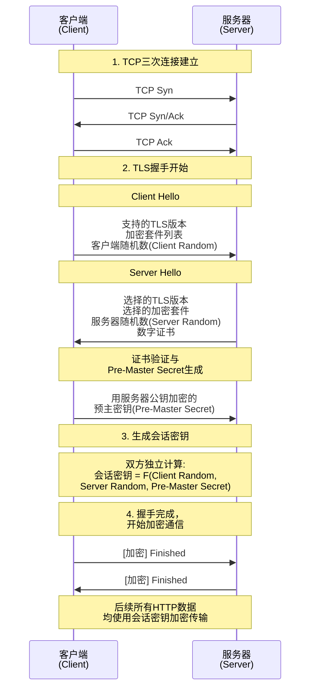
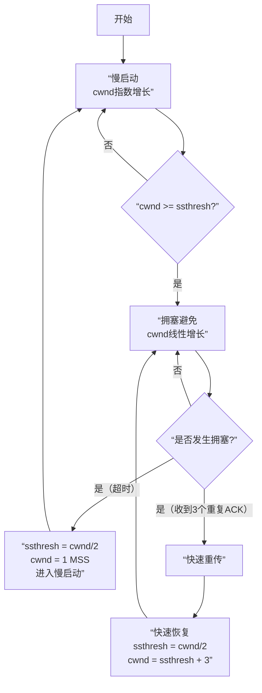
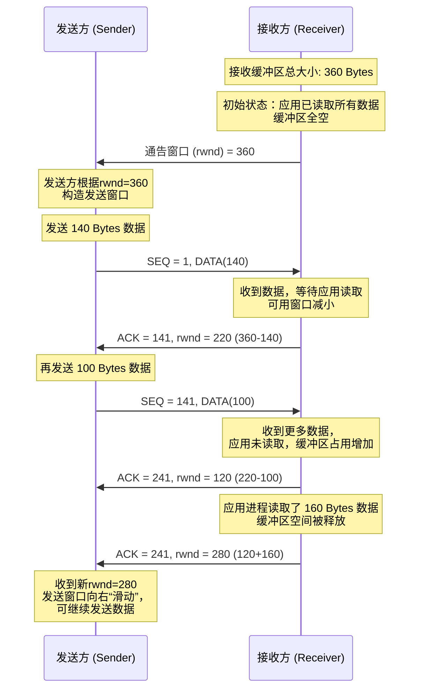
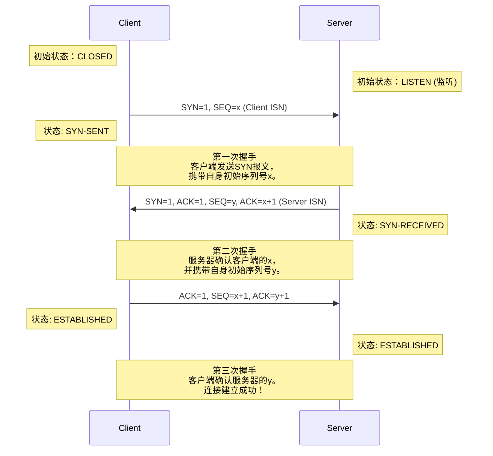
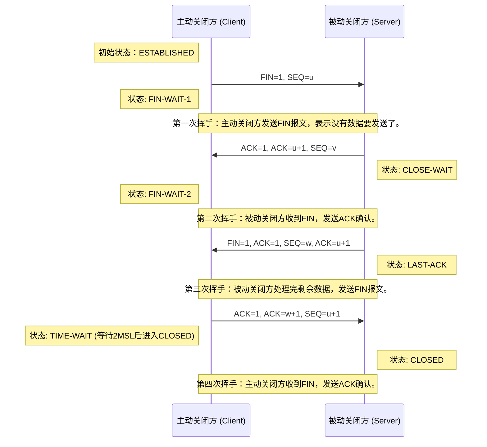

## 计算机网络

> 参考资料：小林coding——图解网络

### 1 介绍下OSI模型和TCP/IP模型的区别

关于OSI模型和TCP/IP模型，首先最核心的区别是：OSI是一个理论上的**参考模型**而TCP/IP是一个实践中运行的**协议模型**。

具体来讲他们的区别主要有以下几点：

首先是出生和目的不同，OSI模型由ISO提出的，是**“模型先行”**。它先设计一个分层框架来让大家遵守，是一个**理想化标准**。而TCP/IP模型源于美国国防部的APARNET项目，是**“协议先行”**。它是从实际应用中先有了TCP/IP这些协议再被总结为模型，是**互联网的事实标准**。

其次是结构层次不同，OSI有**7层**，从下至上分别为**物理层、数据链路层、网络层、传输层、会话层、表示层和应用层**。

- 物理层是最底层，它负责**在物理媒介上传输原始的比特流**，网线、光纤、集线器工作在这一层。
- 数据链路层负责**在同一个局域网内节点到节点的可靠传输**，它将比特流组装成“帧”，帧头包含MAC地址来寻址，帧尾包含校验码进行差错检测，交换机、网卡驱动工作在这一层。
- 网络层负责**在不同网络之间进行数据路由**，即选择最佳路径将数据包从源主机送到目标主机，IP协议、路由器是这一层的核心，其中**IP协议使用IP地址来标识主机和网络，并进行逻辑地址寻址**。
- 传输层负责**端到端的数据传输**，借助不同协议提供差异化服务，主要的传输层协议有TCP和UDP，**TCP是面向连接的、可靠的传输协议**，确保数据的正确性和完整性，**TCP的三次握手和四次挥手就是在这层实现的，**而**UDP则是无连接的、高效的传输协议**，适用于不要求可靠性的传输，如实时音频和视频流。
- 会话层负责**建立、管理和终止两个应用程序之间的会话**。
- 表示层充当翻译官的角色，负责数**据的格式转换、加密解密、压缩解压缩**。
- 应用层最靠近用户的一层，**为应用程序提供网络访问的接口，实现具体的网络服务**，如电子邮件（SMTP）、网页浏览（HTTP）、文件传输（FTP）等。

TCP/IP有4层，从下至上分别为网络接口层（**对应OSI的物理层和数据链路层**）、网络层、传输层和应用层（**整合了OSI模型中会话、表示、应用三层的功能**）。


### 2 从输入URL到页面展示发生了什么？

从输入URL到页面展示这个过程可以概括为：**URL解析 -> DNS域名解析 -> TCP握手 -> HTTP请求 -> 服务器处理响应 -> 浏览器解析渲染 -> TCP挥手**。

1. **URL解析：** 浏览器首先会解析输入的URL，比如 `https://www.example.com/index.html`。它会分析出协议（`https`）、主机名（`www.example.com`）、端口（`https`默认443）、路径（`/index.html`）等信息。

2. **DNS域名解析：** 浏览器需要知道目标服务器的IP地址才能通信。这个过程就是域名解析。
   - 浏览器会先检查**本地缓存**（浏览器缓存、操作系统缓存）。
   - 如果缓存没有，会向**本地配置的DNS服务器**（通常是路由器或运营商提供的）发起查询。
   - 查询是一个**递归过程**，可能经过根域名服务器、顶级域名（.com）服务器、权威域名服务器，最终获得IP地址。

3. **TCP握手：**拿到IP地址后，浏览器要通过**传输层的TCP协议**与服务器建立一个可靠的连接。**核心过程就是三次握手：**
   - 浏览器向服务器发送一个`SYN`（同步）包，表示请求建立连接。
   - 服务器收到后，回复一个`SYN-ACK`（同步确认）包，表示同意。
   - 浏览器再回复一个`ACK`包，握手完成。此时，TCP连接就建立好了。

​	**如果是HTTPS协议，还需要额外的TLS握手**，用于协商加密密钥、验证服务器证书等，确保通信安全。

4. **HTTP请求：**连接建立后，浏览器会构造一个**HTTP请求报文**，并通过这个TCP连接发送给服务器。请求报文主要包括：
   - **请求行：** 包含方法（GET/POST）、路径、HTTP版本。
   - **请求头：** 包含浏览器信息（User-Agent）、接受的数据类型（Accept）、Cookie等重要信息。
   - **请求体：** 如果是POST请求，会包含提交的表单数据等。

5. **服务器处理响应：**服务器接收到请求后，会根据路径和参数进行处理（比如调用后端应用、查询数据库）。处理完成后，服务器会返回一个**HTTP响应报文**。响应报文主要包括：
   - **状态行：** 包含状态码（如200成功、404未找到）。
   - **响应头：** 包含内容类型（Content-Type）、内容长度、设置Cookie等信息。
   - **响应体：** 即我们真正请求的数据，通常是HTML文档。

**浏览器解析渲染和TCP挥手是异步进行的，但核心在于页面的主要解析和渲染过程发生在TCP连接关闭之前。**

6. **浏览器解析渲染：**

   - **解析HTML，构建DOM树：** 浏览器从上到下解析HTML代码，将标签转换为树状结构的**DOM（文档对象模型）**。
   - **解析CSS，构建CSSOM树：** 同时，浏览器会解析CSS（包括外部样式表、内联样式），生成**CSSOM（CSS对象模型）**，它决定了每个DOM节点的样式。
   - **合并成渲染树：** 将DOM树和CSSOM树合并，生成一棵**渲染树**，它只包含需要显示在页面上的元素。
   - **布局：** 根据渲染树，计算每个节点在屏幕上的确切位置和大小。
   - **绘制：** 遍历渲染树，调用操作系统API，将每个节点绘制到屏幕上（像素化）。
   - **合成：** 现代浏览器有合成层机制，会将页面分成多个图层，分别绘制，最后再合成一个完整的页面，这样效率更高。

   **注：**HTML解析过程一旦遇到 `<script>` 标签，会**暂停DOM的构建**，先去下载（如果是外部脚本）和执行JavaScript。因为JS可能会修改DOM或CSSOM。所以通常建议将`<script>`标签放在body底部，或者使用`async`/`defer`属性来避免阻塞解析。

7. **TCP挥手：**当页面数据传输完成后，TCP连接会通过**四次挥手**的过程被安全地关闭。

   - 客户端发送一个 `FIN` 报文，并进入 `FIN_WAIT_1` 状态。
   - 服务器收到 `FIN` 后，立即回复一个 `ACK` 确认报文。此时，服务器可能还有数据要发送，进入 `CLOSE_WAIT` 状态。客户端收到 `ACK` 后进入 `FIN_WAIT_2` 状态。
   -  当服务器处理完所有剩余数据后，也发送一个 `FIN` 报文给客户端，然后进入 `LAST_ACK` 状态。
   -  客户端收到 `FIN` 后，发送最后一个 `ACK` 确认报文，并进入 `TIME_WAIT` 状态，等待一段时间（2MSL）后最终关闭。服务器收到这个 `ACK` 后便立即关闭连接。


### 3 HTTP请求报文和响应报文是怎样的，有哪些常见的字段？

HTTP报文是HTTP协议中用于在客户端和服务器之间传输数据的基本单位，它分为请求报文和响应报文两种。它们的结构类似，都包含三个部分：**起始行、头部字段和消息体**。

首先，是客户端发送给服务器的**请求报文**

1. **请求行**
   - 这是报文的第一行，包含了三个核心信息：
     - **方法：** 表示请求的目的，如 `GET`（获取资源）、`POST`（提交数据）、`PUT`（更新资源）、`DELETE`（删除资源）。
     - **请求目标：** 通常是URL的路径和查询参数，例如 `/index.html?name=value`。
     - **HTTP版本：** 如 `HTTP/1.1` 或 `HTTP/2`。
2. **请求头**
   - 紧接着请求行之后，每一行都是一个 `键: 值` 对，用于向服务器传递附加信息。
   - **常见重要字段包括：**
     - `Host`：**（必需）** 指定请求的服务器的域名和端口号。
     - `User-Agent`：告知服务器客户端的类型（如浏览器型号、操作系统）。
     - `Accept`：声明客户端可以处理的内容类型，如 `text/html, application/json`。
     - `Content-Type`：**（在POST/PUT等有体的请求中非常重要）** 声明请求体的数据类型，如 `application/json`、`application/x-www-form-urlencoded`。
     - `Cookie`：将本地存储的Cookie信息发送给服务器，用于身份验证等。
     - `Authorization`：用于携带身份验证凭证，如Bearer Token。
3. **请求体**
   - 在头部之后，用一个空行隔开，后面就是可选的请求体。
   - **GET请求通常没有请求体**，而 **POST、PUT等方法** 会使用请求体来发送数据，比如表单数据或JSON数据。

**举例：**

```json
GET /api/users/123 HTTP/1.1
Host: api.example.com
User-Agent: Mozilla/5.0...
Accept: application/json
Cookie: sessionId=abc123
```

*(这是一个GET请求，所以没有请求体)*

服务器收到请求后，会返回一个**响应报文**。

1. **状态行**
   - 响应的第一行，也包含三个部分：
     - **HTTP版本：** 如 `HTTP/1.1 200 OK`。
     - **状态码：** 一个三位数字，清晰表示请求的结果。这是最关键的信息。
     - **原因短语：** 对状态码的简短文字描述，如 `OK`。
2. **响应头**
   - 同样由 `键: 值` 对组成，描述了服务器的信息和返回的资源信息。
   - **常见重要字段包括：**
     - `Status Code`：状态码本身，如 `200`（成功）、`404`（未找到）、`500`（服务器内部错误）、`301`（永久重定向）。
     - `Content-Type`：**（非常重要）** 声明响应体的数据类型，如 `text/html; charset=UTF-8`、`application/json`。浏览器据此决定如何解析内容。
     - `Content-Length`：响应体的长度（字节）。
     - `Set-Cookie`：服务器要求客户端设置Cookie。
     - `Cache-Control`：指示客户端如何缓存响应资源，对性能优化至关重要，如 `max-age=3600`。
     - `Location`：在重定向（状态码3xx）时，指定新的URL地址。
3. **响应体**
   - 空行之后，就是服务器返回的实际数据，比如HTML文档、JSON数据或图片文件等。

**举例：**

```json
HTTP/1.1 200 OK
Content-Type: application/json; charset=utf-8
Content-Length: 56
Cache-Control: max-age=3600

{"id": 123, "name": "张三", "email": "zhangsan@example.com"}
```


### 4 HTTP有哪些请求方式？

HTTP协议定义了一组请求方法，也称为HTTP动词，用来表明要对目标资源执行的操作。**最核心和常见的是GET和POST**，但还有其他一些重要的方法。

1. **GET**
   - **语义：** **获取**资源。它应该是幂等的、安全的，意味着多次执行相同的GET请求，效果是一样的，且不会修改服务器数据。
   - **特点：** 请求参数直接附加在URL后面（查询字符串），有长度限制（因浏览器和服务器而异），可以被缓存、收藏为书签。
   - **场景：** 请求页面、搜索查询、获取数据等。
2. **POST**
   - **语义：** **提交**数据，用于创建新资源或触发一个处理数据的操作。它既不是安全的也不是幂等的。
   - **特点：** 数据放在请求体中，更适合传输敏感或大量数据（如图片、表单提交）。
   - **场景：** 用户登录、提交表单、上传文件。
3. **PUT**
   - **语义：** **更新**整个资源。客户端提供更新后的完整资源信息。它是幂等的。
   - **场景：** 更新用户的所有个人信息。
4. **DELETE**
   - **语义：** **删除**指定的资源。它也是幂等的。
   - **场景：** 删除一篇文章。
5. **PATCH**
   - **语义：** **部分更新**资源。客户端只提供需要修改的字段，而不是整个资源。它通常不是幂等的。
   - **场景：** 只更新用户的手机号码。
6. **HEAD**
   - **语义：** 与GET类似，但服务器**只返回响应头，不返回响应体**。用于获取资源的元信息（如大小、类型），检查资源是否存在或是否被修改。
   - **场景：** 在下载大文件前检查其大小或最后修改时间。


### 5 GET请求和POST请求的区别

GET和POST是HTTP协议中最基础的两种请求方法，它们的区别可以从**语义、用法、安全性、技术实现**等多个维度来理解。最核心的区别在于它们的**设计语义**不同。

- **GET** 的语义是 **“获取”** 数据。它用于从服务器检索资源，不应该对服务器状态产生任何副作用。它是 **“安全”** 且 **“幂等”** 的。
  - **安全**：意味着操作只是读取，不会修改数据。
  - **幂等**：意味着多次执行相同的GET请求，得到的结果都是一样的。
- **POST** 的语义是 **“提交/创建”** 数据。它用于向服务器提交数据，通常会改变服务器上的状态（如新建一个订单、更新数据库）。它既 **不是安全** 的，也 **不是幂等** 的。

**“幂等性”举例：** 比如我用GET请求查询用户信息，无论执行多少次，结果都一样。但如果我用POST请求创建一个新用户，执行两次就会创建两个用户，所以它不是幂等的。

基于上述语义，它们在具体实现上产生了差异。

| 特性          | GET                                                  | POST                                                         |
| :------------ | :--------------------------------------------------- | :----------------------------------------------------------- |
| **参数位置**  | 附在**URL**之后，作为**查询字符串**                  | 放在**请求体**中                                             |
| **数据大小**  | 受**URL长度限制**（浏览器和服务器不同，通常2KB-8KB） | **理论上无限制**，实际受服务器配置约束                       |
| **数据类型**  | 只允许ASCII字符                                      | 支持二进制数据（如文件上传）                                 |
| **安全性**    | **差**。参数直接暴露在URL、浏览器历史、服务器日志中  | **相对较好**。参数在请求体内，不直接可见（但仍是明文，HTTPS才是关键） |
| **缓存**      | **可被缓存**，可被收藏为书签                         | **默认不可缓存**，不可被收藏为书签                           |
| **后退/刷新** | 无害（因为是幂等的）                                 | 浏览器会提示“是否重新提交表单”（因为不是幂等的）             |


### 6 HTTP中常见的状态码有哪些？

HTTP状态码是服务器返回的3位数字代码，用来表示一个HTTP请求的处理结果。它分为五个大类，分别以不同的首位数字开头，这本身就便于我们快速定位问题。

1. **1xx (信息性状态码)：** 表示请求已被接收，需要继续处理。**在实际开发中较少直接接触**。
   - **例如：** `100 Continue`（客户端应继续发送请求体）。
2. **2xx (成功状态码)：** 表示请求已成功被服务器接收、理解并处理。这是我们最希望看到的。
   - **常见码：** 
     - `200 OK`：**最最常见的成功状态。** 请求成功，响应体中包含了请求的资源（如HTML页面、JSON数据）。
     - `201 Created`：**创建成功。** 通常在 `POST` 或 `PUT` 请求后返回，表示一个新资源已在服务器端被成功创建。**响应头 `Location` 字段通常会包含新资源的URL。**
     - `204 No Content`：**成功但无内容。** 服务器成功处理了请求，但不需要返回任何实体内容。例如，对于一些只需要成功信号而不需要返回数据的 `DELETE` 或 `UPDATE` 操作非常有用。
3. **3xx (重定向状态码)：** 表示需要客户端采取进一步的操作才能完成请求。通常与**缓存和URL重定向**相关。
   - **常见码：** 
     - `301 Moved Permanently`：**永久重定向。** 请求的资源已被**永久**移动到新的URL。搜索引擎会更新其链接到新的URL。**浏览器会缓存这个重定向。**
     -  `302 Found`：**临时重定向。** 请求的资源**临时**从不同的URL响应。搜索引擎不会更新链接。这是最常见的重定向类型。
     - `304 Not Modified`：**未修改。** 用于缓存控制。当客户端发起一个有条件的GET请求（例如请求头中带了 `If-Modified-Since`），如果资源自指定时间后未被修改，服务器会返回304，告诉客户端可以直接使用缓存的版本。**这可以极大地节省带宽。**
4. **4xx (客户端错误状态码)：** 表示请求含有错误（如语法错误）或无法完成。**责任通常在客户端**。
   - **常见码：** 
     - `400 Bad Request`：**错误请求。** 服务器无法理解请求的格式，通常是客户端发送的请求语法有误（例如，JSON格式错误）。
     - `401 Unauthorized`：**未认证。** 请求需要用户认证。客户端必须提供有效的身份验证凭证（如Bearer Token）。通俗讲，就是“你是谁？”的问题。
     - `403 Forbidden`：**禁止访问。** 服务器理解请求，但拒绝执行。与401不同，身份验证可能已经成功，但用户没有访问该资源的权限。通俗讲，就是“你无权做这个操作”。
     - `404 Not Found`：**未找到。** 服务器找不到请求的资源。可能是URL错误，或资源已被删除。
5. **5xx (服务器错误状态码)：** 表示服务器在处理请求的过程中发生了错误。**责任通常在服务器端**。
   - **常见码：**
     -  `500 Internal Server Error`：**通用服务器错误。** 服务器遇到了一个未曾预料的状况，导致了它无法完成对请求的处理。通常是后端代码出现了未捕获的异常。
     - `502 Bad Gateway`：**坏网关。** 当服务器作为网关或代理，从上游服务器收到无效响应。常见于Nginx等反向代理服务器后端的应用服务器（如Tomcat）挂掉或无法连接。
     - `503 Service Unavailable`：**服务不可用。** 服务器当前无法处理请求（由于超载或进行停机维护）。这通常是一个**临时状态**。

总结一下，理解状态码的关键在于抓住其首位数字的类别。在实际开发和调试中，状态码是我们定位问题的第一线索：

- **遇到4xx，我们应该优先检查前端发送的请求是否正确；**
- **遇到5xx，问题大概率出在后端服务上。**

这种分类能帮助我们快速协同排查问题。另外，像 `304` 对于性能优化，`201`、`204` 对于设计规范的RESTful API都至关重要。


### 7 什么是强缓存和协商缓存？

浏览器缓存是提升Web性能最关键的手段之一，它能显著减少重复请求、节省带宽、加快页面加载。浏览器缓存机制主要分为两大类：**强缓存**和**协商缓存**。它们的核心区别在于：**使用强缓存时，浏览器根本不会发送请求到服务器；而使用协商缓存时，浏览器会发送请求，但服务器会判断资源是否过期，从而决定是返回新资源还是告知浏览器使用本地缓存。**

**一、强缓存（Strong Cache）**

“首先，我们看强缓存。当浏览器第一次向服务器请求资源时，服务器可以在响应头中附带缓存规则，告诉浏览器这个资源可以缓存多久。”

**1. 核心概念：**

- **目标：** 在缓存有效期内，完全避免向服务器发送请求。
- **行为：** 浏览器直接读取本地磁盘或内存中的缓存副本，状态码为 `200 (from disk cache)` 或 `200 (from memory cache)`。**这个过程没有网络请求，因此速度极快。**

**2. 关键响应头字段（服务器返回的指令）：**

- **`Cache-Control`（HTTP/1.1 的规范，优先级更高）**
  - `max-age=31536000`： 资源的最大有效时间，单位是秒（例如一年）。
  - `no-cache`： **注意，这个名字有点误导性。它不代表不缓存，而是表示“可以使用缓存，但使用前必须经过服务器验证”**（即跳过强缓存，直接进入我们后面要讲的协商缓存）。
  - `no-store`： **真正的“不缓存”**。每次都要从服务器获取完整响应。
  - `public`： 响应可以被任何对象（浏览器、代理服务器）缓存。
  - `private`： 响应只能被单个用户的浏览器缓存，不能被代理服务器缓存。
- **`Expires`（HTTP/1.0 的遗留物）**
  - 它指定一个绝对的过期时间点，例如 `Expires: Wed, 21 Oct 2025 07:28:00 GMT`。
  - **缺点：** 依赖客户端和服务器的时间严格同步，如果用户修改了本地时间，会导致缓存失效判断不准。因此，在现代浏览器中，**`Cache-Control` 的 `max-age` 优先级更高。**

**强缓存流程：** 浏览器检查缓存，如果发现缓存未过期（根据 `Cache-Control` 或 `Expires`），则直接使用缓存，否则进入下一步——协商缓存。

**二、协商缓存（Negotiation Cache）**

“当强缓存失效（过期）后，浏览器就会携带缓存的‘标识’向服务器发起请求。这个阶段就是协商缓存。”

**1. 核心概念：**

- **目标：** 验证客户端缓存是否仍然有效，避免在资源未变化时重复下载整个资源。
- **行为：** 浏览器会发送请求到服务器。如果资源没变，服务器返回 `304 Not Modified`，响应体为空，浏览器则继续使用本地缓存。如果资源变了，服务器返回 `200 OK` 和新的资源。

**2. 关键字段对（一对请求头/响应头）：**

- **第一对：`Last-Modified` / `If-Modified-Since`**
  - **工作流程：**
    1. **第一次请求：** 服务器在响应头中返回 `Last-Modified: GMT`，表示资源最后的修改时间。
    2. **再次请求：** 浏览器将这个时间放在请求头 `If-Modified-Since: GMT` 中发给服务器。
    3. **服务器判断：** 服务器比较资源的当前修改时间和 `If-Modified-Since` 的时间。
       - 如果时间一致，返回 `304 Not Modified`。
       - 如果不一致，返回 `200 OK` 和新的资源，并更新 `Last-Modified`。
- **第二对：`ETag` / `If-None-Match`（更精确的方案）**
  - **为什么需要ETag？** `Last-Modified` 有一些缺陷：
    - 精度只到秒，如果文件在1秒内被多次修改，无法识别。
    - 文件内容可能没变，但修改时间变了（比如被touch了一下）。
  - **工作流程：**
    1. **第一次请求：** 服务器为资源生成一个唯一标识符（通常是哈希值），通过响应头 `ETag: "xyz123"` 返回。
    2. **再次请求：** 浏览器将这个标识符放在请求头 `If-None-Match: "xyz123"` 中发给服务器。
    3. **服务器判断：** 服务器计算当前资源的ETag，并与 `If-None-Match` 的值对比。
       - 如果一致，返回 `304 Not Modified`。
       - 如果不一致，返回 `200 OK` 和新的资源，并更新 `ETag`。
  - **`ETag` 的优先级通常比 `Last-Modified` 更高。**

我们可以把整个缓存决策过程想象成一个清晰的流程图：

1. 浏览器发起资源请求。
2. **检查强缓存：** 查看 `Cache-Control`/`Expires`。
   - 如果未过期，**直接使用本地缓存（200 from cache）**，流程结束。
   - 如果已过期，进入下一步。
3. **发起协商缓存请求：** 浏览器携带 `If-Modified-Since` 和 `If-None-Match` 向服务器发送请求。
4. **服务器验证：**
   - 如果资源未变，返回 `304 Not Modified`。浏览器使用本地缓存。
   - 如果资源已变，返回 `200 OK` 和新的资源及新的缓存标识。

**最佳实践：**

- 对于**不常变化的静态资源**（如JS、CSS库，图片字体），使用强缓存并设置很长的 `max-age`（例如一年）。同时，通过给文件名添加哈希指纹（如 `app.abc123.js`）来实现“覆盖式更新”：当文件内容变化时，文件名也变，就等于请求了一个全新的URL，从而绕过缓存。
- 对于**HTML文件**，通常使用 `Cache-Control: no-cache` 或较短的 `max-age`，使其走协商缓存，确保用户能及时获取到最新的页面。”


### 8 HTTP1.0和HTTP1.1的区别

HTTP/1.1 是 HTTP/1.0 的重大改进，它解决了许多 1.0 版本中影响性能和功能的关键问题。它们的区别主要体现在**连接方式、缓存机制、主机头支持、带宽优化**等多个方面。其中最核心的区别是**连接模型的改进**。

**一、核心区别：连接模型（Connection Model）**

这是最重要的区别，直接影响了网站性能。

- **HTTP/1.0：** 默认使用 **短连接**。
  - **行为：** 每次TCP连接只处理一个请求-响应周期。收到响应后，TCP连接立即关闭。
  - **缺点：** 加载一个包含多个资源（图片、CSS、JS）的网页时，需要频繁地建立和断开TCP连接。而TCP的三次握手和慢启动过程会带来巨大的性能开销和延迟。
- **HTTP/1.1：** 默认使用 **持久连接**。
  - **行为：** 在一个TCP连接上可以连续进行多个请求-响应，而不用每次都重新建立连接。连接会在空闲一段时间后或通过头字段显式关闭。
  - **优点：** 极大地减少了TCP握手和慢启动的次数，降低了延迟，提升了页面加载速度。这是HTTP/1.1最显著的性能优化。

**“管道化”是相关的进阶概念：**HTTP/1.1还尝试引入了**管道化**，允许客户端在同一个连接上连续发送多个请求，而不用等待上一个响应返回。但由于队头阻塞等问题，实践中很少被启用且现代浏览器默认禁用。

**二、其他关键区别**

1. 虚拟主机支持（Host Header）

- **HTTP/1.0：** 没有 `Host` 请求头。一个物理服务器（一个IP地址）只能托管一个网站。
- **HTTP/1.1：** **必须**包含 `Host` 请求头。这使得虚拟主机成为可能，即一个物理服务器可以通过不同的 `Host` 值来托管多个不同的网站（域名）。这是现代Web托管的基础。

2. 缓存控制机制

- **HTTP/1.0：** 缓存控制功能较弱，主要依赖 `Expires` 头（一个绝对过期时间）和 `If-Modified-Since`/`Last-Modified`。
- **HTTP/1.1：** 引入了功能强大的 `Cache-Control` 头，提供了更精细的缓存策略，如 `max-age`（相对过期时间）、`no-cache`、`no-store`、`public`、`private` 等。同时还引入了 `ETag`/`If-None-Match` 作为比 `Last-Modified` 更可靠的缓存验证器。

3. 带宽优化

- **HTTP/1.0：** 不支持断点续传。如果下载中断，必须重新开始。
- **HTTP/1.1：** 引入了 **范围请求**。
  - 通过 `Range` 和 `Content-Range` 头，客户端可以只请求资源的一部分。
  - **应用场景：**
    1. **断点续传：** 下载大文件时，可以从断开的地方继续下载。
    2. **视频/音频流：** 播放器可以跳转到指定时间点进行播放。

4. 状态码扩充

- **HTTP/1.0：** 定义了16个状态码。
- **HTTP/1.1：** 扩充到了24个，引入了更多描述性状态码，如：
  - `100 Continue`： 客户端在发送大请求体前，先询问服务器是否愿意接收。
  - `409 Conflict`： 请求与资源的当前状态发生冲突。
  - `410 Gone`： 资源已永久删除，比404更明确。

5. 错误处理

- **HTTP/1.0：** 连接出错时，只能简单地关闭连接。
- **HTTP/1.1：** 引入了 `Connection: close` 头，允许在传输完响应后优雅地关闭连接。还改进了错误消息的格式，使其更易于理解。

总而言之，HTTP/1.1 通过引入**持久连接**解决了HTTP/1.0最大的性能瓶颈，通过**Host头**奠定了现代互联网多站点共存的基础，并通过增强的缓存和带宽优化机制提供了更好的用户体验。这些改进使得HTTP/1.1成为统治了互联网近二十年的主流协议。

当然，HTTP/1.1本身也存在**队头阻塞**（Head-of-Line Blocking）等无法根治的问题，这最终催生了HTTP/2和HTTP/3的诞生。理解1.0到1.1的演进，有助于我们更好地把握后续协议的发展思路。


### 9 HTTP2.0与HTTP1.1的区别

HTTP/2 是 HTTP/1.1 的一次重大革新，它的目标不再是增加新的方法或状态码，而是**从根本上解决 HTTP/1.1 的性能瓶颈**。其核心区别在于，HTTP/2 从一种基于文本的、线性的协议，转变为了一种**二进制、多路复用**的协议。

**一、核心区别：二进制分帧层（The Binary Framing Layer）**

这是最根本的架构性改变，是其他所有优化的基础。

- **HTTP/1.1：** 是一个**文本协议**。请求和响应消息都是纯文本格式，用换行符分隔。虽然对人类可读，但对机器解析效率低，且容易出错（比如需要处理空白字符、大小写等）。
- **HTTP/2：** 是一个**二进制协议**。它在应用层（HTTP）和传输层（TCP）之间引入了一个**二进制分帧层**。

**这意味着什么？** HTTP/2 将请求和响应消息分解为更小的、独立的**帧**，例如 `HEADERS` 帧（存放头信息）和 `DATA` 帧（存放正文）。这些帧可以乱序发送，然后在另一端根据流标识符重新组装。

**这个改变带来了革命性的优势，最直接的就是解决了队头阻塞问题。**

**二、关键性能区别（由二进制分帧层衍生）**

1. 多路复用 vs. 队头阻塞

- **HTTP/1.1 的问题：** 存在**线头阻塞**。
  - 在同一个TCP连接上，虽然可以发送多个请求（持久连接），但**响应必须是按请求的顺序返回**。如果第一个请求的响应很慢（比如一个复杂的数据库查询），它会阻塞后面所有已经发送的请求的响应，即使后面的资源（如CSS、图片）已经准备好了。
- **HTTP/2 的解决方案：** **真正的多路复用**。
  - 基于二进制分帧，多个请求和响应可以**同时交错地进行**，而不会互相阻塞。
  - 浏览器只需要和服务器建立一个**TCP连接**，就可以并行地交互无数个请求和响应。这彻底解决了HTTP/1.1的队头阻塞问题，避免了为了并行而建立多个连接（HTTP/1.1的浏览器有6-8个域名连接数限制）所带来的巨大开销。

2. 头部压缩

- **HTTP/1.1：** 头部是纯文本的，且**大量重复**。每次请求都会携带 `Cookie`, `User-Agent`, `Accept` 等相同的头字段，造成巨大的带宽浪费（尤其是在移动网络上）。
- **HTTP/2：** 引入了 **HPACK** 压缩算法。
  - **静态表：** 预定义了61个常见头字段。
  - **动态表：** 在连接过程中，将首次出现的头字段存入动态表。
  - **Huffman编码：** 对值进行压缩。
  - **效果：** 头部大小通常能被压缩**85%-95%**，显著减少了开销。

3. 服务器推送

- **HTTP/1.1：** 完全是被动的“请求-响应”模式。浏览器必须解析HTML，发现需要哪些资源（如CSS、JS），然后再发起新的请求去获取。
- **HTTP/2：** 服务器可以**主动推送**资源给客户端。
  - **场景：** 当服务器收到对一个HTML页面的请求时，它知道客户端接下来一定会请求这个页面所依赖的CSS和JS文件。于是，它可以在返回HTML响应之前，主动将这些资源推送给浏览器。
  - **优势：** 减少了额外的请求往返延迟，让页面加载更快。

4. 流优先级

- **HTTP/1.1：** 虽然浏览器可以尝试优先下载重要的资源（如CSS），但受限于队头阻塞和有限的连接数，控制力很弱。
- **HTTP/2：** 客户端可以为每个“流”（即一个请求-响应交换）指定一个**依赖关系和权重**。
  - 例如，浏览器可以告诉服务器：“请优先处理HTML和CSS的流，然后再处理图片的流”。这使得浏览器能更智能地分配带宽，优化渲染速度。

总而言之，HTTP/2 并非通过增加新功能，而是通过**改变数据传输的基本方式**来提升性能。它用一个高效的二进制协议取代了低效的文本协议，并通过多路复用、头部压缩等机制，极大地降低了延迟和带宽消耗。

**需要注意的一点是：** HTTP/2 解决的是**应用层**的队头阻塞，但它的底层仍然基于TCP。如果单个TCP包在传输层丢失，会导致整个TCP连接等待重传，这被称为**TCP层的队头阻塞**。这也是为什么会有HTTP/3和QUIC协议的出现，它们旨在用UDP替代TCP，从根本上解决这个问题。

所以，理解HTTP/2的改进，能让我们看到网络协议优化从‘打补丁’（如HTTP/1.1的并发连接、域名分片）到‘重构架构’的演进思路。


### 10 HTTPS和HTTP有哪些区别

HTTP和HTTPS最核心的区别在于**安全性**。HTTP是超文本传输协议，而HTTPS可以理解为 **HTTP over SSL/TLS**，即在HTTP之下加入了一个安全层。这使得HTTPS能够解决HTTP三大安全问题：**窃听、篡改和冒充**。

**一、最核心的区别：安全性**

- **HTTP：** **明文传输**。数据在客户端和服务器之间以纯文本形式传送，就像寄送一张明信片。途中的任何中间人（网络运营商、公共Wi-Fi提供商、黑客）都可以轻松地看到所有内容，包括密码、信用卡号、聊天记录等。
- **HTTPS：** **加密传输**。通过SSL(Secure Sockets Layer)/TLS(Transport Layer Security)协议对传输的数据进行加密，就像把明信片装进一个只有收件人才能打开的保险箱。即使数据被截获，攻击者看到的也只是毫无意义的乱码。

**由此衍生出的三大安全能力：**

1. **加密：** 防止数据被窃听，保证**机密性**。
2. **完整性校验：** 防止数据在传输过程中被恶意篡改，保证**完整性**。
3. **身份认证：** 通过数字证书验证网站服务器的真实身份，防止你访问到假冒的钓鱼网站，保证**真实性**。

**二、具体技术区别**

| 特性         | HTTP                          | HTTPS                                                       | **区别解释**                                                 |
| :----------- | :---------------------------- | :---------------------------------------------------------- | :----------------------------------------------------------- |
| **协议**     | 应用层协议                    | **HTTP + SSL/TLS**                                          | HTTPS在HTTP和TCP之间增加了一个安全层（SSL/TLS）。            |
| **默认端口** | **80**                        | **443**                                                     | 这是服务器监听请求的默认端口号。                             |
| **URL开头**  | `http://`                     | `https://`                                                  | 浏览器地址栏会明确显示，现代浏览器对HTTP网站标记为“不安全”。 |
| **工作流程** | 直接建立TCP连接，发送HTTP报文 | 1. 建立TCP连接 2. **进行SSL/TLS握手** 3. 发送加密的HTTP报文 | HTTPS在传输数据前，需要先进行一个复杂的握手过程，以协商加密密钥、验证证书等。 |
| **数字证书** | 不需要                        | **必须由受信任的证书颁发机构（CA）签发**                    | 证书是验证服务器身份的关键，它包含了服务器的公钥和CA的签名。 |
| **性能开销** | 低                            | 相对较高                                                    | 由于加密、解密和握手过程，HTTPS会消耗更多的CPU和网络资源（但现代硬件优化已使差距微乎其微）。 |

**三、HTTPS的工作原理（SSL/TLS握手简析）**

HTTPS的安全核心是SSL/TLS握手，这个过程大致如下：

1. **ClientHello：** 客户端（浏览器）向服务器发送支持的加密套件列表和一个随机数。
2. **ServerHello：** 服务器选择加密套件，发送自己的**数字证书**和一个随机数。
3. **验证证书：** 客户端验证证书是否由可信CA签发、是否过期、域名是否匹配等。
4. **生成会话密钥：** 客户端用证书中的**公钥**加密一个预主密钥，发送给服务器。服务器用自己持有的**私钥**解密。双方利用三个随机数（两个Hello中的加上预主密钥）生成相同的**对称会话密钥**。
5. **加密通信：** 后续所有HTTP数据都使用这个高效的对称会话密钥进行加密传输。

**关键点：** 使用非对称加密（公钥/私钥）安全地交换对称密钥，再使用对称加密来高效地加密大量数据。

**四、为什么HTTPS在今天至关重要？**

除了显而易见的安全优势，HTTPS在现代Web中已经成为一项必备要求：

1. **浏览器标记：** Chrome、Firefox等主流浏览器会将所有HTTP网站明确标记为 **“不安全”** ，严重影响用户信任。
2. **SEO排名：** Google等搜索引擎明确将**HTTPS作为搜索排名的正面信号**，使用HTTPS的网站在排名上更有优势。
3. **现代Web API 的前提：** 很多强大的浏览器API（如**地理定位、Service Worker、支付请求API**等）都要求必须在HTTPS上下文环境中才能使用。
4. **性能和未来协议：** HTTP/2和HTTP/3协议在实践中几乎都要求基于HTTPS部署，它们能提供更好的性能。而且，HTTPS下的加密数据有助于避免某些网络运营商的消极流量干扰。

总而言之，HTTP和HTTPS的区别远不止于一个‘S’。这个‘S’代表的是**Security**，它通过加密、认证和完整性保护，将Web从开放的明文世界带入了安全的加密时代。在当今环境下，HTTPS不再是一个‘可选项’，而是构建可信、高性能、符合标准的网站的**基石**。

从HTTP切换到HTTPS的成本已经非常低（有Let‘s Encrypt这样的免费证书颁发机构），但收益是巨大的，它保护了用户，也保护了网站自身。


### 11 HTTPS的工作原理(HTTPS建立连接的过程）

HTTPS的工作原理核心是**SSL/TLS握手协议**。这个过程的主要目标有三个：**1）验证服务器身份；2）协商加密套件；3）安全地生成一个对称会话密钥**。整个过程可以概括为‘用非对称加密安全地交换对称密钥’。

**一、核心思想：为什么需要握手？**

HTTP是明文传输的，极不安全。直接使用对称加密（用同一把密钥加密和解密）虽然高效，但如何把密钥安全地告诉对方呢？在网上‘寄送钥匙’的过程中，钥匙本身就可能被窃听。

HTTPS的握手过程巧妙地解决了这个问题：它先使用**非对称加密**（公钥和私钥）来安全地传递‘对称加密的钥匙’，之后双方再使用这把‘钥匙’进行高效的**对称加密**通信。

**二、TLS握手过程详解（最关键的部分）**



**第一步：TCP连接建立（TLS握手的基础）**

- 客户端和服务器首先进行标准的**TCP三次握手**，建立一个可靠的TCP连接。这是所有后续TLS对话的基础。

**第二步：TLS握手开始 - `Client Hello`**

- 客户端向服务器发送一条消息，包含：
  1. **支持的TLS版本**：如TLS 1.2或TLS 1.3。
  2. **支持的加密套件列表**：一个密码学算法的组合，比如 `TLS_ECDHE_RSA_WITH_AES_128_GCM_SHA256`。
  3. **客户端随机数**：一个由客户端生成的随机字符串，后续用于生成会话密钥。

**第三步：服务器响应 - `Server Hello`**

- 服务器选择合适的参数，并返回给客户端：
  1. **确认的TLS版本**。
  2. **选择的加密套件**。
  3. **服务器随机数**：一个由服务器生成的随机字符串。
  4. **数字证书**：这是**最关键的一步**。证书中包含了服务器的公钥、域名、颁发机构（CA）等信息。

**第四步：客户端验证证书与生成预主密钥**

- **证书验证**：客户端（浏览器）会做以下几件事：
  - 检查证书是否由受信任的证书颁发机构（CA）签发。
  - 检查证书是否在有效期内。
  - 检查证书上的域名是否与正在访问的域名一致。
  - （可选）检查证书是否已被吊销。
  - **如果验证失败，浏览器会弹出严重警告。**
- **生成预主密钥**：验证通过后，客户端会再生成一个随机字符串，称为 **预主密钥**。
- **加密预主密钥**：客户端使用证书中提供的**服务器公钥**对这个预主密钥进行加密，然后发送给服务器。

**第五步：服务器解密预主密钥**

- 服务器用自己的**私钥**解密客户端发来的信息，得到预主密钥。
- **关键点到此为止**：至此，客户端和服务器都拥有了三个共同的值：**客户端随机数、服务器随机数、预主密钥**。而窃听者虽然能看到加密后的预主密钥，但由于没有服务器的私钥，无法解密它。

**第六步：生成会话密钥**

- 客户端和服务器**分别使用相同的算法**，根据刚才的三个随机数（Client Random, Server Random, Pre-Master Secret）生成一把相同的**对称会话密钥**。后续所有的应用数据都将使用这把密钥进行加密和解密。

**第七步：握手结束与加密通信**

- 双方互相发送一条用会话密钥加密的 `Finished` 消息，验证之前的握手过程是否成功，加解密环境是否正常。
- 验证通过后，**TLS隧道就此建立**。之后，所有的HTTP请求和响应都会在这个安全的、加密的隧道中进行传输。

所以，我们可以把整个握手过程总结为：

1. **打招呼**（Hello）：交换随机数和加密能力。
2. **验明正身**（Certificate）：服务器出示证书，客户端验证身份。
3. **秘密送货**（Key Exchange）：客户端用服务器公钥加密‘密钥种子’（预主密钥）并送出。
4. **配制钥匙**（Key Generation）：双方用三个随机数生成同一把对称会话密钥。
5. **安全通话**（Encrypted Communication）：开始用对称密钥进行高效、安全的加密通信。

**其精妙之处在于**：它结合了非对称加密（安全性高但速度慢，用于交换密钥）和对称加密（速度快，用于加密大量数据）的优点，完美地解决了密钥分发的安全问题。

另外值得一提的是，**TLS 1.3** 协议为了提升性能和安全，极大地简化了握手过程，将往返次数从2-RTT减少到了1-RTT，甚至支持0-RTT模式，但核心思想依然不变。


### 12 TCP连接如何确保可靠性

TCP协议是通过一系列复杂的机制来共同确保数据传输的可靠性的。其核心思想可以概括为：**‘数据有序、传输确认、丢包重传、流量控制’**。它就像一个非常可靠的快递系统，确保每个包裹都按顺序、不丢失、不重复地送达。

**一、可靠性四大支柱**

1. **数据分段与序列号**

- **机制：** TCP将应用程序传来的数据流分割成最适合发送的**数据段**，并为每个字节分配一个唯一的**序列号**。
- **目的：**
  - **解决乱序问题：** 即使网络中的数据包到达顺序是乱的（比如后发的包先到），接收方也可以根据序列号**重新排序**，组装成原始数据流。
  - **作为确认的基础：** 序列号是后续确认机制的依据。

2. **确认应答与重传机制**

这是可靠性的最核心环节。

- **机制：**
  1. **确认应答：** 接收方收到数据后，会向发送方回送一个**确认报文**。这个ACK报文里包含一个值，意思是“我已經成功收到了序列号在这个值之前的所有数据”。
  2. **超时重传：** 发送方在发送一个数据段后，会启动一个**重传计时器**。如果在计时器超时之前没有收到对应的ACK确认，发送方就认为这个数据包在传输途中丢失了，于是会**重新发送**该数据包。
- **目的：** 解决**数据包丢失**的问题。

3. **流量控制**

- **机制：** 使用**滑动窗口协议**。接收方在每次发送ACK时，会通过 **`TCP Window`** 字段告诉发送方自己当前**接收缓冲区**的剩余空间大小。发送方发送的数据量不能超过这个窗口的大小。
- **目的：** 防止发送方发送数据过快、数据量过大，导致接收方的缓冲区溢出，从而引发丢包。这相当于接收方对发送方说：“你慢点发，我这边快处理不过来了。”

4. **拥塞控制**

- **机制：** 这是为了防止网络本身过载而设计的全局性策略，而不仅仅是考虑收发双方。它通过感知网络当前的拥堵情况，动态调整发送速率。主要包括四个算法：
  1. **慢启动：** 连接刚开始时，从一个很小的窗口开始，每收到一个ACK，窗口大小就指数级增长，快速探测网络容量。
  2. **拥塞避免：** 当窗口增长到一个阈值后，转为线性增长，谨慎地增加数据量。
  3. **快速重传：** 如果发送方连续收到3个重复的ACK，就判断某个包可能丢失了，会立即重传该包，而不必等待超时。这大大提高了效率。
  4. **快速恢复：** 在快速重传之后，不进行激进的慢启动，而是将窗口降到一个合理值，直接进入拥塞避免阶段。
- **目的：** 保护整个网络，避免因为所有TCP连接都无节制地发送数据而导致网络全局性瘫痪。

总结一下，TCP的可靠性不是由单一机制保证的，而是一个**协同工作的系统**：

- **序列号**解决了**乱序**问题。
- **确认和重传**解决了**丢失**问题。
- **流量控制**解决了**接收方处理能力不足**的问题。
- **拥塞控制**解决了**网络路径拥堵**的问题。

可以打一个比方：TCP就像一个既有责任心又很聪明的快递员（**可靠性**）。他不仅会给每个包裹贴上编号（**序列号**），要求收件人每收到一个就签收回执（**确认应答**），如果没收到回执就重新投递（**超时重传**）。他还会根据你家快递柜的大小（**接收窗口**）来决定一次送多少包裹，并且会根据整个城市的交通状况（**网络拥塞**）来调整自己的行车路线和速度，避免堵死在路上。

正是这种多层次、精细化的设计，使得TCP成为互联网基石般的可靠传输协议。


### 13 既然提到了拥塞控制，那你能说说说拥塞控制是怎么实现的吗？

TCP的拥塞控制本质上是一个**闭环反馈系统**。发送方通过感知网络状态（如丢包），来动态调整其发送数据的速率，从而避免网络过载。它的实现不依赖于网络的明确通知，而是基于一个**探测-调整**的哲学。其核心是维护一个关键变量——**拥塞窗口**，并通过几个经典算法来调整它。

一、**核心概念：拥塞窗口（cwnd）**

- **是什么：** 除了接收方告知的**接收窗口**，发送方内部还维护着一个 **拥塞窗口**。发送方实际能发送的数据量，是这两个窗口的最小值。
  - `实际发送窗口 = min(接收窗口, 拥塞窗口)`
- **为什么：** **接收窗口** 只关心接收方的处理能力，而 **拥塞窗口** 是发送方根据自己感知到的网络拥堵程度，进行的自我限制。这是防止网络瘫痪的关键。

二、**拥塞控制的四大算法（详细阐述）**



1**. 慢启动**

- **触发时机：** 建立新连接或发生**超时重传**（最严重的拥塞信号）之后。
- **行为：**
  1. 初始 `cwnd` 通常很小（如1个MSS，最大报文段长度）。
  2. 每收到一个**有效的ACK**，`cwnd` 就增加1个MSS。
  3. 这导致 **`cwnd` 呈指数级增长**（1, 2, 4, 8, 16...）。就像开车时先轻踩油门，快速加速。
- **目的：** 在连接开始时**快速探测**当前网络的可用带宽，但又不会一开始就注入大量数据冲击网络。

2. **拥塞避免**

- **触发时机：** 当 `cwnd` 增长到一个**慢启动阈值** 时，就从“慢启动”阶段切换到“拥塞避免”阶段。
- **行为：**
  1. `ssthresh` 是一个动态变化的阈值，初始值通常较大。
  2. 在拥塞避免阶段，每收到一个**有效的ACK**，`cwnd` 只增加 `1/cwnd`。
  3. 这导致 **`cwnd` 呈线性增长**（每次RTT时间大约增加1个MSS）。就像车速上来后，改为缓踩油门，平稳加速。
- **目的：** 在接近网络容量时，转为谨慎的线性增长，避免因激进增长而瞬间压垮网络。

3. **快速重传与快速恢复**

这是为了优化对轻度拥塞的反应，避免等待超时带来的性能损失。

- **触发时机：** 当发送方**连续收到3个重复的ACK**。这意味着网络可能只丢失了个别包，但网络通路仍然是通的（后续包还能到达接收方）。
- **行为：**
  1. **快速重传：** 发送方不必等待超时计时器，**立即重传**对方未收到的那个数据包。
  2. **快速恢复：**
     - 将 `ssthresh` 设置为当前 `cwnd` 的一半。`ssthresh = cwnd / 2`
     - 然后，**并不将 `cwnd` 重置为1**，而是设置为新的 `ssthresh` 加上3（因为收到了3个重复ACK，表明有3个包已离开网络）。`cwnd = ssthresh + 3`
     - 随后直接进入**拥塞避免**阶段。
- **目的：** 高效处理单个包丢失，避免进入耗时的慢启动过程，保持较高的传输效率。

所以，整个拥塞控制的过程可以看作发送方在不断地进行**网络探测**：

- **慢启动**是**积极探测**，快速寻找带宽上限。
- **拥塞避免**是**谨慎探测**，在逼近上限时小心试探。
- **发生拥塞（丢包）是最终的反馈信号**：
  - **超时重传**（严重拥塞）：认为网络状况极差，采取最保守策略，**回归慢启动**。
  - **快速重传/恢复**（轻微拥塞）：认为网络状况尚可，采取优化策略，**降速后直接进入拥塞避免**。

这种设计体现了TCP的**合作精神**：每个TCP连接都通过这种自律的算法，主动为网络让路，从而实现了整个互联网的全局稳定性。后来的**BBR**等新算法则尝试通过测量带宽和RTT来更精确地控制速率，但经典的四算法模型仍是TCP的基石。


### 14 TCP流量控制是怎么实现的？

TCP的流量控制是通过**滑动窗口协议**来实现的。其核心目标是**防止发送方发送数据过快、过多，导致接收方的应用程序来不及处理，从而耗尽接收方的缓冲区**。可以把它想象成接收方在不断地对发送方说：‘我这边还能收多少数据，你就发多少。’

**一、核心机制：滑动窗口协议**



如上图所示，整个过程的核心在于一个变量：**接收方窗口**。

1. **接收方窗口：** 接收方在每次发送ACK确认报文时，都会通过TCP首部中的 **`window`** 字段，告知发送方自己**接收缓冲区**的剩余空间大小。这个值就是 **`rwnd`**。
2. **发送窗口限制：** 发送方在发送数据时，必须保证**已发送但未确认的数据量** 不能超过接收方通告的这个 **`rwnd`** 值。
3. **动态调整：** 随着接收方应用程序从缓冲区中读取数据，缓冲区空间被释放，**`rwnd`** 会变大。接收方会通过新的ACK报文将这个更大的窗口通告给发送方，发送方就可以据此发送更多数据。反之，如果接收方处理变慢，**`rwnd`** 变小，发送方就必须减慢发送速度。

**二、关键细节与潜在问题**

1. **零窗口与死锁**

- **问题：** 如果接收方的缓冲区满了，它会通告一个 **`rwnd = 0`** 的窗口。发送方收到后必须停止发送数据。如果之后接收方缓冲区有空闲了，它该如何通知发送方呢？因为发送方已经停止发送，接收方也就没有机会通过ACK来通告新窗口了，这可能导致**死锁**。
- **解决方案：** TCP设计了**零窗口探测** 机制。
  - 当发送方收到零窗口通告后，会启动一个**持续计时器**。
  - 计时器超时后，发送方会向接收方发送一个**仅1字节**的探测报文。
  - 接收方收到探测报文后，会回复一个ACK，并在其中携带当前的窗口大小（如果缓冲区已有空间，`rwnd` 就不再是0）。
  - 这样，死锁就被打破了。

2. **糊涂窗口综合征**

- **问题：** 如果接收方应用程序一次只从缓冲区读取几个字节，然后它就通告一个很小的窗口（比如几个字节）。发送方得知后，立即发送这几个字节的数据。这导致网络上传输的都是有效数据很少的小报文，**传输效率极低**。这就好比用巨型货轮只运送一个快递盒，极其浪费。
- **解决方案：** 两端都有优化策略：
  - **接收方策略：** 不通告太小的窗口。它会等待，直到缓冲区有**足够大**的空间（如缓冲区大小的一半或一个MSS）时，才通告窗口。
  - **发送方策略（Nagle算法）：** 在连接上最多只能有一个**已发送但未确认**的小报文。在收到该报文的确认之前，如果需要发送新的小数据，发送方会将这些小数据缓存起来，合并成一个更大的报文再发送。

所以，总结一下TCP流量控制的实现：

- **核心机制：** **滑动窗口协议**，通过接收方通告的 **`rwnd`** 来动态控制发送方的发送速率。
- **关键保障：** **零窗口探测** 解决了窗口通告丢失导致的死锁问题。
- **性能优化：** 通过应对**糊涂窗口综合征**，避免了大量小报文传输，保证了网络效率。

最后，值得一提的是，流量控制常常与**拥塞控制**一起被问到。它们的区别在于：

- **流量控制**是**端到端**的机制，关心的是**接收方**的处理能力，是一个‘接收方主导’的速度限制。
- **拥塞控制**是**全局性**的机制，关心的是**整个网络路径**的承载能力，是一个‘发送方自律’的速率调整。

在实际的TCP发送中，发送方的真实窗口大小是取 `min(拥塞窗口, 接收窗口)`，两者共同协作，既保证了网络不瘫痪，也保证了接收方不被压垮。


### 15 UDP怎么实现可靠传输

UDP本身是**无连接、不保证可靠性**的传输层协议，这既是它的缺点也是它的优点——**极高的效率和灵活性**。如果我们要在UDP之上实现可靠传输，实际上就是在应用层‘重新实现’一套TCP的核心机制，但我们可以根据具体场景进行定制和优化。

**一、核心思想：在应用层模拟TCP机制**

“实现可靠UDP的核心思路是：**在UDP这个简单的‘数据报’传输通道之上，通过在应用数据中添加自定义包头，来实现序号、确认、重传等逻辑。** 就像我们用原始的砖块（UDP）来盖一栋有抗震结构（可靠传输）的房子。”

**二、关键技术与实现方案**

以下是要在应用层实现的几个核心模块，我们可以对比TCP来阐述：

1. **确认应答机制**

- **目标：** 解决**数据包是否到达**的问题。
- **实现：**
  - 为每个发送的数据包分配一个唯一的、递增的**序列号**。
  - 接收方收到数据包后，必须向发送方回送一个**确认包**，ACK包中指明它确认收到的序列号。
  - **优化（类比TCP）：** 可以采用**累计确认**（如ACK 100表示100之前的数据都收到了）或**选择性确认**（SACK，明确指出收到了哪些不连续的数据块），后者能更高效地应对乱序和丢包。

2. **重传机制**

- **目标：** 解决**数据包丢失**的问题。
- **实现：**
  - **超时重传：** 发送方每发送一个数据包，就启动一个定时器。如果在设定的**超时时间**内没有收到对应的ACK，就重新发送该数据包。RTO的计算是一个关键点，可以参考TCP的算法（基于RTT动态调整）。
  - **快速重传：** 如果发送方连续收到3次对同一个序列号的ACK（意味着这个包之后的包都收到了，但唯独它丢了），则立即重传该数据包，而不必等待超时。这能大大降低重传延迟。

3. **流量控制**

- **目标：** 防止**发送方发送过快，压垮接收方**。
- **实现：**
  - 模仿TCP的**滑动窗口协议**。接收方在ACK包中通告自己的**接收窗口大小**，表示自己还能缓存多少数据。
  - 发送方需要维护一个发送窗口，其大小不能超过接收方通告的窗口，从而实现速率匹配。

4. **拥塞控制（高级特性，体现深度）**

- **目标：** 防止**发送方压垮网络**，这是体现可靠传输方案是否成熟的关键。
- **实现：**
  - 同样可以实现类似TCP的**拥塞控制算法**，如慢启动、拥塞避免、快速恢复等。
  - 通过感知丢包（作为网络拥塞的信号）来动态调整发送速率。**这是很多自制可靠UDP协议最容易忽略但也最重要的部分。**

5. **连接管理**

- **目标：** 建立和终止有序的通信上下文。
- **实现：**
  - 可以模拟TCP的**三次握手**来建立连接，同步初始序列号，交换参数（如窗口大小）。
  - 同样可以通过类似**四次挥手**的机制来保证双方都能安全地释放连接。

**三、实际应用案例（升华回答）**

事实上，这种思路已经有很多非常成功的现实案例，它们都是为了解决TCP在特定场景下的瓶颈而生的：

1. **QUIC协议：** 这是最著名的例子。Google提出的QUIC协议就是基于UDP，在用户空间实现了包括可靠传输、安全加密（集成了TLS）等一整套机制。它已经成为HTTP/3的底层标准，旨在减少连接建立延迟，改善移动网络下的性能。
2. **音视频实时通信：** 像WebRTC这样的技术，它在UDP之上实现了**部分可靠**的传输。比如，对于关键的控制信息（如建立连接的信令）要求绝对可靠，但对于视频帧数据，如果重传耗时太长导致延迟，则可以选择性丢弃，优先保证**实时性**。这体现了可靠UDP设计的灵活性。
3. **在线游戏：** 很多实时对战游戏使用可靠UDP。游戏状态更新对延迟极其敏感，但允许偶尔的丢包（比如某一帧的位置信息丢了，可以用下一帧插值）。开发者可以定制重传策略，比如只重传最重要的数据包（如玩家开枪指令），而对次要数据（如粒子特效）则采用不可靠传输。

**四、总结与对比**

所以，总结一下：

- **能否实现？** **能**。核心是在应用层重新实现**序列号、确认、重传、窗口控制**这四大支柱。
- **与TCP的区别？** 这样做不是为了替代TCP，而是为了**定制和优化**。我们可以摆脱TCP内核实现的‘黑盒’，根据业务需求（如极低延迟、部分可靠、多路复用无队头阻塞）来设计更高效的协议。
- **代价是什么？** **实现复杂度极高**。需要处理各种边界条件，调试困难。因此，除非有非常强烈的性能需求，否则直接使用TCP是更明智的选择。


### 16 TCP连接三次握手的过程，为什么是三次，可以是两次或者更多吗？

TCP的三次握手是建立连接的过程，其根本目的是为了**确保通信双方都具有数据收发的能力，并同步初始序列号**。‘三次’这个数字是在**保证可靠性的前提下，实现连接建立的最低成本方案。**

**一、三次握手的过程（简单回顾）**

首先，我们需要明确三次握手交换了什么信息，其核心是同步序列号（Sequence Number, SEQ）和确认号（Acknowledgment Number, ACK）。整个过程如下图所示：



(ISN - Initial Sequence Number)

关键点在于：

- **序列号（SEQ）**：是字节流的编号，用于解决乱序、重复等问题。每次握手，发送方都会通告自己的初始序列号。
- **确认号（ACK）**：是期望收到的下一个字节的序列号，值为`收到的序列号+1`，表示之前的数据已正确接收。

**二、为什么不能是两次握手？（核心论证）**

这是回答的重点，需要从两个关键角度阐述两次握手的致命缺陷。

1. **防止已失效的连接请求报文突然传送到，导致资源浪费和错误。**

- **场景模拟：**
  1. 客户端发送一个SYN请求（SEQ=x）来建立连接，但这个包在网络中**滞留**了。
  2. 客户端超时后重发一个SYN（SEQ=y），这次成功建立连接，传输数据后关闭连接。
  3. 此时，那个**滞留的SYN包（SEQ=x）** 终于到达了服务器。
- **两次握手的结果：** 服务器收到这个旧的SYN，会认为是一个新的连接请求，于是回复SYN-ACK（ACK=x+1）并**直接进入ESTABLISHED状态**，开始等待接收数据。
- **问题：**
  - 服务器为这个“幽灵连接”分配了资源（缓冲区、控制块），但客户端根本不会理会这个回应（因为它早已完成通信）。
  - 这将导致服务器端**资源被白白占用**，如果这种情况频繁发生，服务器可能因资源耗尽而无法服务，这是一种**安全漏洞**。

2. **确保双向连接可靠建立，同步双方序列号。**

- **两次握手的结果：** 服务器在发送完SYN-ACK后，就单方面认为连接已建立。但它**无法确认客户端是否收到了自己的SYN-ACK**，以及客户端是否准备好了接收数据。
- **问题：**
  - 如果服务器的SYN-ACK报文在途中丢失，客户端根本不知道连接已建立，不会发送数据。
  - 而服务器却一直在等待数据，这同样会造成资源浪费。
  - 更重要的是，TCP是全双工通信，需要确保**双方的初始序列号都得到确认**。两次握手只确认了客户端的序列号，服务器的序列号并未得到客户端的确认。

**结论：两次握手无法阻止历史连接问题，且只能保证单向连接可靠，是一个“半开连接”，不可接受。**

**三、为什么不需要四次（或更多）握手？**

- **核心原则：** 通信协议的设计追求**在满足需求的前提下尽可能简单高效**。三次握手已经完美地达到了所有目标：
  1. **确认了客户端具备收发能力**（第一次和第三次）。
  2. **确认了服务器具备收发能力**（第二次和第三次）。
  3. **双方初始序列号都得到了确认和同步**。
  4. **有效防止了失效请求造成的错误**。
- **四次握手是多余的：** 在三次握手之后，连接已经双向可靠建立。如果非要进行第四次握手（比如服务器再确认一次客户端的ACK），它并不会带来任何新的信息或额外的可靠性，只会增加连接的延迟和开销。**TCP的设计哲学是‘够用就好’。**

**四、总结与升华（回答亮点）**

“所以，我们可以这样总结：

- **一次握手**：完全不可靠，对方是否存在都不知道。
- **两次握手**：**致命缺陷**在于无法防止失效请求造成的资源浪费，且只能保证单向连接可靠。
- **三次握手**：是**理论上的最小值**，它完美地解决了双向序列号同步、信道能力确认和历史连接问题，实现了可靠的全双工通信基础。
- **四次握手**：是**不必要的冗余**，因为三次握手已经提供了足够的保证，第四次握手不会增加任何可靠性。

这就好比两个人打电话：

- **两次握手**：A说‘喂，听得到吗？’B说‘听得到！’但B不确定A是否听到了自己的回答。（B在单向等待）
- **三次握手**：A说‘喂，听得到吗？’B说‘听得到！你听得到我吗？’A说‘我也听得到！’（双方都确认了通信畅通）。

因此，‘三次’是可靠性与效率之间最优雅的平衡点。”


### **17 TCP连接四次挥手的过程，为什么是四次？**

TCP的四次挥手是连接终止的过程。之所以需要四次，根本原因在于 **TCP连接是全双工的，每个方向必须独立关闭**。‘四次’是保证双方数据都能发送完毕、并安全关闭连接的最优方案。

**一、四次挥手的过程（详细步骤）**

首先，我们通过一个序列图来清晰展示四次挥手的过程，这有助于理解为什么需要四个步骤：



具体步骤解析：

1. **第一次挥手（FIN）**：
   - 主动关闭方（假设是客户端）发送一个FIN报文（FIN标志位设为1），序列号为`u`。这表示客户端告诉服务器：“我（客户端到服务器方向）没有数据要发送了。”
   - 客户端状态由`ESTABLISHED`变为`FIN-WAIT-1`。
2. **第二次挥手（ACK）**：
   - 服务器收到FIN后，必须进行确认。它发送一个ACK报文，确认号为`u+1`，序列号为`v`。这表示：“我收到了你的关闭请求。”
   - 服务器状态由`ESTABLISHED`变为`CLOSE-WAIT`。
   - 客户端收到这个ACK后，状态由`FIN-WAIT-1`变为`FIN-WAIT-2`。**此时，从客户端到服务器方向的连接已经关闭**，客户端不能再发送数据，但服务器可能还有数据要发送给客户端。
3. **第三次挥手（FIN）**：
   - 当服务器也准备好关闭连接时（即它也没有数据要发送了），它会发送自己的FIN报文，序列号为`w`，确认号仍为`u+1`。
   - 服务器状态由`CLOSE-WAIT`变为`LAST-ACK`。
4. **第四次挥手（ACK）**：
   - 客户端收到服务器的FIN后，必须发送一个ACK进行确认，确认号为`w+1`，序列号为`u+1`。
   - 客户端状态由`FIN-WAIT-2`变为`TIME-WAIT`。它会等待**2MSL**（两倍的最大报文段生存时间）后，才进入`CLOSED`状态。
   - 服务器一旦收到这个ACK，就立即进入`CLOSED`状态。

**二、为什么是四次？为什么不能是三次？**

这是回答的核心，需要从TCP的**全双工**特性来解释。

1. **TCP连接是全双工的**

这意味着数据可以在两个方向上独立传输。可以把一个TCP连接看作由两条独立的**单向通道**组成：

- 一条是 **A -> B** 的数据通道
- 一条是 **B -> A** 的数据通道

2. **关闭需要双方独立确认**

- **第一次和第二次挥手**：关闭的是 **A -> B** 的这个通道。
  - A说：“我这边没话说了。”（FIN）
  - B说：“好的，我知道你沒话说了。”（ACK）
- **第三次和第四次挥手**：关闭的是 **B -> A** 的这个通道。
  - B说：“我也没话说了。”（FIN）
  - A说：“好的，我知道你也没话说了。”（ACK）

3. **关键点：第二次和第三次挥手不能合并**

- **为什么？** 因为当B收到A的FIN时，仅仅表示A没有数据要发送了。但B可能**还有数据要发送给A**！
- B需要时间来处理完自己缓冲区里最后要发送给A的数据。在第二次挥手（ACK）和第三次挥手（FIN）之间的`CLOSE-WAIT`状态，就是B用来发送剩余数据的时间。
- **如果强行合并为三次挥手**（即B在收到A的FIN后，立即回复一个FIN+ACK），那就意味着B在确认的同时也宣布自己立即关闭，没有机会再发送剩余数据，这可能会导致数据丢失。

**简单比喻：** 两个人打电话：

- A说：“我说完了。”（第一次挥手）
- B说：“好的，但我还有几句要说。”（第二次挥手 + B继续说话）
- B说：“好了，我也说完了。”（第三次挥手）
- A说：“好的，再见。”（第四次挥手）

如果合并成三次，就变成了：

- A说：“我说完了。”
- B说：“好的，但我还有几句要说。好了，我也说完了。”（合并的第二次挥手）
- A说：“好的，再见。”

这听起来很别扭，而且如果B的话很长，这种合并就不合理了。TCP的设计考虑到了这种“数据未发送完”的情况。

**三、TIME_WAIT状态的重要性**

“另外，为什么主动关闭方最后要停留在`TIME-WAIT`状态等待2MSL？这有两个关键作用：

1. **可靠地终止连接**：确保被动关闭方收到的最后一个ACK。如果这个ACK丢失，被动关闭方会超时重传它的FIN。主动关闭方在`TIME-WAIT`状态下收到这个重传的FIN后，可以重发ACK，从而保证连接能正常关闭。
2. **让旧的报文段在网络中消失**：等待2MSL时间，可以确保这次连接中产生的所有报文段都从网络中消失。这样，在建立新的连接时，就不会出现旧的连接中的报文段干扰新连接的情况（防止报文混淆）。

如果只有三次挥手，就无法实现这种安全的终止机制。”

**四、总结**

“所以，总结一下：

- **根本原因**：TCP的**全双工**特性决定了两个方向的通道需要**独立关闭**。
- **直接原因**：被动关闭方在收到FIN后，可能需要**时间来处理和发送剩余数据**，因此无法立即回复FIN。第二次挥手（ACK）和第三次挥手（FIN）之间必然存在一个间隔。
- **四次挥手**是保证**数据完整性**和**连接可靠性终止**的最小次数。它完美地解决了全双工连接如何优雅、可靠地关闭的问题。”


### 18 HTTP的Keep-Alive是什么？TCP 的 Keepalive 和 HTTP 的 Keep-Alive 是一个东西吗？

**HTTP的Keep-Alive和TCP的Keepalive是两种完全不同层面、不同目的的机制，它们之间没有任何直接关系，只是名字相似而已。** 我们可以从它们各自所属的协议层和要解决的问题来理解。

**一、HTTP的Keep-Alive（应用层机制）**

“首先，我们来说**HTTP的Keep-Alive**，它也叫**HTTP持久连接**。

- **目的：** **提升HTTP通信的效率。**
- **解决的问题：** 在早期的HTTP/1.0中，默认情况下每完成一次HTTP请求/响应（比如请求一个HTML页面和其中的图片），就会断开TCP连接。如果下一个请求还需要建立新的TCP连接，这带来了巨大的开销（三次握手、慢启动等）。对于一个包含很多资源的现代网页来说，这种性能是无法接受的。
- **工作原理：**
  1. 通过在HTTP请求头中设置 `Connection: keep-alive`（在HTTP/1.1中已成为**默认行为**，无需显式设置，如果要关闭则用 `Connection: close`）。
  2. 当启用Keep-Alive后，一个TCP连接可以在**多个HTTP请求/响应**中复用。
  3. 客户端和服务器完成一次交互后，这个连接不会立即关闭，而是保持打开状态，等待后续的请求使用。
- **核心价值：** **减少TCP连接建立和关闭的次数，降低延迟，提高页面加载速度和服务器性能。**

**简单比喻：** HTTP的Keep-Alive就像使用**同一根电话线连续打多个电话**。你接通电话后（建立TCP连接），问完第一个问题（HTTP请求1），得到回答（HTTP响应1）后不挂断，紧接着问第二个问题（HTTP请求2）。这比每次问问题都重新拨号要高效得多。

**二、TCP的Keepalive（传输层机制）**

“然后，我们来看**TCP的Keepalive**，它是一个传输层的特性。

- **目的：** **探测对端是否还“活着”，并防止连接因中间网络设备（如防火墙）的超时策略而被意外中断。**
- **解决的问题：** 在某些场景下，TCP连接的两端可能长时间没有数据交换（即**空闲连接**）。此时，无法区分对方是崩溃了，还是确实没有数据要发送。此外，网络中的防火墙或NAT设备通常会有一个超时时间，如果一条连接长时间空闲，它们会清除该连接的状态表，导致之后的通信失败。
- **工作原理（需在代码或系统配置中开启，默认关闭）：**
  1. 在一个TCP连接空闲一段时间后（例如2小时），启用了Keepalive的一端会向对端发送一个**探测报文**。这个报文不包含任何数据，序列号是对端期望的下一个序列号减一，所以对端必须回复一个ACK。
  2. 如果收到ACK，说明对端工作正常，连接保持，计时器重置。
  3. 如果连续多次探测（例如连续10次）都没有收到回应，则判定对端已失效，从而**主动关闭本端的TCP连接**，释放资源。
- **核心价值：** **保证连接的有效性，及时释放僵尸连接占用的资源。**

**简单比喻：** TCP的Keepalive就像在长时间不说话的会议中，**定期问一句“你还在吗？”**。如果对方回答“在”，则继续开会；如果问了几次都没人应答，就认为对方已经离开，宣布散会。

**三、核心区别总结（表格对比更清晰）**

“为了更直观地对比，我们可以总结如下：”

| 特性           | HTTP的Keep-Alive（持久连接）   | TCP的Keepalive（保活探测）                           |
| :------------- | :----------------------------- | :--------------------------------------------------- |
| **协议层**     | **应用层**                     | **传输层**                                           |
| **主要目的**   | **提高效率**，复用连接         | **检测存活**，释放无效连接                           |
| **触发条件**   | 有HTTP请求需要发送时           | TCP连接**长时间空闲**时                              |
| **数据内容**   | 传输的是**实际的HTTP数据**     | 传输的是**空的、用于探测的ACK包**                    |
| **默认状态**   | HTTP/1.1中**默认开启**         | 在操作系统中**默认关闭**，需手动开启                 |
| **解决的问题** | 避免频繁建立/断开TCP连接的开销 | 解决因对方崩溃或网络中间设备超时导致的“半开连接”问题 |

**四、场景关系（升华回答）**

“虽然它们是独立的，但在实际场景中可能会共同作用。例如：

1. 我们利用**HTTP的Keep-Alive**创建了一个可复用的TCP长连接，来高效地传输网页资源。
2. 这个长连接可能会因为页面交互不频繁而进入空闲状态。
3. 此时，如果开启了**TCP的Keepalive**，它就能确保这个空闲连接不会被中间的防火墙误杀掉，并且在服务器意外宕机时，客户端能及时感知并释放连接。

所以，它们一个负责‘高效利用’，一个负责‘健康检查’，从不同层面保证了网络通信的可靠和高效。”
